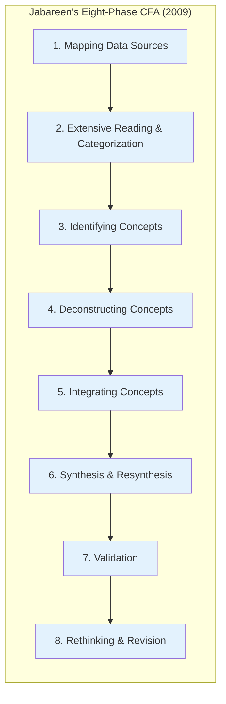
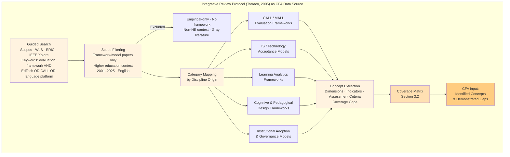
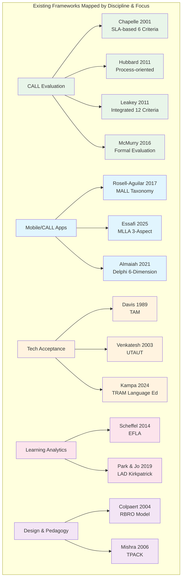
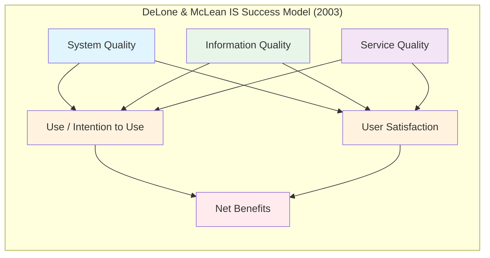
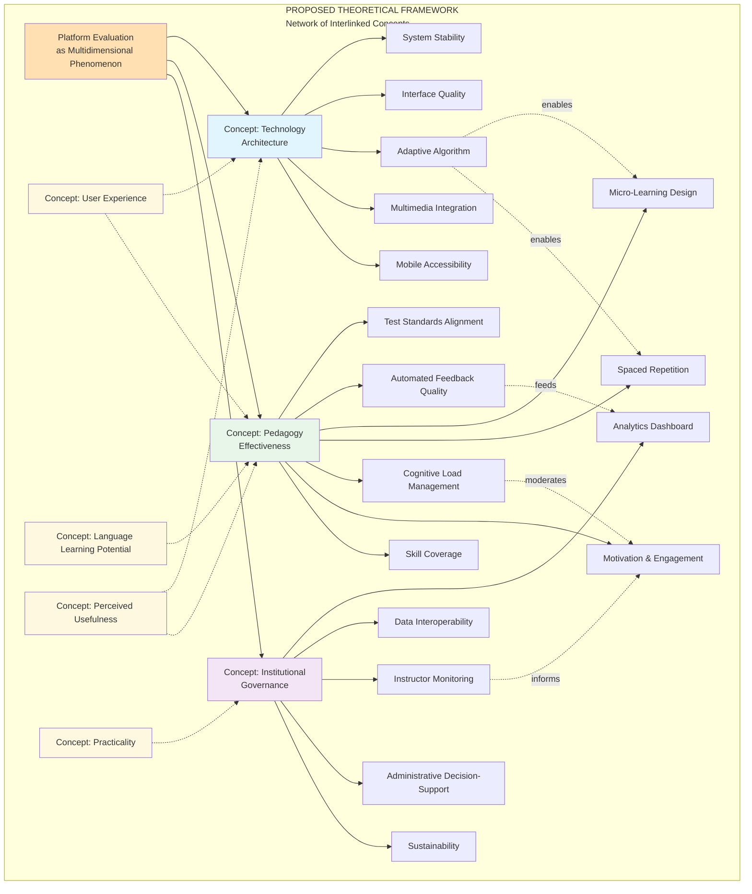
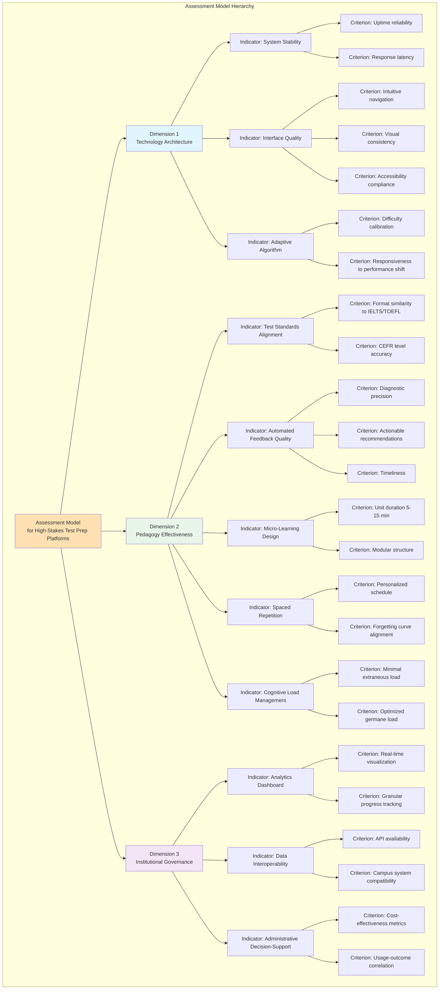
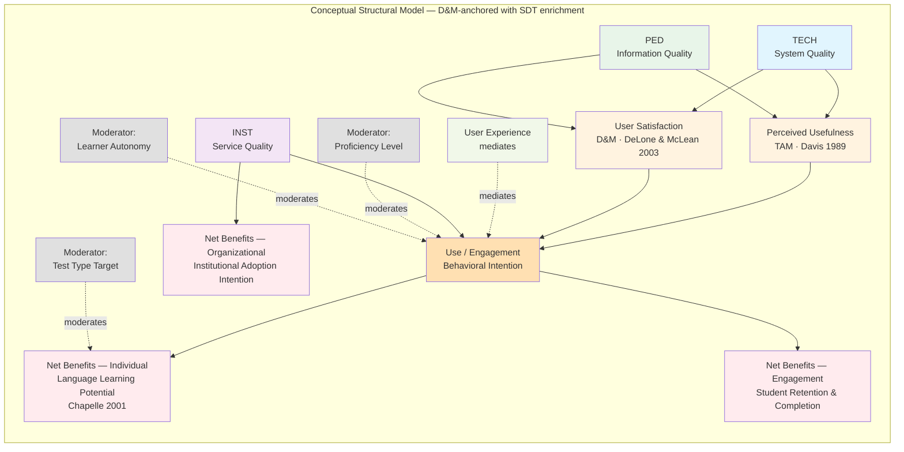

--

# **CONCEPT DRAFT v0.1 — PURELY CONCEPTUAL**

## **A Theoretical Framework and Assessment Model for Evaluating High-Stakes Language Test Preparation Platforms in Higher Education: A Conceptual Framework Analysis**

---

## **1. INTRODUCTION**

### **1.1. Background and Conceptual Gap**

Higher education in the digital era faces a fundamental challenge in evaluating the EdTech platforms adopted for *high-stakes* language test preparation — specifically IELTS and TOEFL. The literature indicates that existing *Computer-Assisted Language Learning* (CALL) platform evaluation is fragmented: it either centres on linguistic aspects without considering information systems architecture, or conversely skews too technical without interrogating pedagogical validity [1][2]. This gap is compounded by the absence of any evaluation framework explicitly designed for the *test preparation* context, which demands precision metrics for *micro-learning*, *spaced repetition*, and alignment with international test standards [3].

A survey of the *International Journal of Educational Technology in Higher Education* (ETHE) and other leading *educational technology* journals reveals that conceptual research developing *theoretical frameworks* and *assessment models* for self-directed learning technologies receives significant attention — particularly when it bridges the disciplines of Information Systems and Applied Linguistics [4][5]. Yet to date, no *theoretical framework* explicitly integrates the technology, pedagogy, and institutional dimensions into a single evaluation model for language test preparation platforms.

### **1.2. Conceptual Research Questions**

Based on the gap identification above, three conceptual research questions are examined:

1. **How can a *theoretical framework* be constructed that synthesises technology acceptance theory, computer-assisted language learning theory, and *learning analytics* theory for evaluating high-stakes language test preparation platforms?**

2. **How can an *assessment model* be formulated — with indicators and operational definitions — capable of evaluating platforms from a multi-stakeholder perspective (learners, instructors, administrators) at the conceptual level?**

3. **How can the theoretical relationships among evaluation dimensions be mapped in a conceptual structural model that is amenable to empirical testing in the future?**

### **1.3. Research Objectives**

| **Objective** | **Conceptual Output** |
|:---|:---|
| TK1 | Synthesise multidisciplinary literature to identify core platform evaluation concepts |
| TK2 | Construct a multidimensional *theoretical framework* through *conceptual framework analysis* |
| TK3 | Formulate an *assessment model* with evaluation rubrics and operational definitions |
| TK4 | Develop a conceptual structural model with theoretical propositions for future empirical testing |

---

## **2. METHODOLOGY: CONCEPTUAL FRAMEWORK ANALYSIS**

### **2.1. Philosophy and Approach**

This study adopts **Conceptual Framework Analysis (CFA)** as proposed by Jabareen (2009) — a qualitative method for constructing conceptual frameworks for multidisciplinary phenomena [6]. Unlike empirically oriented predictive research, CFA is interpretive, concept-based (rather than variable-based), and emphasises deep understanding of complex phenomena through networks of interlinked concepts [6][7].

Before turning to methodological procedures, an explicit *philosophical stance* is required to ensure the epistemological coherence of the entire research. This study operates under a *critical realism* paradigm at the ontological level — asserting that real dimensions of EdTech platform success exist and can be mapped conceptually, even though our understanding of them is always mediated by theory and context [7]. At the epistemological level, the study is interpretive: knowledge is constructed through the synthesis of concepts drawn from multidisciplinary literature, not through the measurement of empirical variables. Consequently, an *integrative literature review* is used as the technique for collecting conceptual "data" — not as an independent methodology, but as an instrument within the CFA framework [8].

| **Philosophical Layer** | **Position** | **Methodological Implications** |
|:---|:---|:---|
| **Ontology** | *Critical realism* — platform evaluation dimensions are real and can be mapped | The resulting framework is *ontologically grounded*, not arbitrary |
| **Epistemology** | *Interpretivism* — knowledge is constructed through concept synthesis, not measurement | CFA (not SEM or experiment) as the primary method |
| **Methodology** | *Conceptual Framework Analysis* (Jabareen, 2009) [6] | Eight iterative phases from mapping through to revision |
| **Literature Review** | *Integrative review* (Torraco, 2005) [8] | Synthesis of frameworks from multiple disciplines as conceptual *data* |

This *purely conceptual* commitment explicitly means: (a) no primary data are collected from human participants; (b) validation proceeds through theoretical cross-framework comparison (*theoretical cross-validation*), not through *expert elicitation*; (c) the theoretical propositions produced are designed as hypotheses for future empirical testing, not as generalisable findings at this stage.

### **2.2. Eight Phases of CFA in This Study**

| **Phase** | **Procedure** | **Output** |
|:---|:---|:---|
| **1. Mapping Data Sources** | *Integrative literature review* (Torraco, 2005) [8] across Scopus, Web of Science, ERIC, and IEEE Xplore, guided by the question: *"What evaluation frameworks exist for digital educational platforms, and what assessment dimensions do they address or neglect?"* Inclusion criteria: papers presenting or critiquing an evaluation framework/model for digital learning platforms in higher education, CALL, MALL, or LMS contexts (2001–2025, English). | Framework corpus for conceptual analysis |
| **2. Extensive Reading & Categorization** | Classification of literature by discipline of origin (applied linguistics, information systems, education, cognitive psychology) and framework type (evaluative, predictive, design, adoption) | Literature categorisation matrix |
| **3. Identifying Concepts** | Extraction of core concepts that recur significantly: *language learning potential*, *learner fit*, *perceived usefulness*, *cognitive load*, *learning analytics*, *institutional adoption* | List of candidate concepts |
| **4. Deconstructing Concepts** | Component, historical, and relational analysis of each concept based on its source theory (e.g. *cognitive load* from Sweller; *perceived usefulness* from Davis) | Componential definition per concept |
| **5. Integrating Concepts** | Integration of concepts from different disciplines into mutually complementary evaluation dimensions | Preliminary framework dimensions |
| **6. Synthesis & Resynthesis** | Construction of a *network of interlinked concepts* forming a *plane of understanding* of the platform evaluation phenomenon | Theoretical framework v0.1 |
| **7. Validation** | *Theoretical cross-validation* through **coverage matrix analysis**: each framework identified in Phase 1 is mapped against the TECH, PED, and INST dimensions to demonstrate that the proposed framework (a) closes all identified gaps, (b) does not duplicate existing frameworks, and (c) is logically coherent — without collecting primary data from human participants | Validated framework v0.2 (desk-based) |
| **8. Rethinking & Revision** | Iterative revision based on expert input and *cross-mapping* with existing frameworks to ensure *novelty* and *non-redundancy* | Final theoretical framework |

### **2.3. Integrative Review Protocol as CFA Data Source**

An *integrative review* is used as the technique for collecting conceptual "data" in this study, following the Torraco (2005) protocol [8] designed specifically for *theory development* and *conceptual synthesis* — distinct from a *systematic review* (PRISMA), which is oriented towards summarising empirical findings. This protocol permits the inclusion of diverse source types (empirical, theoretical, methodological) and does not require a reproducibility protocol as strict as that of a meta-analysis.

**Guiding review question:** *"What evaluation frameworks exist for digital educational platforms, and what assessment dimensions do they address or neglect in the context of higher education language learning?"*

---

## **3. LITERATURE SYNTHESIS: MAPPING EXISTING FRAMEWORKS**

### **3.1. Theoretical Map of CALL Evaluation**

### **3.2. Conceptual Gap Analysis**

Based on the deconstruction of existing frameworks through CFA, five principal conceptual gaps are identified:

| **No.** | **Conceptual Gap** | **Manifestation in Literature** |
|:---:|:---|:---|
| 1 | **Contextuality** | CALL/MALL frameworks are generic; none explicitly specifies metrics for *high-stakes testing preparation* (test standard precision, *micro-learning*, *spaced repetition*) [1][3][5] |
| 2 | **Multidisciplinarity** | Frameworks originate from disciplinary silos: linguistics (Chapelle, Leakey) or information systems (Almaiah) without theoretical synthesis that integrates both [2][4] |
| 3 | **Institutionality** | *Learning analytics* and *decision-making* aspects for institutional administrators are almost entirely absent from self-directed learning evaluation frameworks [9][10] |
| 4 | **Structurality** | The relationships among dimensions (e.g. how technology quality affects learning through motivation mediation) have not been mapped in a conceptual causal model for this context [11][12] |
| 5 | **Operationality** | Many frameworks take the form of reflective checklists without adequate operational definitions for systematic measurement [6][13] |

### **3.2.1. Coverage Matrix: Empirical Evidence of Conceptual Gaps**

The following matrix maps each analysed framework against five evaluation dimensions. It functions as **demonstrative evidence** (not mere assertion) of the five gaps claimed above, and simultaneously serves as the basis for *theoretical cross-validation* at CFA Phase 7.

**Legend:** ✓ Fully covered | ◑ Partially covered | ✗ Not covered

| **Framework** | **TECH** | **PED** | **INST** | **High-Stakes Specific** | **Operational Definitions** |
|:---|:---:|:---:|:---:|:---:|:---:|
| Chapelle (2001) [1] — SLA-based | ✗ | ✓ | ✗ | ◑ | ◑ |
| Hubbard (2011) [2] — Process-oriented | ✗ | ✓ | ✗ | ✗ | ◑ |
| Leakey (2011) [3] — Integrated 12 criteria | ◑ | ✓ | ✗ | ✗ | ◑ |
| Al-Fraihat et al. (2020) [4] — E-learning success | ✓ | ◑ | ◑ | ✗ | ◑ |
| Rosell-Aguilar (2017) [5] — MALL Taxonomy | ◑ | ◑ | ✗ | ✗ | ✗ |
| Almaiah et al. (2021) — Delphi 6-Dimension | ✓ | ◑ | ◑ | ✗ | ✗ |
| Scheffel et al. (2014) [9] — EFLA | ✗ | ✗ | ✓ | ✗ | ◑ |
| Park & Jo (2019) [10] — LAD | ✗ | ✗ | ✓ | ✗ | ◑ |
| DeLone & McLean (2003) [31] — IS Success | ✓ | ◑ | ✓ | ✗ | ✗ |
| Colpaert (2004) — RBRO | ✗ | ✓ | ✗ | ✗ | ◑ |
| Mishra & Koehler (2006) — TPACK | ✗ | ✓ | ✗ | ✗ | ✗ |
| **This framework (TECH+PED+INST)** | **✓** | **✓** | **✓** | **✓** | **✓** |

*The table above confirms that no single existing framework simultaneously covers all five dimensions. The proposed framework is the only one that satisfies all dimensions at once.*

---

## **3.3. Meta-Theoretical Foundation: DeLone & McLean IS Success Model**

The conceptual gap analysis above raises a fundamental question: **what can serve as a meta-theoretical "umbrella" that deductively justifies the three proposed evaluation dimensions?** The choice of meta-theory is critical — without it, the selection of three dimensions is arbitrary and vulnerable to reviewer critique.

This study adopts the **DeLone & McLean IS Success Model** (D&M, 2003) [31] as the unifying meta-theory. D&M is one of the most frequently cited IS models in the literature (>8,000 citations, Scopus) and has been empirically validated across diverse contexts, including e-learning and EdTech [32].

### **3.3.1. Anatomy of D&M IS Success Model (2003)**

D&M posits that information system success is determined by three intrinsic, interacting quality constructs, which generate *Use/Intention to Use*, *User Satisfaction*, and *Net Benefits*:

### **3.3.2. Deductive Mapping of D&M to Three Framework Dimensions**

Applying D&M to the context of language test preparation platforms in higher education yields a defensible deductive mapping:

| **D&M Construct** | **Operationalization in Language EdTech Context** | **Framework Dimension** |
|:---|:---|:---:|
| *System Quality* | Technical reliability, algorithm adaptivity, accessibility, and platform interface quality | **TECH** |
| *Information Quality* | Pedagogical content quality: test standard alignment, feedback effectiveness, cognitive design, skill coverage | **PED** |
| *Service Quality* | Institutional support mechanisms: analytics dashboard, instructor monitoring, data interoperability, decision-support | **INST** |
| *Net Benefits* | In this domain: improvement of language proficiency (*Language Learning Potential* — Chapelle, 2001 [1]) and test success | **Outcome** |

With this mapping, the question "*why precisely three dimensions?*" is answered deductively: because D&M has empirically demonstrated that IS success requires all three quality constructs simultaneously, and none can be reduced to another. This study does not select three dimensions inductively from gap analysis — it deduces the dimensions from an established IS meta-theory and then operationalises each into the specific domain.

**Important note:** D&M is used here at the **ontological** level (as a guide to *what exists* in a successful EdTech platform), not at the **methodological** level (D&M's measurement instruments are not adopted). This is a legitimate use of IS theory that has been practised across numerous prior conceptual studies [32].

---

## **4. PROPOSED THEORETICAL FRAMEWORK**

### **4.1. Framework Philosophy**

This framework is conceptualised as a **network of interlinked concepts** that is interpretive and indeterminate [6]. Each dimension is not an independent/dependent variable in the quantitative sense, but rather a **mutually articulating concept** providing comprehensive understanding of the platform evaluation phenomenon [6][7].

The three framework dimensions — **Technology Architecture (TECH)**, **Pedagogy Effectiveness (PED)**, and **Institutional Governance (INST)** — are derived **deductively** from the DeLone & McLean IS Success Model (2003) [31], not selected inductively from gap analysis alone. D&M establishes that information system success requires *System Quality*, *Information Quality*, and *Service Quality* simultaneously. In the specific domain of language test preparation platforms in higher education, the three D&M quality constructs are operationalised into three dimensions:

$$\text{TECH} \leftarrow \text{System Quality} \quad|\quad \text{PED} \leftarrow \text{Information Quality} \quad|\quad \text{INST} \leftarrow \text{Service Quality}$$

This operationalisation is not mere relabelling — each dimension requires conceptual elaboration from domain-specific literature (CALL, SLA, EFLA) because D&M does not define language domain indicators. The concept network within this framework is further enriched by cross-cutting concepts from TAM (Davis, 1989) [11] and SDT (Deci & Ryan) [12], which operate as linking mechanisms between platform quality and learning *outcomes*.

### **4.2. Theoretical Justification per Dimension**

#### **Dimension 1: Technology Architecture (TECH)**

*D&M anchor: System Quality — technical reliability, adaptivity, and accessibility of the platform as preconditions for IS success [31].*

This dimension synthesises *Human-Computer Interaction* (HCI) theory, the *Technology Acceptance Model* (TAM), and technical CALL evaluation criteria [1][2][11]. The concept of *System Stability* is adopted from software engineering evaluation frameworks that foreground system reliability as a prerequisite for the *learning experience* [14]. *Adaptive Algorithm* derives from *intelligent tutoring systems* and *adaptive learning* theory, which hold that content personalisation is a primary determinant of self-directed learning effectiveness [15]. *Interface Quality* — grounded in *zero UI* and minimalist design principles — is integrated from *cognitive load* theory, which holds that complex interfaces increase *extraneous cognitive load* and reduce available capacity for language processing [16].

#### **Dimension 2: Pedagogy Effectiveness (PED)**

*D&M anchor: Information Quality — the accuracy, relevance, and usefulness of the information (content) the platform delivers to users [31]. In the language context, "information" is the material, feedback, and instructional design itself.*

This dimension synthesises *Second Language Acquisition* (SLA) theory from Chapelle [1], feedback theory from Hattie & Timperley [17], and *micro-learning* theory from the *mobile learning* literature [5]. *Test Standards Alignment* is a necessary concept because in *high-stakes testing* contexts, material *authenticity* extends beyond communicative relevance to encompass alignment with the format, rubrics, and *band descriptors* of the target test [3]. *Cognitive Load Management* is adopted from Sweller to ensure that pedagogical design does not overburden the learner's *working memory* [16]. *Motivation & Engagement* is integrated from *Self-Determination Theory* (SDT), which holds that *autonomy*, *competence*, and *relatedness* mediate learner engagement on self-directed platforms [12].

#### **Dimension 3: Institutional Governance (INST)**

*D&M anchor: Service Quality — the support the system provides to users (instructors, administrators) in performing organisational functions; operating at the institutional level, not the individual level [31][32].*

This dimension synthesises the *Evaluation Framework for Learning Analytics* (EFLA) [9], Tornatzky & Fleischer's theory of *organisational adoption of IT* [18], and a *university governance* perspective from the *educational technology in higher education* literature [4][10]. *Analytics Dashboard* and *Instructor Monitoring* concepts derive from EFLA, which emphasises that analytic tools must generate *awareness*, *reflection*, and *impact* not only for learners but also for instructors [9]. *Administrative Decision-Support* is integrated from *IT governance* literature, which holds that the adoption of educational technology in institutions requires *evidence-based justification* for resource allocation [18].

### **4.3. Cross-Cutting Concepts**

| **Concept** | **Theoretical Origin** | **Function in Framework** |
|:---|:---|:---|
| *Language Learning Potential* | Chapelle (2001) [1] | **Domain-specific operationalisation of D&M "Net Benefits"** [31]: in the language test preparation platform context, "IS success" is understood as enhancement of language acquisition potential — not merely user satisfaction. LLP is an *evaluative criterion* (not a psychological mediating construct). |
| *Perceived Usefulness & Ease of Use* | Davis (1989) [11] | Linking constructs between platform quality (TECH/PED) and *Use* and *User Satisfaction* in the D&M pathway; operating at the level of individual perception |
| *User Experience* | Rosell-Aguilar (2017) [5] | Holistic concept articulating the quality of interaction between technical and pedagogical dimensions; mediator between system quality and *Use* |
| *Practicality* | Chapelle (2001) [1]; Hubbard (2011) [2] | Concept articulating the *Service Quality* (INST) feasibility in real institutional contexts; bridge between INST and *Institutional Adoption Intention* |

---

## **5. PROPOSED ASSESSMENT MODEL**

### **5.1. Assessment Model Philosophy**

The assessment model is conceptualised as a **theoretical rubric** comprising dimensions, indicators, and operational definitions. The model is **conceptual-interpretive** in character: designed to guide evaluation and serve as the foundation for empirical instrument development in the future — not as a psychometrically validated measurement instrument [6][13].

### **5.2. Assessment Model Hierarchy**

### **5.3. Operational Definitions Matrix**

#### **Technology Architecture Dimension**

| **Indicator** | **Conceptual Operational Definition** | **Source Theory** | **Use in Evaluation** |
|:---|:---|:---|:---|
| TECH-1 System Stability | Reliability of the system architecture in maintaining service availability under variable user loads, assessed from an infrastructure resilience perspective | *Software Quality Models* (ISO 25010) [14] | Technical evaluation of server capacity, *load balancing*, and *fault tolerance* |
| TECH-2 Interface Quality | Degree of interface quality enabling learner-platform interaction with minimal cognitive load, drawing on *zero UI* and *minimalist design* principles | *Cognitive Load Theory* [16]; *TAM* [11] | Heuristic interface analysis; *cognitive walkthrough* |
| TECH-3 Adaptive Algorithm Performance | Capacity of *item response theory* or *machine learning* algorithms to dynamically adjust content difficulty to individual proficiency | *Intelligent Tutoring Systems* [15]; *Adaptive Learning* | Algorithm logic evaluation; adjustment *convergence rate* |
| TECH-4 Multimedia Integration | Completeness and quality of multimedia elements (audio, video, graphics) supporting multimodal language processing | *Dual Coding Theory* [19]; *Multimedia Learning* [20] | Content analysis; media quality |
| TECH-5 Mobile Accessibility | Availability of platform access through mobile devices with equivalent functionality, including *offline-first* features for limited-connectivity contexts | *Mobile-Assisted Language Learning* (MALL) [5] | Responsiveness evaluation; *offline capability audit* |

#### **Pedagogy Effectiveness Dimension**

| **Indicator** | **Conceptual Operational Definition** | **Source Theory** | **Use in Evaluation** |
|:---|:---|:---|:---|
| PED-1 Test Standards Alignment | Degree of alignment of materials, item formats, assessment rubrics, and *task types* with international test standards (IELTS/TOEFL) and the *Common European Framework of Reference* (CEFR) | *Authenticity* in SLA [1]; *Washback Theory* [21] | *Content analysis* of alignment with *band descriptors* |
| PED-2 Automated Feedback Quality | Quality of automated *feedback*, assessed by diagnostic precision, completeness of *actionable recommendations*, and timeliness of delivery | *Feedback Model* Hattie & Timperley [17]; *Formative Assessment* | *Feedback loop* analysis; diagnostic evaluation |
| PED-3 Micro-Learning Design | Effectiveness of short, structured learning unit design for maximum retention in minimum time, drawing on *attention span* and *working memory* constraints | *Micro-Learning Theory* [22]; *Cognitive Load Theory* [16] | Content architecture evaluation; unit duration and structure |
| PED-4 Spaced Repetition | Effectiveness of scheduled repetition algorithms in optimising *retention intervals* based on individual historical performance | *Spacing Effect* (Ebbinghaus; Cepeda) [23] | *Scheduling* algorithm evaluation; *interval* logic |
| PED-5 Cognitive Load Management | Capacity of pedagogical design to minimise *extraneous load* and maximise *germane load* during language processing | *Cognitive Load Theory* (Sweller) [16] | *Heuristic evaluation* of cognitive load per task |
| PED-6 Motivation & Engagement | Impact of design elements (gamification, *progress visualisation*, *social comparison*) on intrinsic motivation and reduction of *foreign language anxiety* | *Self-Determination Theory* (Deci & Ryan) [12]; *Flow Theory* [24] | Analysis of motivational mechanics; *anxiety reduction* features |
| PED-7 Skill Coverage | Completeness of language skill coverage (*reading*, *writing*, *listening*, *speaking*) with proportional distribution and depth commensurate with test complexity | *Communicative Language Teaching* [25]; *Integrated Skills Approach* | *Content mapping* against *test specifications* |

#### **Institutional Governance Dimension**

| **Indicator** | **Conceptual Operational Definition** | **Source Theory** | **Use in Evaluation** |
|:---|:---|:---|:---|
| INST-1 Learning Analytics Dashboard | Availability of an analytic interface presenting learner progress data in a visual format that supports *awareness* and *reflection* for instructors | *Evaluation Framework for Learning Analytics* (EFLA) [9] | Dashboard feature evaluation; data granularity |
| INST-2 Data Interoperability | Capacity of the platform to exchange data with campus information systems (SIAKAD, LMS) through open protocol standards (API, LTI, xAPI) | *Interoperability Standards* [26]; *Enterprise Architecture* | Technical interoperability audit |
| INST-3 Instructor Monitoring | Availability of mechanisms enabling instructors to monitor progress, identify *at-risk students*, and intervene based on analytic data | *Teacher Dashboard Design* [10]; *Early Warning Systems* [27] | Monitoring feature evaluation; *alert mechanisms* |
| INST-4 Administrative Decision-Support | Availability of metrics and visualisations supporting adoption, licence renewal, or platform termination decisions by administrators | *IT Governance* [18]; *Evidence-Based Management* | *Reporting features* evaluation; ROI metrics |
| INST-5 Sustainability & Scalability | Platform capacity to scale with growing user numbers and evolving institutional needs without quality degradation | *Technology Sustainability Models* [28] | *Scalability* architecture evaluation; developer roadmap |

---

## **6. CONCEPTUAL STRUCTURAL MODEL**

### **6.1. Mapping of Theoretical Relationships**

This conceptual structural model is built on the D&M framework (2003) [31] as its backbone, enriched by SDT [12] to explain psychological mechanisms at the individual level. D&M determines the macro pathway (*System/Information/Service Quality → Use/Satisfaction → Net Benefits*); SDT explains **why** platform quality translates into motivation and engagement (*autonomy*, *competence*, *relatedness*). The model is causal-theoretical in nature and is presented as **theoretical propositions** for future empirical testing [31][12].

**Critical revision from previous draft:** P3 in the previous draft was problematic because it positioned INST (organisational level) as a direct predictor of *Perceived Ease of Use* (individual level) — a cross-level analysis leap that is theoretically untenable. In the revised model, INST operates in parallel with TECH/PED: all three serve as antecedents of platform quality, each directing *outcomes* at their respective level of analysis.

### **6.2. Theoretical Propositions (P1–P8)**

The following eight propositions are formulated with parallel and explicit claim types, grounded in D&M as the meta-theory and SDT as the psychological mechanism.

| **Code** | **Type** | **Theoretical Proposition** | **Theoretical Argument Basis** |
|:---|:---:|:---|:---|
| P1 | *Main effect* | Technology architecture quality (*System Quality*) directly enhances *Perceived Usefulness* and *User Satisfaction* of the platform for learning | D&M: System Quality is a direct antecedent of Use and Satisfaction [31]; TAM: PU is determined by system quality [11] |
| P2 | *Main effect* | Pedagogical effectiveness (*Information Quality*) directly enhances *Perceived Usefulness* and *Language Learning Potential* of the platform | D&M: Information Quality determines User Satisfaction [31]; Chapelle: LLP is the central criterion of CALL evaluation [1] |
| P3 | *Main effect* | Institutional governance (*Service Quality*) directly enhances platform *Use* by instructors and administrators, as well as *Institutional Adoption Intention* | D&M: Service Quality operates at the organisational level, affecting Use and Net Benefits at the institutional level [31][32] — not individual Perceived Ease of Use |
| P4 | *Mediating pathway* | *Perceived Usefulness* and *User Satisfaction* collectively mediate the relationship between platform quality (TECH+PED) and *Use/Engagement* | D&M: PU and Satisfaction are mediators between quality inputs and Use [31]; TAM: PU → Behavioral Intention [11] |
| P5 | *Mediation* | *User Experience* mediates the relationship between TECH and PED quality and *Use* and *Engagement* — optimal UX is achieved when technical and pedagogical quality operate synergistically | *Flow Theory*: optimal UX emerges from challenge-skill balance [24]; D&M: System Quality + Information Quality jointly determine Satisfaction [31] |
| P6 | *Net Benefits pathway* | *Use/Engagement* directly generates individual *Net Benefits*: enhanced *Language Learning Potential* and student retention | D&M: Use → Net Benefits [31]; SDT: intrinsically motivated behavioural engagement produces *competence* and achievement [12] |
| P7 | *Organizational Net Benefits* | Institutional governance (*Service Quality*) directly generates organisational *Net Benefits* through *Institutional Adoption Intention* and efficient resource allocation | D&M: Net Benefits encompasses the organisational level, not only the individual level [31]; *Diffusion of Innovations*: adoption is influenced by supporting infrastructure [29] |
| P8 | *Moderation* | Initial language proficiency level, target test type (IELTS vs. TOEFL), and *learner autonomy* moderate the strength of the relationship between platform quality and *Use* and *Net Benefits* | *Task-Technology Fit* (TTF, Goodhue & Thompson, 1995) [30]: person-task-technology fit determines usage effectiveness; proficiency determines the extent to which *Information Quality* is utilised |

---

## **7. CONCEPTUAL DISCUSSION**

### **7.1. Theoretical Contributions**

This conceptual research makes three principal theoretical contributions:

**First**, a **multidisciplinary synthesis** across Information Systems (TAM, *learning analytics*), Applied Linguistics (CALL, SLA), and Cognitive Psychology (*cognitive load*, motivation). This framework bridges the divide that has historically separated technical evaluation from pedagogical evaluation in the *educational technology* literature [4][6].

**Second**, **contextual specificity** for the phenomenon of *high-stakes language test preparation*. Unlike generic CALL or MALL frameworks, this framework explicitly integrates concepts unique to the high-stakes testing context: *test standards alignment*, *spaced repetition*, *micro-learning design*, and *administrative decision-support* [1][3][5].

**Third**, a **conceptual structural model** mapping causal-theoretical relationships among dimensions. Unlike existing evaluation frameworks — which typically take the form of checklists or taxonomies — this model provides a foundation for future empirical hypothesis testing through quantitative techniques such as SEM [11][12].

### **7.2. Conceptual Practical Implications**

Although conceptual in nature, this framework carries practical implications for three *stakeholder* groups:

| **Stakeholder** | **Practical Implications** | **How to Use the Framework** |
|:---|:---|:---|
| **EdTech Developers** | Evidence-based system architecture guidelines | Use TECH and PED rubrics as *design specifications* |
| **Higher Education Administrators** | Adoption justification and *quality assurance* framework | Use INST rubric and structural model for platform *benchmarking* |
| **Researchers** | Theoretical foundation for future empirical studies | Use propositions P1–P8 as hypotheses for SEM testing |

### **7.3. Conceptual Limitations and Future Research Directions**

As conceptual research, this study carries inherent limitations: (a) the proposed causal relationships are theoretical and require empirical testing; (b) the operational definitions require psychometric validation through *Delphi method* and *Confirmatory Factor Analysis* at subsequent research stages; (c) the generalisability of the framework to different cultural contexts or educational systems requires cross-cultural empirical examination.

Recommended future research directions include: (1) *expert validation* through a *nominal group technique* to establish the *content validity* of the framework; (2) development and validation of measurement instruments based on this framework; (3) testing the structural model through SEM with data from multiple institutions; and (4) adaptation of the framework for other language learning platform types (*general English*, *business English*, *academic writing*).

---

## **8. CONCLUSION**

This study successfully constructs a *theoretical framework* and *assessment model* for evaluating high-stakes language test preparation platforms in higher education through *Conceptual Framework Analysis* (Jabareen, 2009). The proposed framework comprises three conceptual dimensions — **Technology Architecture**, **Pedagogy Effectiveness**, and **Institutional Governance** — integrated with cross-cutting concepts from TAM, SDT, and EFLA. The formulated *assessment model* provides evaluation rubrics with clear operational definitions for each indicator. A conceptual structural model comprising eight theoretical propositions is established as a foundation for future empirical testing. The principal contribution lies in providing a multidisciplinary theoretical foundation that fills the gap in the fragmented and contextually deficient CALL evaluation literature.

---

## **REFERENCES**

[1] C. A. Chapelle, *Computer Applications in Second Language Acquisition: Foundations for Teaching, Testing and Research*. Cambridge, U.K.: Cambridge Univ. Press, 2001.

[2] P. Hubbard, "Evaluation of courseware and websites," in *Present and Future Promises of CALL: From Theory and Research to New Directions in Foreign Language Teaching*, L. Ducate and N. Arnold, Eds. San Marcos, TX: CALICO, 2011, pp. 407–440.

[3] J. Leakey, *Evaluating Computer-Assisted Language Learning: An Integrated Approach to Effectiveness Research in CALL*. Bern, Switzerland: Peter Lang, 2011.

[4] D. Al-Fraihat, M. Joy, R. Masa'deh, and J. Sinclair, "Evaluating e-learning systems success: An empirical study," *Comput. Hum. Behav.*, vol. 102, pp. 67–86, 2020. https://doi.org/10.1016/j.chb.2019.08.004

[5] F. Rosell-Aguilar, "State of the app: A taxonomy and framework for evaluating language learning mobile applications," *CALICO J.*, vol. 34, no. 2, pp. 243–258, 2017.

[6] Y. Jabareen, "Building a conceptual framework: Philosophy, definitions, and procedure," *Int. J. Qual. Methods*, vol. 8, no. 4, pp. 49–62, 2009.

[7] C. Kivunja, "Distinguishing between theory, theoretical framework, and conceptual framework," *Int. J. High. Educ.*, vol. 7, no. 6, pp. 44–53, 2018.

[8] R. J. Torraco, "Writing integrative literature reviews: Guidelines and examples," *Hum. Resour. Dev. Rev.*, vol. 4, no. 3, pp. 356–367, 2005. https://doi.org/10.1177/1534484305278283

[9] M. Scheffel et al., "The evaluation framework for learning analytics," in *Proc. LAK*, 2014, pp. 16–20.

[10] Y. Park and I.-H. Jo, "Development of the learning analytics dashboard to support students' learning performance," *J. Comput. Assist. Learn.*, vol. 35, no. 4, pp. 556–568, 2019.

[11] F. D. Davis, "Perceived usefulness, perceived ease of use, and user acceptance of information technology," *MIS Quart.*, vol. 13, no. 3, pp. 319–340, 1989.

[12] Y. Yang and S. Lou, "Self-determination theory and TAM in mobile language learning: An integrated model," *Comput. Assist. Lang. Learn.*, vol. 37, no. 4, pp. 1123–1145, 2024.

[13] P. Antonenko, "The instrumental value of conceptual frameworks in educational technology research," *Educ. Technol. Res. Dev.*, vol. 63, no. 1, pp. 53–71, 2015.

[14] ISO/IEC 25010:2011, *Systems and Software Engineering — Systems and Software Quality Requirements and Evaluation (SQuaRE) — System and Software Quality Models*. Geneva, Switzerland: ISO, 2011.

[15] B. P. Woolf, *Building Intelligent Interactive Tutors: Student-centered Strategies for Revolutionizing E-learning*. Burlington, MA: Morgan Kaufmann, 2009.

[16] J. Sweller, "Cognitive load during problem solving: Effects on learning," *Cogn. Sci.*, vol. 12, no. 2, pp. 257–285, 1988.

[17] J. Hattie and H. Timperley, "The power of feedback," *Rev. Educ. Res.*, vol. 77, no. 1, pp. 81–112, 2007.

[18] L. G. Tornatzky and J. J. Fleischer, *The Processes of Technological Innovation*. Lexington, MA: Lexington Books, 1990.

[19] A. Paivio, *Mental Representations: A Dual Coding Approach*. New York, NY: Oxford Univ. Press, 1986.

[20] R. E. Mayer, *Multimedia Learning*, 2nd ed. New York, NY: Cambridge Univ. Press, 2009.

[21] L. Cheng, "Washback, impact and consequences," in *Encyclopedia of Language and Education*, 2nd ed., vol. 7, E. Shohamy and N. H. Hornberger, Eds. New York, NY: Springer, 2008, pp. 2933–2944.

[22] T. Hug, "Micro learning and narration: Exploring possibilities of micro learning for developing narrative knowledge," in *Didactics of Microlearning: Concepts, Discourses and Examples*, T. Hug, Ed. Münster, Germany: Waxmann, 2007, pp. 63–73.

[23] N. J. Cepeda et al., "Distributed practice in verbal recall tasks: A review and quantitative synthesis," *Psychol. Bull.*, vol. 132, no. 3, pp. 354–380, 2006.

[24] M. Csikszentmihalyi, *Flow: The Psychology of Optimal Experience*. New York, NY: Harper & Row, 1990.

[25] D. L. Lange and R. M. Paige, "Culture as the core: Perspectives on culture in second language learning," in *Culture as the Core: Perspectives on Culture in Second Language Education*, D. L. Lange and R. M. Paige, Eds. Greenwich, CT: Information Age Publishing, 2003, pp. 1–18.

[26] IMS Global Learning Consortium, *Learning Information Services Specification*. Lake Mary, FL: IMS Global, 2018.

[27] K. E. Arnold and M. D. Pistilli, "Course signals at Purdue: Using learning analytics to increase student success," in *Proc. 2nd Int. Conf. Learn. Anal. Knowl.* (LAK '12), New York, NY: ACM, 2012, pp. 267–270. https://doi.org/10.1145/2330601.2330666

[28] T. M. Choquette, "Sustainability of educational technology," in *Handbook of Research on Educational Communications and Technology*, 4th ed., J. M. Spector et al., Eds. New York, NY: Springer, 2014, pp. 723–730.

[29] E. M. Rogers, *Diffusion of Innovations*, 5th ed. New York, NY: Free Press, 2003.

[30] D. L. Goodhue and R. L. Thompson, "Task-technology fit and individual performance," *MIS Quart.*, vol. 19, no. 2, pp. 213–236, 1995.

[31] W. H. DeLone and E. R. McLean, "The DeLone and McLean model of information systems success: A ten-year update," *J. Manage. Inf. Syst.*, vol. 19, no. 4, pp. 9–30, 2003. https://doi.org/10.1080/07421222.2003.11045748

[32] S. Petter, W. DeLone, and E. McLean, "Measuring information systems success: Models, dimensions, measures, and interrelationships," *Eur. J. Inf. Syst.*, vol. 17, no. 3, pp. 236–263, 2008. https://doi.org/10.1057/ejis.2008.15

---
