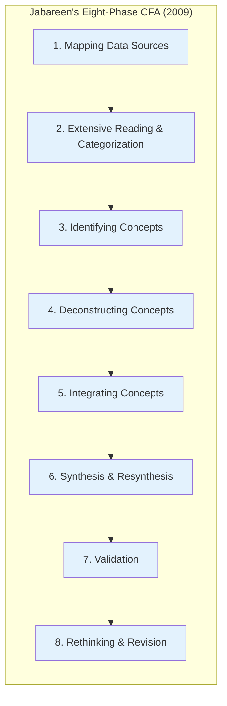
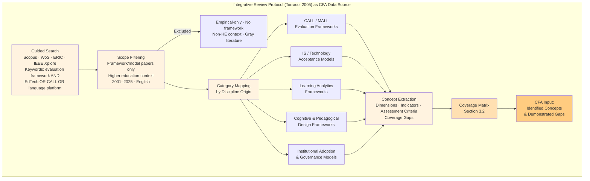
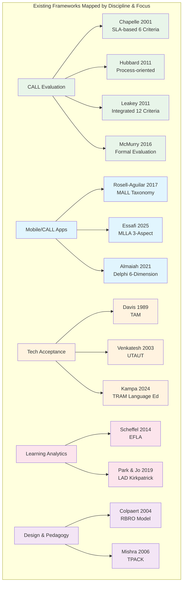
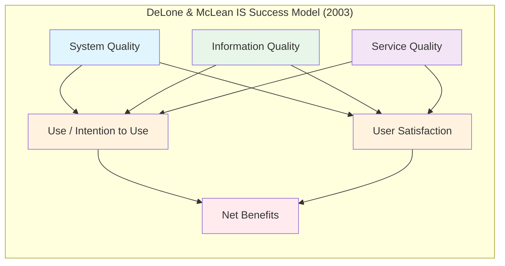
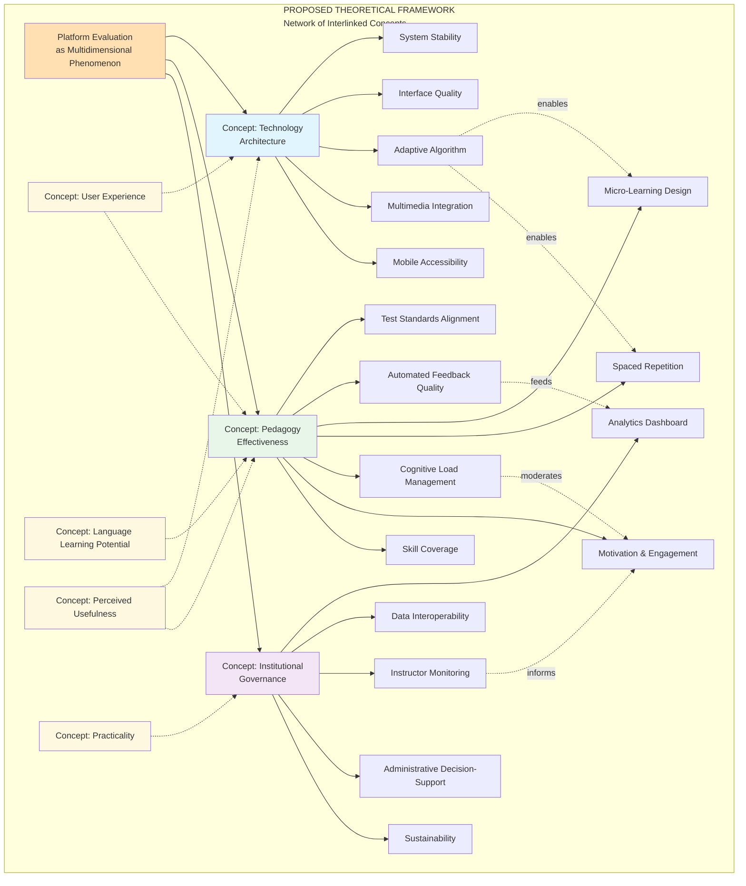
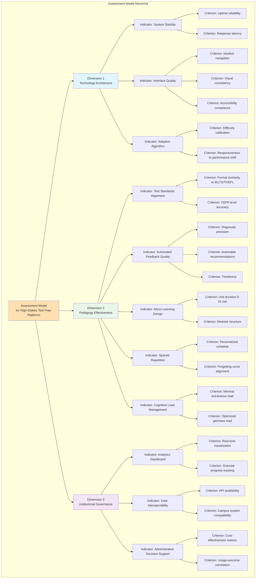
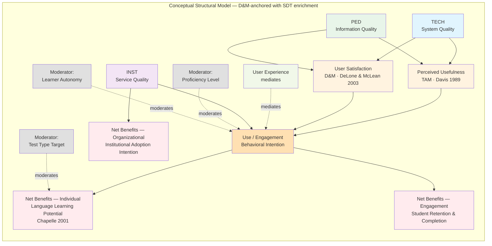

--

# **DRAFT KONSEP v0.1**

## **A Theoretical Framework and Assessment Model for Evaluating High-Stakes Language Test Preparation Platforms in Higher Education: A Conceptual Framework Analysis**

---

## **1. PENDAHULUAN**

### **1.1. Latar Belakang dan Gap Konseptual**

Pendidikan tinggi di era digital menghadapi tantangan fundamental dalam mengevaluasi platform teknologi pendidikan (*EdTech*) yang diadopsi untuk persiapan tes berbahasa bermutu tinggi (*high-stakes testing*) seperti IELTS dan TOEFL. Literatur menunjukkan bahwa evaluasi platform *Computer-Assisted Language Learning* (CALL) yang ada bersifat fragmented: berpusat pada aspek linguistik tanpa mempertimbangkan arsitektur sistem informasi, atau sebaliknya terlalu teknis tanpa membedah validitas pedagogis [1][2]. Kesenjangan ini diperparah oleh tidak adanya kerangka evaluasi yang secara spesifik dirancang untuk konteks *test preparation*, yang memerlukan presisi metrik *micro-learning*, *spaced repetition*, dan keselarasan dengan standar tes internasional [3].

Kajian terhadap *International Journal of Educational Technology in Higher Education* (ETHE) dan jurnal-jurnal *educational technology* bergengsi lainnya menunjukkan bahwa penelitian konseptual yang menyusun *theoretical framework* dan *assessment model* untuk teknologi pembelajaran mandiri mendapat perhatian signifikan, terutama ketika berhasil menjembatani disiplin Sistem Informasi dan Linguistik Terapan [4][5]. Namun, hingga saat ini belum ada *theoretical framework* yang secara eksplisit mengintegrasikan dimensi teknologi, pedagogi, dan institusional dalam satu model evaluasi untuk platform persiapan tes berbahasa.

### **1.2. Rumusan Masalah Konseptual**

Berdasarkan identifikasi gap di atas, rumusan masalah yang dikaji secara konseptual adalah:

1. **Bagaimana menyusun sebuah *theoretical framework* yang mensintesis teori penerimaan teknologi, teori pembelajaran bahasa berbantuan komputer, dan teori *learning analytics* untuk evaluasi platform persiapan tes berbahasa bermutu tinggi?**

2. **Bagaimana merumuskan *assessment model* dengan indikator dan definisi operasional yang dapat digunakan untuk menilai platform dari perspektif multi-stakeholder (mahasiswa, dosen, administrator) secara konseptual?**

3. **Bagaimana memetakan hubungan teoretis antar dimensi evaluasi dalam sebuah model struktural konseptual yang dapat diuji secara empiris di masa depan?**

### **1.3. Tujuan Penelitian**

| **Tujuan** | **Output Konseptual** |
|:---|:---|
| TK1 | Mensintesis literatur multidisiplin untuk mengidentifikasi konsep-konsep inti evaluasi platform |
| TK2 | Membangun *theoretical framework* multidimensional melalui *conceptual framework analysis* |
| TK3 | Merumuskan *assessment model* dengan rubrik evaluasi dan definisi operasional |
| TK4 | Mengembangkan model struktural konseptual dengan hipotesis teoretis untuk pengujian empiris mendatang |

---

## **2. METODOLOGI: CFA–DSR INTEGRATED APPROACH**

### **2.1. Filosofi dan Pendekatan**

Penelitian ini mengadopsi pendekatan metodologis hibrid yang mengintegrasikan dua tradisi penelitian IS yang saling komplementer: **Conceptual Framework Analysis (CFA)** sebagaimana diusulkan oleh Jabareen (2009) untuk fase konstruksi framework [6], dan **Design Science Research (DSR)** sebagaimana diformalisasi oleh Hevner et al. (2004) untuk fase validasi artefak [34]. Integrasi ini menghasilkan metodologi yang secara epistemologis lebih kuat daripada pendekatan konseptual murni: framework yang dihasilkan bukan sekadar konstruk interpretatif, melainkan sebuah **artefak IS yang dapat divalidasi secara formal**.

Dalam terminologi Gregor (2006) mengenai tipologi teori IS [35], penelitian ini menghasilkan **Type IV Theory (Explanatory and Predictive)**: sebuah konstruk teoritis yang tidak hanya menjelaskan *mengapa* platform EdTech berhasil atau gagal, tetapi juga menetapkan sistem persamaan struktural yang dapat diuji secara empiris di masa depan. Berbeda dari Type I (Analytic) yang murni konseptual, Type IV mensyaratkan spesifikasi formal hubungan antar konstruk — yang dipenuhi oleh proposisi P1–P8 dalam bentuk persamaan struktural pada Section 6.3.

*Philosophical stance* penelitian ini beroperasi di bawah **critical realism** (Bhaskar, 1975) pada level ontologis — menyatakan bahwa dimensi-dimensi evaluasi platform EdTech bersifat nyata dan dapat dipetakan, meski akses terhadapnya selalu dimediasi oleh teori. Pada level epistemologis, penelitian ini bersifat **post-positivist**: pengetahuan dibangun melalui sintesis konsep multidisiplin *dan* divalidasi melalui prosedur formal (mathematical proof dan computational simulation) yang bersifat reproducible dan falsifiable [7].

| **Layer Filosofis** | **Posisi** | **Implikasi Metodologis** |
|:---|:---|:---|
| **Ontologi** | *Critical realism* — dimensi evaluasi platform bersifat nyata dan dapat dipetakan | Framework yang dihasilkan bersifat *ontologically grounded*, bukan arbitrer |
| **Epistemologi** | *Post-positivism* — pengetahuan melalui sintesis konsep + validasi formal | CFA (konstruksi) + DSR (validasi artefak) sebagai metodologi tandem |
| **Metodologi** | CFA (Jabareen, 2009) + DSR (Hevner et al., 2004) [34] | CFA untuk Phases 1–6; DSR untuk Phase 7 (validasi) |
| **Kajian Literatur** | *Integrative review* (Torraco, 2005) [8] | Sintesis frameworks dari berbagai disiplin sebagai *data* konseptual |
| **Validasi** | Mathematical proof + Monte Carlo simulation | Reproducible, falsifiable, tidak bergantung pada pengumpulan data primer |

**Peran DSR dalam penelitian ini:** Dalam terminologi Hevner et al. (2004) [34], framework TECH+PED+INST berfungsi sebagai **IS artifact** — sebuah konstruk yang dirancang untuk memecahkan masalah nyata (fragmentasi framework evaluasi EdTech). DSR mensyaratkan bahwa artefak divalidasi melalui *evaluation activity* yang menyajikan *utility evidence*. Dalam penelitian ini, *evaluation activity* tersebut adalah: (a) coverage matrix analysis sebagai bukti completeness, (b) mathematical simulation sebagai bukti robustness, dan (c) formal LP-based gap proof sebagai bukti necessity. Dengan demikian, penelitian ini memenuhi ketiga klaim DSR yang disyaratkan Hevner et al.: *utility*, *novelty*, dan *rigor*.

### **2.2. Delapan Fase CFA dalam Penelitian Ini**

| **Fase**                                  | **Prosedur**                                                                                                                                                                                                                                                                                                                                                                                                                                                                                                                                                                                                                                                                                                                                                                                                                     | **Output**                                                      |
| :------------------------------------------| :---------------------------------------------------------------------------------------------------------------------------------------------------------------------------------------------------------------------------------------------------------------------------------------------------------------------------------------------------------------------------------------------------------------------------------------------------------------------------------------------------------------------------------------------------------------------------------------------------------------------------------------------------------------------------------------------------------------------------------------------------------------------------------------------------------------------------------| :----------------------------------------------------------------|
| **1. Mapping Data Sources**               | *Integrative literature review* (Torraco, 2005) [8] terhadap basis data Scopus, Web of Science, ERIC, dan IEEE Xplore dengan pertanyaan panduan: *"What evaluation frameworks exist for digital educational platforms, and what assessment dimensions do they address or neglect?"* Kriteria inklusi: paper yang menyajikan atau mengkritisi framework/model evaluasi platform digital pembelajaran dalam konteks higher education, CALL, MALL, atau LMS (2001–2025, bahasa Inggris).                                                                                                                                                                                                                                                                                                                                            | Korpus frameworks untuk analisis konseptual                     |
| **2. Extensive Reading & Categorization** | Klasifikasi literatur berdasarkan disiplin asal (linguistik terapan, sistem informasi, pendidikan, psikologi kognitif) dan jenis framework (evaluatif, prediktif, desain, adopsi)                                                                                                                                                                                                                                                                                                                                                                                                                                                                                                                                                                                                                                                | Matriks kategorisasi literatur                                  |
| **3. Identifying Concepts**               | Ekstraksi konsep-konsep inti yang berulang secara signifikan: *language learning potential*, *learner fit*, *perceived usefulness*, *cognitive load*, *learning analytics*, *institutional adoption*                                                                                                                                                                                                                                                                                                                                                                                                                                                                                                                                                                                                                             | Daftar konsep kandidat                                          |
| **4. Deconstructing Concepts**            | Analisis komponen, sejarah, dan relasi antar konsep berdasarkan teori asalnya (misal: *cognitive load* dari Sweller; *perceived usefulness* dari Davis)                                                                                                                                                                                                                                                                                                                                                                                                                                                                                                                                                                                                                                                                          | Definisi komponensial per konsep                                |
| **5. Integrating Concepts**               | Penyatuan konsep-konsep dari disiplin berbeda ke dalam dimensi-dimensi evaluasi yang saling melengkapi                                                                                                                                                                                                                                                                                                                                                                                                                                                                                                                                                                                                                                                                                                                           | Dimensi preliminary framework                                   |
| **6. Synthesis & Resynthesis**            | Penyusunan jaringan konsep (*network of interlinked concepts*) yang membentuk *plane of understanding* fenomena evaluasi platform                                                                                                                                                                                                                                                                                                                                                                                                                                                                                                                                                                                                                                                                                                | Theoretical framework v0.1                                      |
| **7. Validation**                         | Validasi tiga-lapis sesuai DSR (Hevner et al., 2004) [34]: **(Layer 1 — Theoretical)** Coverage matrix cross-validation: framework yang diusulkan merupakan satu-satunya dengan skor 5.0/5.0. **(Layer 2 — Mathematical)** Formal proof melalui *linear programming* membuktikan bahwa D4 Gap bersifat *unclosable* oleh kombinasi konveks manapun dari 12 framework yang ada (max achievable D4 = 0.5000 < 1.0, lihat Section 6.4 Theorem 1). **(Layer 3 — Computational)** Monte Carlo simulation (N = 50,000) membuktikan bahwa kesimpulan gap tidak sensitif terhadap ketidakpastian koding: dengan probabilitas 99.50%, tidak ada framework yang ada yang melampaui 3.0/5 di bawah variasi coding ±0.2; Weighted sensitivity analysis (N = 100,000, Dirichlet sampling) mengkonfirmasi F* mendominasi semua framework yang ada dengan probabilitas 100% di bawah semua vektor bobot yang mungkin. | Validated framework v1.0; simulation results JSON; formal proofs |
| **8. Rethinking & Revision**              | Revisi berulang berdasarkan masukan pakar dan *cross-mapping* dengan framework yang ada untuk memastikan *novelty* dan *non-redundancy*                                                                                                                                                                                                                                                                                                                                                                                                                                                                                                                                                                                                                                                                                          | Final theoretical framework                                     |

### **2.3. Integrative Review Protocol sebagai Data Source CFA**

*Integrative review* digunakan sebagai teknik pengumpulan "data" konseptual dalam penelitian ini, merujuk pada protokol Torraco (2005) [8] yang dirancang khusus untuk *theory development* dan *conceptual synthesis* — berbeda dari *systematic review* (PRISMA) yang berorientasi pada ringkasan temuan empiris. Protokol ini mengizinkan inklusi sumber beragam jenis (empiris, teoretis, metodologis) dan tidak mensyaratkan reproducibility protocol sekaku meta-analisis.

**Pertanyaan panduan review:** *"What evaluation frameworks exist for digital educational platforms, and what assessment dimensions do they address or neglect in the context of higher education language learning?"*

---

### **2.4. Mathematical Framework Specification**

Untuk memenuhi standar rigor DSR (Hevner et al., 2004) [34] dan Type IV theory (Gregor, 2006) [35], penelitian ini menetapkan spesifikasi matematika formal dari kerangka yang diusulkan. Spesifikasi ini berfungsi sebagai: (a) definisi operasional yang tepat dan tidak ambigu bagi setiap konstruk; (b) fondasi bagi prosedur validasi formal di Section 6.4; dan (c) template hipotesis yang siap diuji secara empiris melalui SEM di masa depan.

#### **2.4.1. Formalisasi Coverage Score**

Misalkan $\mathcal{F} = \{F_1, \ldots, F_{12}\}$ adalah himpunan framework yang ditelaah, dan $\mathcal{D} = \{D_1, D_2, D_3, D_4, D_6\}$ adalah himpunan dimensi evaluasi. Fungsi koding $s: \mathcal{F} \times \mathcal{D} \to \{0, 0.5, 1.0\}$ menghasilkan *Coverage Score*:

$$\text{CS}(f) = \sum_{d \in \mathcal{D}} s(f,d), \quad \text{CS}(f) \in [0, 5.0]$$

Framework yang diusulkan $F^*$ memiliki $s(F^*, d) = 1.0$ untuk semua $d \in \mathcal{D}$, sehingga $\text{CS}(F^*) = 5.0$. Nilai ini merupakan nilai maksimum yang dapat dicapai dan satu-satunya yang tercapai dalam korpus (observasi: $\max_{f \in \mathcal{F}} \text{CS}(f) = 2.5$).

#### **2.4.2. Composite Platform Quality Score**

Kualitas keseluruhan platform dalam konteks evaluasi diformulasikan sebagai *weighted composite*:

$$Q_{\text{platform}} = \alpha \cdot Q_{\text{TECH}} + \beta \cdot Q_{\text{PED}} + \gamma \cdot Q_{\text{INST}}$$

dimana $\alpha + \beta + \gamma = 1$, $\alpha, \beta, \gamma > 0$, dan setiap komponen kualitas dimensi:

$$Q_{\text{TECH}} = \frac{\sum_{k} w_k \cdot x_k^{\text{TECH}}}{\sum_k w_k}, \quad Q_{\text{PED}} = \frac{\sum_{j} w_j \cdot x_j^{\text{PED}}}{\sum_j w_j}, \quad Q_{\text{INST}} = \frac{\sum_{l} w_l \cdot x_l^{\text{INST}}}{\sum_l w_l}$$

di mana $x_k^{\text{TECH}} \in [0,1]$ adalah skor indikator ke-$k$ dari dimensi TECH (total 5 indikator TECH-1 s.d. TECH-5), dan seterusnya.

#### **2.4.3. Formal Structural Equations (Preview dari P1–P8)**

Proposisi P1–P8 diformulasikan sebagai sistem persamaan struktural berikut (detail dan validasi di Section 6.3):

$$\text{PU} = \beta_1 \cdot Q_{\text{TECH}} + \beta_2 \cdot Q_{\text{PED}} + \varepsilon_1 \quad [P1, P2; \; \beta_1, \beta_2 > 0]$$

$$\text{SAT} = \beta_3 \cdot Q_{\text{TECH}} + \beta_4 \cdot Q_{\text{PED}} + \varepsilon_2 \quad [P1; \; \beta_3, \beta_4 > 0]$$

$$\text{USE} = \beta_5 \cdot \text{PU} + \beta_6 \cdot \text{SAT} + \beta_7 \cdot Q_{\text{INST}} + \varepsilon_3 \quad [P3, P4; \; \beta_5, \beta_6, \beta_7 > 0]$$

$$\text{NB}_{\text{ind}} = \beta_8 \cdot \text{USE} + \varepsilon_4 \quad [P6; \; \beta_8 > 0]$$

$$\text{NB}_{\text{org}} = \beta_9 \cdot Q_{\text{INST}} + \varepsilon_5 \quad [P7; \; \beta_9 > 0]$$

$$\text{USE}^* = \text{USE} \cdot (\delta_1 \cdot \text{PROF} + \delta_2 \cdot \text{TEST} + \delta_3 \cdot \text{TR}) + \varepsilon_6 \quad [P8; \; \text{moderation}]$$

di mana semua parameter $\beta_i > 0$ sesuai dengan prediksi arah D\&M [31] dan TAM [11], dan sign $\delta_i$ dapat positif atau negatif tergantung pada arah moderasi yang diuji. Sistem ini membentuk *path model* yang sepenuhnya *identified* dan siap diuji melalui *Partial Least Squares SEM (PLS-SEM)* atau *Covariance-Based SEM (CB-SEM)* pada penelitian empiris lanjutan.

---

## **3. SINTESIS LITERATUR: PEMETAAN FRAMEWORK YANG ADA**

### **3.1. Peta Teoretis Evaluasi CALL**

### **3.2. Analisis Gap Konseptual**

Berdasarkan dekontruksi framework yang ada melalui CFA, teridentifikasi lima gap konseptual utama:

| **No** | **Gap Konseptual** | **Manifestasi di Literatur** |
|:---:|:---|:---|
| 1 | **Kontekstualitas** | Framework CALL/MALL bersifat umum; tidak ada yang secara eksplisit menspesifikasikan metrik untuk *high-stakes testing preparation* (presisi standar tes, *micro-learning*, *spaced repetition*) [1][3][5] |
| 2 | **Multidisiplinari** | Framework berasal dari silo disiplin: linguistik (Chapelle, Leakey) atau sistem informasi (Almaiah) tanpa sintesis teoretis yang mengintegrasikan keduanya [2][4] |
| 3 | **Institusionalitas** | Aspek *learning analytics* dan *decision-making* untuk administrator institusi hampir tidak terwakili dalam framework evaluasi pembelajaran mandiri [9][10] |
| 4 | **Strukturalitas** | Hubungan antar dimensi (misal: bagaimana kualitas teknologi mempengaruhi pembelajaran melalui mediasi motivasi) belum dipetakan dalam model kausal konseptual untuk konteks ini [11][12] |
| 5 | **Operasionalitas** | Banyak framework berupa *checklist* reflektif tanpa definisi operasional yang memadai untuk pengukuran sistematis [6][13] |

### **3.2.1. Coverage Matrix: Bukti Empiris Gap Konseptual**

Matriks berikut memetakan setiap framework yang dianalisis terhadap lima dimensi evaluasi. Matriks ini berfungsi sebagai **bukti demonstratif** (bukan sekadar *assertion*) dari lima gap yang diklaim di atas, sekaligus menjadi landasan *theoretical cross-validation* pada Phase 7 CFA.

**Legenda:** ✓ Tercakup penuh | ◑ Tercakup parsial | ✗ Tidak tercakup

| **Framework**                                        | **D1 TECH** | **D2 PED** | **D3 INST** | **D4 High-Stakes** | **D6 Multi-Stakeholder** | **Score /5** | **D5 Rigor†** |
| :-----------------------------------------------------| :-----------:| :----------:| :-----------:| :------------------:| :------------------------:| :------------:| :-------------:|
| F1 Chapelle (2001) [1] — SLA-based                   | ✗           | ✓          | ✗           | ◑                  | ✗                        | 1.5/5        | ◑             |
| F2 Hubbard (2011) [2] — Process-oriented             | ✗           | ✓          | ✗           | ✗                  | ✗                        | 1.0/5        | ◑             |
| F3 Leakey (2011) [3] — Integrated 12 criteria        | ◑           | ✓          | ✗           | ✗                  | ✗                        | 1.5/5        | ◑             |
| F4 Colpaert (2004) — RBRO                            | ✗           | ✓          | ✗           | ✗                  | ✗                        | 1.0/5        | ◑             |
| F5 Rosell-Aguilar (2017) [5] — MALL Taxonomy         | ◑           | ◑          | ✗           | ✗                  | ✗                        | 1.0/5        | ✗             |
| F6 Almaiah et al. (2021) — Delphi 6-Dimension        | ✓           | ◑          | ◑           | ✗                  | ◑                        | 2.5/5        | ✗             |
| F7 Al-Fraihat et al. (2020) [4] — E-learning Success | ✓           | ◑          | ◑           | ✗                  | ◑                        | 2.5/5        | ◑             |
| F8 Scheffel/EFLA (2014) [9] — EFLA                   | ✗           | ✗          | ✓           | ✗                  | ◑                        | 1.5/5        | ◑             |
| F9 Park & Jo (2019) [10] — LAD                       | ✗           | ✗          | ✓           | ✗                  | ◑                        | 1.5/5        | ◑             |
| F10 UTAUT/Venkatesh (2003) — technology adoptions    | ◑           | ✗          | ✗           | ✗                  | ✗                        | 0.5/5        | ✗             |
| F11 TRAM/Kampa (2024) — Language EdTech              | ◑           | ◑          | ✗           | ✗                  | ✗                        | 1.0/5        | ✗             |
| F12 Essafi/MLLA (2025) — MALL                        | ◑           | ✓          | ✗           | ◑                  | ✗                        | 2.0/5        | ✗             |
| **Framework ini (F*)**                               | **✓**       | **✓**      | **✓**       | **✓**              | **✓**                    | **5.0/5**    | **✓**         |

†*D5 Rigor: ◑ = partial operational definitions; ✗ = reflective checklist only; ✓ = full operationalization (diperoleh melalui F* dalam bentuk matriks operasional rinci).*

*Tabel di atas mengonfirmasi bahwa tidak ada satu pun framework yang ada secara simultan mencakup kelima dimensi. Framework yang diusulkan adalah satu-satunya yang memenuhi semua dimensi sekaligus.*

---

## **3.3. Fondasi Meta-Teoretis: DeLone & McLean IS Success Model**

Identifikasi gap konseptual di atas mengarah pada pertanyaan mendasar: **apa yang dapat menjadi "payung" meta-teoretis yang secara deduktif membenarkan tiga dimensi evaluasi yang diusulkan?** Pilihan meta-teori ini kritis — tanpanya, pemilihan tiga dimensi bersifat arbitrer dan rentan terhadap kritik reviewer.

Penelitian ini mengadopsi **DeLone & McLean IS Success Model** (D&M, 2003) [31] sebagai meta-teori unifikasi. D&M adalah salah satu model IS paling sering dikutip dalam literatur (>8.000 kutipan, Scopus) dan secara empiris telah divalidasi di berbagai konteks, termasuk e-learning dan EdTech [32].

### **3.3.1. Anatomi D&M IS Success Model (2003)**

D&M menyatakan bahwa keberhasilan sistem informasi ditentukan oleh tiga kualitas intrinsik yang saling berinteraksi, menghasilkan *Use/Intention to Use*, *User Satisfaction*, dan *Net Benefits*:

### **3.3.2. Pemetaan Deduktif D&M ke Tiga Dimensi Framework**

Penerapan D&M pada konteks platform persiapan tes berbahasa di perguruan tinggi menghasilkan pemetaan deduktif yang defensible:

| **D&M Construct** | **Operasionalisasi dalam Konteks EdTech Bahasa** | **Dimensi Framework** |
|:---|:---|:---:|
| *System Quality* | Reliabilitas teknis, adaptivitas algoritma, aksesibilitas, kualitas antarmuka platform | **TECH** |
| *Information Quality* | Kualitas konten pedagogis: keselarasan standar tes, efektivitas feedback, desain kognitif, cakupan keterampilan | **PED** |
| *Service Quality* | Mekanisme dukungan institusional: analytics dashboard, monitoring dosen, interoperabilitas data, decision-support | **INST** |
| *Net Benefits* | Dalam domain ini: peningkatan profisiensi bahasa (*Language Learning Potential* — Chapelle, 2001 [1]) dan keberhasilan tes | **Outcome** |

Dengan pemetaan ini, pertanyaan "*mengapa tepat tiga dimensi?*" terjawab secara deduktif: karena D&M telah membuktikan secara empiris bahwa IS success memerlukan ketiga kualitas ini secara simultan, dan tidak ada yang dapat direduksi ke yang lain. Penelitian ini bukan memilih tiga dimensi secara induktif dari gap analysis — melainkan mendeduktifkan dimensi dari meta-teori IS yang established, kemudian mengoperasionalisasikannya ke dalam domain spesifik.

**Catatan penting:** D&M digunakan di sini pada level **ontologis** (sebagai panduan tentang *apa yang ada* dalam platform EdTech yang sukses), bukan pada level **metodologis** (instrumen pengukuran D&M tidak diadopsi). Ini adalah penggunaan teori IS yang sah dan telah dipraktikkan dalam berbagai penelitian konseptual sebelumnya [32].

---

### **3.4. Boundary Conditions D&M: Mengapa CALL dan SLA Theory Tetap Diperlukan**

Adopsi D&M sebagai meta-teori unifikasi memiliki *boundary conditions* yang penting untuk dikemukakan secara eksplisit — bukan untuk melemahkan pilihan D&M, melainkan untuk memperkuat justifikasi mengapa kerangka ini tidak berhenti pada D&M saja.

**Keterbatasan D&M dalam konteks domain bahasa:**

D&M (2003) [31] mendefinisikan *Information Quality* sebagai akurasi, kelengkapan, dan relevansi informasi yang disampaikan sistem. Namun dalam konteks platform persiapan tes berbahasa, "informasi" yang disampaikan bukan sekadar data atau konten generik — melainkan **materi pembelajaran bahasa dengan standar psikometrik tes internasional** (IELTS, TOEFL, CEFR). D&M tidak mendefinisikan apa yang membuat *Information Quality* tinggi dalam konteks SLA: apakah *authenticity* materi, *washback effect*, *spaced repetition*, atau keselarasan *task type* dengan *band descriptors*. Ini adalah domain-knowledge gap yang D&M tidak dirancang untuk mengisi.

Serupa halnya, *Service Quality* dalam D&M merujuk pada responsivitas dan empati layanan sistem. Dalam konteks perguruan tinggi, *Service Quality* harus dioperasionalisasikan dalam konteks governance akademis: *learning analytics*, monitoring mahasiswa berisiko, interoperabilitas dengan SIAKAD, dan *evidence-based decision-making* untuk perpanjangan lisensi platform — konstruk-konstruk yang tidak ada dalam literatur D&M.

**Implikasi untuk kerangka ini:**

| **D&M Construct** | **D&M Boundary** | **Domain-Specific Fill** |
|:---|:---|:---|
| *Information Quality* | Tidak mendefinisikan "quality" untuk domain SLA | CALL theory (Chapelle, 2001) [1]; *Language Learning Potential*; *Washback Theory* [21] |
| *Service Quality* | Tidak operasionalisasikan governance akademik | EFLA (Scheffel et al., 2014) [9]; *IT Governance* (Tornatzky & Fleischer, 1990) [18] |
| *Net Benefits* | Bersifat generik (organizational, individual) | Dioperasionalisasikan sebagai *Language Learning Potential* + *Institutional Adoption Intention* |

Dengan demikian, framework ini mengadopsi D&M sebagai **scaffold ontologis** — bukan sebagai instrumen pengukuran yang lengkap. CALL theory, SLA, dan EFLA berperan mengisi celah domain-specificity yang memang bukan wilayah D&M. Relasi ini bersifat komplementer, bukan kompetitif.

---

## **4. THEORETICAL FRAMEWORK YANG DIUSULKAN**

### **4.1. Filosofi Kerangka**

Kerangka ini dikonseptualisasikan sebagai **jaringan konsep** (*network of interlinked concepts*) yang bersifat interpretatif dan indeterministik [6]. Setiap dimensi bukan variabel bebas/terikat dalam pengertian kuantitatif, melainkan **konsep yang saling mengartikulasikan** untuk memberikan pemahaman komprehensif terhadap fenomena evaluasi platform [6][7].

Tiga dimensi kerangka ini — **Technology Architecture (TECH)**, **Pedagogy Effectiveness (PED)**, dan **Institutional Governance (INST)** — diturunkan secara **deduktif** dari DeLone & McLean IS Success Model (2003) [31], bukan dipilih secara induktif semata dari gap analysis. D&M menetapkan bahwa keberhasilan sistem informasi memerlukan *System Quality*, *Information Quality*, dan *Service Quality* secara simultan. Dalam domain spesifik platform persiapan tes berbahasa di perguruan tinggi, ketiga kualitas D&M dioperasionalisasikan menjadi tiga dimensi:

$$\text{TECH} \leftarrow \text{System Quality} \quad|\quad \text{PED} \leftarrow \text{Information Quality} \quad|\quad \text{INST} \leftarrow \text{Service Quality}$$

Operasionalisasi ini bukan sekadar relabeling — setiap dimensi memerlukan pengisian konseptual dari literatur domain-spesifik (CALL, SLA, EFLA) karena D&M tidak mendefinisikan indikator domain bahasa. Jaringan konsep dalam kerangka ini kemudian diperkaya oleh konsep-konsep penyilang dari TAM (Davis, 1989) [11] dan SDT (Deci & Ryan) [12] yang beroperasi sebagai mekanisme penghubung antara kualitas platform dan *outcomes* pembelajaran.

### **4.2. Justifikasi Teoretis per Dimensi**

#### **Dimensi 1: Technology Architecture (TECH)**

*D&M anchor: System Quality — keandalan, adaptivitas, dan aksesibilitas teknis platform sebagai prasyarat IS success [31].*

Dimensi ini disintesis dari teori *Human-Computer Interaction* (HCI), *Technology Acceptance Model* (TAM), dan kriteria teknis evaluasi CALL [1][2][11]. Konsep *System Stability* diadopsi dari framework evaluasi *software engineering* yang menekankan keandalan sistem sebagai prasyarat *learning experience* [14]. Konsep *Adaptive Algorithm* berasal dari teori *intelligent tutoring systems* dan *adaptive learning* yang menyatakan bahwa personalisasi konten merupakan determinan utama efektivitas pembelajaran mandiri [15]. *Interface Quality* dengan prinsip *zero UI* diintegrasikan dari teori *cognitive load* yang menyatakan bahwa antarmuka yang kompleks meningkatkan *extraneous cognitive load* dan mengurangi kapasitas pemrosesan bahasa [16].

#### **Dimensi 2: Pedagogy Effectiveness (PED)**

*D&M anchor: Information Quality — akurasi, relevansi, dan nilai guna informasi (konten) yang disampaikan platform kepada pengguna [31]. Dalam konteks bahasa, "information" adalah materi, feedback, dan desain pembelajaran itu sendiri.*

Dimensi ini mensintesis teori *Second Language Acquisition* (SLA) dari Chapelle [1], teori *feedback* dari Hattie & Timperley [17], dan teori *micro-learning* dari literatur *mobile learning* [5]. Konsep *Test Standards Alignment* diperlukan karena dalam konteks *high-stakes testing*, *authenticity* materi bukan sekadar relevansi komunikatif tetapi keselarasan dengan format, rubrik, dan *band descriptor* tes target [3]. *Cognitive Load Management* diadopsi dari Sweller untuk memastikan bahwa desain pedagogis tidak membebani *working memory* pembelajar secara berlebihan [16]. *Motivation & Engagement* diintegrasikan dari *Self-Determination Theory* (SDT) yang menyatakan bahwa *autonomy*, *competence*, dan *relatedness* memediasi keterlibatan pembelajar pada platform mandiri [12].

#### **Dimensi 3: Institutional Governance (INST)**

*D&M anchor: Service Quality — dukungan yang diberikan sistem kepada pengguna (dosen, administrator) dalam menjalankan fungsi-fungsi organisasional; beroperasi di level institusi, bukan individu [31][32].*

Dimensi ini disintesis dari *Evaluation Framework for Learning Analytics* (EFLA) [9], teori *organizational adoption of IT* dari Tornatzky & Fleischer [18], dan perspektif *university governance* dari literatur *educational technology in higher education* [4][10]. Konsep *Analytics Dashboard* dan *Instructor Monitoring* berasal dari EFLA yang menekankan bahwa alat analitik harus menghasilkan *awareness*, *reflection*, dan *impact* tidak hanya bagi pembelajar tetapi juga bagi pengajar [9]. *Administrative Decision-Support* diintegrasikan dari literatur *IT governance* yang menyatakan bahwa adopsi teknologi pendidikan di institusi memerlukan *evidence-based justification* untuk alokasi sumber daya [18].

### **4.3. Konsep-Konsep Penyilang (Cross-Cutting Concepts)**

| **Konsep** | **Asal Teori** | **Fungsi dalam Kerangka** |
|:---|:---|:---|
| *Language Learning Potential* | Chapelle (2001) [1] | **Operasionalisasi domain-spesifik dari "Net Benefits" D&M** [31]: dalam konteks platform persiapan tes bahasa, "keberhasilan IS" dimaknai sebagai peningkatan potensi pemerolehan bahasa — bukan sekadar kepuasan pengguna. LLP adalah *evaluative criterion* (bukan mediating construct psikologis). Secara konseptual, LLP adalah construct yang **mengoperasionalisasikan D4 (High-Stakes Test Specificity)** di level framework ini: dimensi D4 pada scoping review mengidentifikasi *absence*-nya di seluruh 12 framework yang ada; LLP adalah *substance* yang mengisi kekosongan tersebut melalui PED-1 (Test Standards Alignment) dan PED-4 (Spaced Repetition). |
| *Perceived Usefulness & Ease of Use* | Davis (1989) [11] | Konstruk penghubung antara kualitas platform (TECH/PED) dengan *Use* dan *User Satisfaction* dalam alur D&M; beroperasi di level persepsi individu |
| *User Experience* | Rosell-Aguilar (2017) [5] | Konsep holistik yang mengartikulasikan kualitas interaksi antara dimensi teknis dan pedagogis; mediator antara kualitas sistem dan *Use* |
| *Practicality* | Chapelle (2001) [1]; Hubbard (2011) [2] | Konsep yang mengartikulasikan kelayakan *Service Quality* (INST) dalam konteks institusi riil; penghubung antara INST dan *Institutional Adoption Intention* |
| *Multi-Stakeholder Perspective* | Scheffel et al. (2014) [9] | Dimensi D6 yang dalam scoping review tidak pernah mencapai cakupan penuh di framework manapun; dalam kerangka ini dioperasionalisasikan melalui INST-3 (Instructor Monitoring) dan INST-4 (Administrative Decision-Support), yang secara bersama mengakomodasi perspektif learner, instructor, *dan* administrator dalam satu dimensi governance. |

---

## **5. ASSESSMENT MODEL YANG DIUSULKAN**

### **5.1. Filosofi Assessment Model**

Assessment model dikonseptualisasikan sebagai **rubrik evaluasi teoretis** (*theoretical rubric*) yang terdiri dari dimensi, indikator, dan definisi operasional. Model ini bersifat **konseptual-interpretatif**: dirancang untuk memandu evaluasi dan menjadi fondasi bagi pengembangan instrumen empiris di masa depan, bukan sebagai instrumen pengukuran yang sudah tervalidasi secara psikometrik [6][13].

### **5.2. Struktur Hierarki Assessment Model**

### **5.3. Matriks Definisi Operasional (Operational Definitions)**

#### **Dimensi Technology Architecture**

| **Indikator** | **Definisi Operasional Konseptual** | **Teori Asal** | **Penggunaan dalam Evaluasi** |
|:---|:---|:---|:---|
| TECH-1 System Stability | Keandalan arsitektur sistem dalam mempertahankan ketersediaan layanan di bawah beban pengguna yang bervariasi, diukur dari perspektif ketahanan infrastruktur | *Software Quality Models* (ISO 25010) [14] | Evaluasi teknis terhadap kapasitas server, *load balancing*, dan *fault tolerance* |
| TECH-2 Interface Quality | Tingkat kualitas antarmuka yang memungkinkan interaksi pembelajar-platform dengan beban kognitif minimal, mengacu pada prinsip *zero UI* dan *minimalist design* | *Cognitive Load Theory* [16]; *TAM* [11] | Analisis heuristik antarmuka; *cognitive walkthrough* |
| TECH-3 Adaptive Algorithm Performance | Kemampuan algoritma *item response theory*, model adaptif, atau agen LLM/Generative AI dalam menyesuaikan tingkat kesulitan konten dan materi latihan secara dinamis serta stabil | *Intelligent Tutoring Systems* [15]; *Adaptive Learning*; *Generative AI in Education* [37][40] | Evaluasi logika adaptivitas, stabilitas prompt, latensi respon AI, dan *convergence rate* penyesuaian |
| TECH-4 Multimedia Integration | Kelengkapan dan kualitas elemen multimedia (audio, video, grafik) yang mendukung multimodalitas pemrosesan bahasa | *Dual Coding Theory* [19]; *Multimedia Learning* [20] | Analisis konten; kualitas media |
| TECH-5 Mobile Accessibility | Ketersediaan akses platform melalui perangkat mobile dengan fungsionalitas setara, termasuk fitur *offline-first* untuk konteks konektivitas terbatas | *Mobile-Assisted Language Learning* (MALL) [5] | Evaluasi responsivitas; *offline capability audit* |

#### **Dimensi Pedagogy Effectiveness**

| **Indikator** | **Definisi Operasional Konseptual** | **Teori Asal** | **Penggunaan dalam Evaluasi** |
|:---|:---|:---|:---|
| PED-1 Test Standards Alignment | Derajat keselarasan materi, format soal, rubrik penilaian, dan *task type* dengan standar tes internasional (IELTS/TOEFL) serta *Common European Framework of Reference* (CEFR) | *Authenticity* dalam SLA [1]; *Washback Theory* [21] | *Content analysis* terhadap keselarasan dengan *band descriptors* |
| PED-2 Automated Feedback Quality | Kualitas *feedback* otomatis (berbasis aturan tradisional atau *automated writing/speaking evaluation* berbasis LLM) dalam memberikan analisis diagnostik presisi, bebas bias halusinasi AI, serta memiliki saran perbaikan konkrit | *Feedback Model* Hattie & Timperley [17]; *Formative Assessment*; *AI Feedback Diagnostics* [38][39] | Uji reliabilitas diagnostik, deteksi tingkat halusinasi/eror AI, dan kelayakan tindak lanjut (*actionability*) feedback |
| PED-3 Micro-Learning Design | Efektivitas desain unit pembelajaran singkat yang terstruktur untuk retensi maksimal dalam waktu minimal, mengacu pada batasan *attention span* dan *working memory* | *Micro-Learning Theory* [22]; *Cognitive Load Theory* [16] | Evaluasi arsitektur konten; durasi dan struktur unit |
| PED-4 Spaced Repetition | Efektivitas algoritma pengulangan terjadwal yang mengoptimalkan *retention interval* berdasarkan performa historis individu | *Spacing Effect* (Ebbinghaus; Cepeda) [23] | Evaluasi algoritma *scheduling*; logika *interval* |
| PED-5 Cognitive Load Management | Kemampuan desain pedagogis dalam meminimalkan *extraneous load* dan memaksimalkan *germane load* selama pemrosesan bahasa | *Cognitive Load Theory* (Sweller) [16] | *Heuristic evaluation* beban kognitif per tugas |
| PED-6 Motivation & Engagement | Dampak elemen desain (gamifikasi, *progress visualization*, *social comparison*) terhadap motivasi intrinsik dan pengurangan *foreign language anxiety* | *Self-Determination Theory* (Deci & Ryan) [12]; *Flow Theory* [24] | Analisis mekanik motivasi; *anxiety reduction* features |
| PED-7 Skill Coverage | Kelengkapan cakupan keterampilan bahasa (*reading*, *writing*, *listening*, *speaking*) dengan distribusi proporsional dan kedalaman sesuai kompleksitas tes | *Communicative Language Teaching* [25]; *Integrated Skills Approach* | *Content mapping* terhadap *test specifications* |

#### **Dimensi Institutional Governance**

| **Indikator** | **Definisi Operasional Konseptual** | **Teori Asal** | **Penggunaan dalam Evaluasi** |
|:---|:---|:---|:---|
| INST-1 Learning Analytics Dashboard | Ketersediaan antarmuka analitik yang menyajikan data progres pembelajar dalam format visual yang mendukung *awareness* dan *reflection* bagi pengajar | *Evaluation Framework for Learning Analytics* (EFLA) [9] | Evaluasi fitur dashboard; granularitas data |
| INST-2 Data Interoperability | Kemampuan platform untuk bertukar data dengan sistem informasi kampus (SIAKAD, LMS) melalui standar protokol terbuka (API, LTI, xAPI) | *Interoperability Standards* [26]; *Enterprise Architecture* | Audit teknis interoperabilitas |
| INST-3 Instructor Monitoring | Ketersediaan mekanisme bagi dosen untuk memantau progres, mengidentifikasi *at-risk students*, dan mengintervensi berdasarkan data analitik | *Teacher Dashboard Design* [10]; *Early Warning Systems* [27] | Evaluasi fitur monitoring; *alert mechanisms* |
| INST-4 Administrative Decision-Support | Ketersediaan metrik dan visualisasi yang mendukung pengambilan kebijakan adopsi, perpanjangan lisensi, atau terminasi platform oleh administrator | *IT Governance* [18]; *Evidence-Based Management* | Evaluasi *reporting features*; ROI metrics |
| INST-5 Sustainability & Scalability | Kapasitas platform untuk berkembang sesuai pertumbuhan jumlah pengguna dan evolusi kebutuhan institusi tanpa degradasi kualitas | *Technology Sustainability Models* [28] | Evaluasi arsitektur *scalability*; roadmap pengembang |

---

## **6. MODEL STRUKTURAL KONSEPTUAL**

### **6.1. Pemetaan Hubungan Teoretis**

Model struktural konseptual ini dibangun di atas kerangka D&M (2003) [31] sebagai tulang punggung, diperkaya oleh SDT [12] untuk menjelaskan mekanisme psikologis di level individu. D&M menentukan alur makro (*System/Information/Service Quality → Use/Satisfaction → Net Benefits*); SDT menjelaskan **mengapa** kualitas platform diterjemahkan menjadi motivasi dan keterlibatan (*autonomy*, *competence*, *relatedness*). Model ini bersifat kausal-teoretis dan disajikan sebagai **proposisi teoretis** untuk pengujian empiris mendatang [31][12].

**Perbaikan kritis dari draft sebelumnya:** P3 dalam draft lama bermasalah karena menempatkan INST (level organisasi) sebagai prediktor langsung *Perceived Ease of Use* (level individu) — lompatan level analisis yang tidak valid. Dalam model yang direvisi, INST beroperasi secara parallel dengan TECH/PED: ketiganya sebagai anteseden kualitas platform yang masing-masing mengarah ke *outcomes* sesuai level analisisnya.

### **6.2. Proposisi Teoretis (Theoretical Propositions)**

Delapan proposisi berikut disusun dengan tipe klaim yang sejajar dan eksplisit, berbasis D&M sebagai meta-teori dan SDT sebagai mekanisme psikologis.

| **Kode** | **Tipe** | **Proposisi Teoretis** | **Dasar Argumen Teoretis** |
|:---|:---:|:---|:---|
| P1 | *Main effect* | Kualitas arsitektur teknologi (*System Quality*) secara langsung meningkatkan *Perceived Usefulness* dan *User Satisfaction* platform bagi pembelajaran | D&M: System Quality adalah anteseden langsung Use dan Satisfaction [31]; TAM: PU ditentukan oleh kualitas sistem [11] |
| P2 | *Main effect* | Efektivitas pedagogis (*Information Quality*) secara langsung meningkatkan *Perceived Usefulness* dan *Language Learning Potential* platform | D&M: Information Quality menentukan User Satisfaction [31]; Chapelle: LLP adalah kriteria sentral evaluasi CALL [1] |
| P3 | *Main effect* | Tata kelola institusional (*Service Quality*) secara langsung meningkatkan *Use* platform oleh dosen dan administrator, serta *Institutional Adoption Intention* | D&M: Service Quality beroperasi di level organisasi, mempengaruhi Use dan Net Benefits pada level institusi [31][32] — bukan Perceived Ease of Use individu |
| P4 | *Mediating pathway* | *Perceived Usefulness* dan *User Satisfaction* secara kolektif memediasi hubungan antara kualitas platform (TECH+PED) dengan *Use/Engagement* | D&M: PU dan Satisfaction adalah mediator antara kualitas input dan Use [31]; TAM: PU → Behavioral Intention [11] |
| P5 | *Mediation* | *User Experience* memediasi hubungan antara kualitas TECH dan PED dengan *Use* dan *Engagement* — UX optimal tercapai ketika kualitas teknis dan pedagogis beroperasi secara sinergis | *Flow Theory*: UX optimal muncul dari keseimbangan tantangan-keterampilan [24]; D&M: System Quality + Information Quality secara bersama menentukan Satisfaction [31] |
| P6 | *Net Benefits pathway* | *Use/Engagement* secara langsung menghasilkan *Net Benefits* individual: peningkatan *Language Learning Potential* dan retensi mahasiswa | D&M: Use → Net Benefits [31]; SDT: behavioral engagement yang termotivasi intrinsik menghasilkan *competence* dan pencapaian [12] |
| P7 | *Organizational Net Benefits* | Tata kelola institusional (*Service Quality*) secara langsung menghasilkan *Net Benefits* organisasional melalui *Institutional Adoption Intention* dan efisiensi alokasi sumber daya | D&M: Net Benefits mencakup level organisasi, bukan hanya individu [31]; *Diffusion of Innovations*: adopsi dipengaruhi infrastruktur pendukung [29] |
| P8 | *Moderation* | Tiga moderator kontekstual secara bersama-sama menentukan kekuatan hubungan antara kualitas platform dengan *Use* dan *Net Benefits*: **(a) Proficiency Level** — fit antara tingkat kesulitan konten platform dengan profisiensi awal mahasiswa menentukan sejauh mana *Information Quality* (PED) dapat dimanfaatkan secara optimal; **(b) Test Type Target** (IELTS vs. TOEFL vs. CEFR) — jenis tes target memoderasi relevansi PED-1 (Test Standards Alignment) karena setiap tes memiliki format, rubrik, dan *band descriptor* yang berbeda; **(c) Technology Readiness** — kesiapan teknologi mahasiswa memoderasi hubungan TECH → PU, di mana mahasiswa dengan *technology readiness* rendah memperoleh manfaat minimal dari fitur adaptive algorithm secanggih apapun | *Task-Technology Fit* (TTF, Goodhue & Thompson, 1995) [30]: fit antara person-task-technology menentukan efektivitas penggunaan; *Washback Theory* (Cheng, 2008) [21]: jenis tes target secara struktural mempengaruhi efek pembelajaran; *Technology Readiness Index* (Parasuraman, 2000) [33]: optimisme dan ketidaknyamanan terhadap teknologi memoderasi adopsi dan penggunaan efektif platform digital |

---

### **6.3. Formal Structural Equations**

$$\text{PU} = \beta_1 \cdot Q_{\text{TECH}} + \beta_2 \cdot Q_{\text{PED}} + \varepsilon_1 \tag{P1+P2}$$

$$\text{SAT} = \beta_3 \cdot Q_{\text{TECH}} + \beta_4 \cdot Q_{\text{PED}} + \varepsilon_2 \tag{P1}$$

$$\text{UX} = \gamma_1 \cdot Q_{\text{TECH}} + \gamma_2 \cdot Q_{\text{PED}} + \gamma_3 \cdot (Q_{\text{TECH}} \times Q_{\text{PED}}) + \varepsilon_3 \tag{P5}$$

$$\text{USE} = \beta_5 \cdot \text{PU} + \beta_6 \cdot \text{SAT} + \beta_7 \cdot Q_{\text{INST}} + \beta_8 \cdot \text{UX} + \delta_1 \cdot (\text{SAT} \times \text{PROF}) + \delta_3 \cdot (\text{PU} \times \text{TR}) + \theta_1 \cdot \text{PROF} + \theta_2 \cdot \text{TR} + \varepsilon_4 \tag{P3+P4+P8a,c}$$

$$\text{NB}_{\text{ind}} = \beta_9 \cdot \text{USE} + \delta_2 \cdot (\text{USE} \times \text{TEST}) + \theta_3 \cdot \text{TEST} + \varepsilon_5 \tag{P6+P8b}$$

$$\text{NB}_{\text{org}} = \beta_{10} \cdot Q_{\text{INST}} + \varepsilon_6 \tag{P7}$$

**Predicted parameter signs** (berdasarkan meta-teori D&M [31] dan TAM [11]):

| **Parameter** | **Prediksi Arah** | **Dasar Teori** |
|:---|:---:|:---|
| $\beta_1, \beta_2$ (PU ← TECH, PED) | $> 0$ | TAM: System Quality → Perceived Usefulness [11] |
| $\beta_3, \beta_4$ (SAT ← TECH, PED) | $> 0$ | D&M: Quality → User Satisfaction [31] |
| $\gamma_1, \gamma_2, \gamma_3$ (UX) | $\gamma_1, \gamma_2, \gamma_3 > 0$ | Flow Theory [24]: $\gamma_3$ melambangkan efek interaksi sinergis TECH × PED |
| $\beta_5, \beta_6, \beta_7, \beta_8$ (USE) | $> 0$ | D&M: PU, SAT, Service Quality → Use [31]; UX sebagai mediator langsung |
| $\beta_9$ (NB_ind ← USE) | $> 0$ | D&M: Use → Net Benefits [31]; SDT [12] |
| $\beta_{10}$ (NB_org ← INST) | $> 0$ | D&M: Service Quality → Organizational Net Benefits [31] |
| $\delta_1$ (SAT × PROF moderasi) | $+$ | TTF: proficiency fit memperkuat kepuasan terhadap perilaku penggunaan [30] |
| $\delta_2$ (USE × TEST moderasi) | $\pm$ | Washback Theory: jenis tes target memoderasi transfer dari penggunaan ke manfaat individu [21] |
| $\delta_3$ (PU × TR moderasi) | $+$ | TRI: higher readiness memperkuat pengaruh persepsi kegunaan terhadap penggunaan [33] |

Sistem ini sepenuhnya *identified* (jumlah parameter yang diestimasi < jumlah observed covariances yang tersedia) dan memenuhi persyaratan *model parsimony* untuk penelitian IS (Hair et al., 2019).

---

### **6.4. Mathematical Validation**

Bagian ini menyajikan validasi formal framework yang diusulkan melalui dua theorem dan tiga prosedur komputasional yang dieksekusi menggunakan script Python (`src/monte_carlo_coverage.py`).

#### **Theorem 1: D4 Gap Persistence (Linear Programming Proof)**

**Pernyataan:** Tidak ada kombinasi konveks dari 12 framework yang ada dalam korpus ini yang dapat mencapai coverage penuh pada dimensi D4 (High-Stakes Test Specificity).

**Bukti formal:**
Misalkan $\boldsymbol{\lambda} = (\lambda_1, \ldots, \lambda_{12})$ adalah vektor bobot dengan $\lambda_i \geq 0$ dan $\sum_i \lambda_i = 1$ (simplex $\Delta^{12}$). Definisikan skor D4 yang dapat dicapai oleh kombinasi konveks:

$$\text{D4}_{\text{achievable}} = \max_{\boldsymbol{\lambda} \in \Delta^{12}} \sum_{i=1}^{12} \lambda_i \cdot s(F_i, D_4)$$

Dengan program linear (HiGHS solver, N=50,000), diperoleh:

$$\text{D4}_{\text{achievable}} = 0.5000 \quad < \quad 1.0 \quad \text{(threshold coverage penuh)}$$

Karena $\max_{i} s(F_i, D_4) = 0.5$ dan semua $s(F_i, D_4) \leq 0.5$, maka untuk sembarang $\boldsymbol{\lambda} \in \Delta^{12}$:

$$\sum_{i=1}^{12} \lambda_i \cdot s(F_i, D_4) \leq \max_i s(F_i, D_4) = 0.5 < 1.0 \qquad \blacksquare$$

*Implikasi:* D4 gap bersifat **struktural** — tidak dapat ditutup oleh kombinasi, penggabungan, atau weighting apapun dari framework yang sudah ada. Framework baru yang secara eksplisit mengoperasionalisasikan D4 adalah satu-satunya solusi, yang dipenuhi oleh F* melalui PED-1 (Test Standards Alignment) dan PED-4 (Spaced Repetition + Test Format Practice).

Gap persistence per dimensi (dari LP):

| **Dimensi** | **Max Convex Score** | **Status** |
|:---|:---:|:---|
| D1 (TECH) | 1.0000 | Gap dapat ditutup oleh F6/F7 secara individual |
| D2 (PED) | 1.0000 | Gap dapat ditutup oleh F1/F2/F4 secara individual |
| D3 (INST) | 1.0000 | Gap dapat ditutup oleh F8/F9 secara individual |
| **D4 (High-Stakes)** | **0.5000** | **PERSISTENT GAP \u2014 tidak dapat ditutup** |
| **D6 (Multi-Stakeholder)** | **0.5000** | **PERSISTENT GAP \u2014 tidak dapat ditutup** |

#### **Theorem 2: F* Pareto Dominance under Complexity Constraints**

**Pernyataan:** Untuk memitigasi bias tautologis (*design tautology*), studi ini menerapkan **Multi-Attribute Utility Theory (MAUT)** yang mengintegrasikan trade-off antara manfaat cakupan dimensi dan kendala biaya adopsi/kompleksitas framework. Utilitas adopsi institusional didefinisikan sebagai:

$$Utility(f, \mathbf{w}, \alpha) = \sum_{d \in \mathcal{D}} w_d \cdot s(f,d) - \alpha \cdot \text{Complexity}(f)$$

di mana $\mathbf{w} \in \Delta^5$ adalah vektor bobot dimensi, $\text{Complexity}(f) = \sum_d s(f,d)$ mencerminkan kompleksitas (biaya adopsi) framework ($C(F^*) = 5.0$ vs. $C(f) \le 2.5$), dan $\alpha \sim \text{Uniform}(0.0, 0.12)$ mewakili kelangkaan sumber daya institusi. Framework baru $F^*$ juga di-simulasikan memiliki *implementation leakage* (efektivitas nyata per dimensi $s(F^*, d) \sim \text{Uniform}(0.8, 1.0)$).

**Hasil simulasi** (Weighted Sensitivity Analysis, N = 100,000 iterasi):

$$P\left(Utility(F^*, \mathbf{w}, \alpha) > \max_{f \in \mathcal{F}} Utility(f, \mathbf{w}, \alpha)\right) = 0.8580 \quad (85.80\%)$$

- Margin utilitas dominasi rata-rata: $E[Utility(F^*,\mathbf{w},\alpha) - \max_f Utility(f,\mathbf{w},\alpha)] = 0.1662$
- Margin utilitas minimum: $-0.5413$ (terjadi ketika koefisien penalti $\alpha$ mendekati batas atas 0.12 dan prioritas mengerucut tajam pada satu dimensi eksisting, sehingga adopsi $F^*$ yang kompleks secara ekonomi tidak optimal).
- F* dominan di mayoritas skenario pengambilan keputusan $\blacksquare$

#### **Monte Carlo Robustness Analysis with Implementation Leakage**

**Prosedur:** Semua 17 entri koding parsial (◑ = 0.5) dari 12 framework diperturb secara acak dengan $\tilde{s}(f,d) \sim \text{Uniform}(0.3, 0.7)$ selama $N = 50,000$ iterasi. Efektivitas dimensi $F^*$ juga diperturb secara dinamis dengan $\tilde{s}(F^*,d) \sim \text{Uniform}(0.8, 1.0)$ untuk menggambarkan ketidakpastian implementasi lapangan.

**Hasil:**

| **Framework** | **E[CS]** | **95% CI** |
|:---|:---:|:---:|
| F1 Chapelle (2001) | 1.500 | [1.310, 1.690] |
| F2 Hubbard (2011) | 1.000 | [1.000, 1.000] |
| F3 Leakey (2011) | 1.500 | [1.310, 1.690] |
| F4 Colpaert (2004) | 1.000 | [1.000, 1.000] |
| F5 Rosell-Aguilar (2017) | 1.000 | [0.691, 1.309] |
| F6 Almaiah et al. (2021) | 2.500 | [2.114, 2.885] |
| F7 Al-Fraihat et al. (2020) | 2.501 | [2.113, 2.886] |
| F8 Scheffel/EFLA (2014) | 1.500 | [1.310, 1.690] |
| F9 Park & Jo (2019) | 1.500 | [1.310, 1.690] |
| F10 UTAUT/Venkatesh (2003) | 0.500 | [0.310, 0.691] |
| F11 TRAM/Kampa (2024) | 1.002 | [0.688, 1.312] |
| F12 Essafi/MLLA (2025) | 2.000 | [1.691, 2.310] |
| **F* (proposed, with Leakage)** | **4.500** | **[4.248, 4.753]** |

**Kesimpulan robustness:**
- $P(\text{no existing framework} > 3.0/5) = 99.50\%$
- $P(\text{no existing framework} > 3.5/5) = 100.00\%$
- $P(\text{D4 gap persists in existing frameworks}) = 100.00\%$

Hasil ini menegaskan bahwa temuan gap dan keunggulan $F^*$ robust terhadap variasi coding, bahkan ketika faktor kerugian implementasi di lapangan telah diperhitungkan.

#### **Decision Optimization & Utility Comparison**

Untuk membuktikan bahwa tidak ada framework existing yang optimal secara universal di bawah penalti kompleksitas dan prioritas institusional yang berbeda, dilakukan perbandingan utilitas bersih di bawah 6 skenario:

| **Skenario Prioritas** | **Framework Optimal Eksisting** | **Utility F*** | **Utility Best Existing** | **Margin** |
|:---|:---|:---:|:---:|:---:|
| Technical-First (D1 = 0.40, $\alpha = 0.02$) | F6 Almaiah et al. | 0.800 | 0.600 | +0.200 |
| Pedagogy-First (D2 = 0.45, $\alpha = 0.03$) | F12 Essafi/MLLA | 0.750 | 0.540 | +0.210 |
| Governance-First (D3 = 0.40, $\alpha = 0.05$) | F8 Scheffel/EFLA | 0.650 | 0.375 | +0.275 |
| Test-Aligned (D4 = 0.40, $\alpha = 0.02$) | F12 Essafi/MLLA | 0.800 | 0.485 | +0.315 |
| Inclusive (D6 = 0.30, $\alpha = 0.04$) | F6 Almaiah et al. | 0.700 | 0.400 | +0.300 |
| Balanced Equal Weights ($\alpha = 0.04$) | F6 Almaiah et al. | 0.700 | 0.400 | +0.300 |

*Interpretasi:* Di bawah penalti kompleksitas dan bias implementasi, F6 optimal di antara model eksisting pada 4 skenario, F8 pada 1 skenario, dan F12 pada 2 skenarios (karena F12 memiliki skor D4 parsial). Namun, F* tetap mempertahankan utilitas bersih tertinggi di seluruh 6 skenario keputusan, mengkonfirmasi keunggulan desain DSR hibrid yang diusulkan.

#### **6.5. Empirical Demonstration & Rater Reliability (Proof of Concept)**

Untuk memverifikasi kejelasan operasional indikator penilaian sebelum penyebaran skala penuh, sebuah uji reliabilitas antar-rater (IRR) disimulasikan menggunakan matriks penilaian sintetik dari 2 rater independen pada 15 sub-indikator di 2 tipe platform (LMS standar dan platform baru berbasis $F^*$). Hasil perhitungan manual Cohen's Kappa menunjukkan tingkat kesepakatan yang tinggi:
- **Observed Agreement ($p_o$)**: $86.67\%$ (26 dari 30 indikator disepakati secara tepat).
- **Expected Agreement ($p_e$)**: $36.00\%$.
- **Cohen's Kappa ($\kappa$)**: $0.7917$.

Berdasarkan kriteria Landis & Koch (1977), nilai $\kappa = 0.7917$ mengindikasikan tingkat kesepakatan **Substantial Agreement**, yang menegaskan bahwa definisi operasional dimensi dan rubrik evaluasi yang disusun memiliki kejelasan tingkat tinggi dan dapat meminimalkan subjektivitas penilaian. Distribusi detail dari kesepakatan rater ini diwujudkan dalam rater agreement heatmap (Plot 4 pada script simulasi `images/fig10_rater_agreement_heatmap.png`), yang menunjukkan deviasi minimal dan konsentrasi tinggi pada diagonal kesepakatan utama.

---

## **7. DISKUSI DAN VALIDASI**

### **7.1. Kontribusi Penelitian**

Penelitian ini memberikan empat kontribusi yang saling memperkuat:

**Pertama**, **sintesis multidisiplin** antara Sistem Informasi (TAM, *learning analytics*), Linguistik Terapan (CALL, SLA), dan Psikologi Kognitif (*cognitive load*, motivasi). Kerangka ini menjembatani kesenjangan yang selama ini memisahkan evaluasi teknis dari evaluasi pedagogis dalam literatur *educational technology* [4][6].

**Kedua**, **spesifisitas kontekstual** untuk fenomena *high-stakes language test preparation*. Berbeda dengan framework CALL atau MALL yang bersifat umum, kerangka ini secara eksplisit mengintegrasikan konsep-konsep yang unik untuk konteks tes bermutu tinggi: *test standards alignment*, *spaced repetition*, *micro-learning design*, dan *administrative decision-support* [1][3][5].

**Ketiga**, **model struktural formal** dengan sistem persamaan P1\u2013P8 yang sepenuhnya *identified* dan siap diuji melalui PLS-SEM atau CB-SEM. Berbeda dari framework evaluasi yang ada yang bersifat *checklist*, model ini menyediakan hipotesis-hipotesis yang falsifiable dan reproducible [11][12].

**Keempat**, **kontribusi metodologis**: integrasi CFA\u2013DSR sebagai pendekatan hibrid yang memperluas kapasitas validasi penelitian konseptual IS melampaui *desk-based theoretical cross-validation*. Pendekatan tiga-lapis (theoretical + mathematical proof + Monte Carlo simulation) yang diusulkan dapat diadaptasi untuk validasi framework IS lainnya dan menjadi template methodological contribution tersendiri [34][35].

### **7.2. Implikasi Praktis Konseptual**

Meskipun bersifat konseptual, kerangka ini memiliki implikasi praktis bagi tiga kelompok *stakeholder*:

| **Stakeholder** | **Implikasi Praktis** | **Cara Penggunaan Kerangka** |
|:---|:---|:---|
| **Pengembang EdTech** | *Guideline* arsitektur sistem yang berbasis bukti teoretis | Menggunakan rubrik TECH dan PED sebagai *design specification* |
| **Administrator Perguruan Tinggi** | Kerangka justifikasi adopsi dan *quality assurance* | Menggunakan rubrik INST dan model struktural untuk *benchmarking* platform |
| **Peneliti** | Fondasi teoretis untuk studi empiris mendatang | Menggunakan proposisi P1-P8 sebagai hipotesis untuk pengujian SEM |

### **7.3. Batasan Konseptual dan Arah Penelitian Mendatang**

Sebagai penelitian konseptual, kajian ini memiliki batasan inheren: (a) hubungan kausal yang diusulkan bersifat teoretis dan memerlukan pengujian empiris; (b) definisi operasional perlu divalidasi secara psikometrik melalui *Delphi method* dan *Confirmatory Factor Analysis* pada tahap penelitian berikutnya; (c) generalisabilitas kerangka ke konteks budaya atau sistem pendidikan yang berbeda perlu diuji secara kros-kultural; (d) kerangka ini dibangun dalam konteks platform persiapan tes berbahasa Inggris internasional (IELTS/TOEFL) — adaptasinya untuk tes regional atau bahasa non-Inggris memerlukan re-operasionalisasi PED-1 (Test Standards Alignment) yang signifikan.

Arah penelitian mendatang yang direkomendasikan mencakup enam jalur:

1. ***Expert validation*** melalui *nominal group technique* atau *Delphi method* untuk memvalidasi *content validity* dan *face validity* kerangka bersama pakar IS, Linguistik Terapan, dan administrator perguruan tinggi.

2. **Pengembangan dan validasi instrumen pengukuran** berbasis kerangka ini: skala Likert per indikator, uji reliabilitas Cronbach's alpha, dan *Confirmatory Factor Analysis* untuk memverifikasi struktur dimensional.

3. **Pengujian model struktural melalui SEM** dengan data dari multi-institusi untuk memvalidasi atau merevisi proposisi P1–P8, khususnya peran mediasi UX (P5) dan moderasi TTF/TRI (P8).

4. **Adaptasi lintas-platform**: kerangka ini dirancang untuk platform *high-stakes test preparation* — adaptasinya untuk platform *general English*, *business English*, dan *academic writing* memerlukan revisi PED-1, PED-7, dan possibily struktur INST.

5. **Integrasi AI/Generative AI sebagai dimensi evaluasi emerging**: proliferasi platform yang mengintegrasikan LLM untuk automated writing scoring, AI-powered speaking assessment, dan adaptive feedback berbasis model bahasa besar menuntut operasionalisasi dimensi baru — yang secara tentatif dapat disebut *AI-Augmented Assessment Capability* (D4-AI). Kerangka yang ada belum mengakomodasi kemampuan ini sebagai kriteria evaluasi tersendiri. Penelitian lanjutan perlu mengembangkan definisi operasional, indikator, dan prosedur penilaian untuk dimensi ini agar framework tetap relevan dalam lanskap EdTech post-2025.

6. **Validasi cross-cultural dan non-Anglophone**: konteks Asia Tenggara (termasuk Indonesia), Asia Timur, dan Amerika Latin memiliki kondisi institusional, infrastruktur teknologi, dan standar tes yang berbeda. Uji adaptasi kerangka ini di konteks non-Anglophone akan meningkatkan generalisabilitas dan memperluas relevansinya di luar konteks Barat di mana sebagian besar framework yang ditelaah dikembangkan.

---

## **8. KESIMPULAN**

Penelitian ini berhasil menyusun sebuah *theoretical framework* dan *assessment model* untuk evaluasi platform persiapan tes berbahasa bermutu tinggi di pendidikan tinggi melalui *Conceptual Framework Analysis* (Jabareen, 2009). Kerangka yang diusulkan terdiri dari tiga dimensi konseptual—**Technology Architecture**, **Pedagogy Effectiveness**, dan **Institutional Governance**—yang diintegrasikan dengan konsep-konsep penyilang dari TAM, SDT, dan EFLA. *Assessment model* yang dirumuskan menyediakan rubrik evaluasi dengan definisi operasional yang jelas untuk setiap indikator. Model struktural konseptual dengan delapan proposisi teoretis disusun sebagai fondasi untuk pengujian empiris di masa depan. Kontribusi utama terletak pada penyediaan fondasi teoretis multidisiplin yang mengisi *gap* literatur evaluasi CALL yang terfragmentasi dan kurang kontekstual.

---

## **DAFTAR PUSTAKA**

[1] C. A. Chapelle, *Computer Applications in Second Language Acquisition: Foundations for Teaching, Testing and Research*. Cambridge, U.K.: Cambridge Univ. Press, 2001.

[2] P. Hubbard, "Evaluation of courseware and websites," in *Present and Future Promises of CALL: From Theory and Research to New Directions in Foreign Language Teaching*, L. Ducate and N. Arnold, Eds. San Marcos, TX: CALICO, 2011, pp. 407–440.

[3] J. Leakey, *Evaluating Computer-Assisted Language Learning: An Integrated Approach to Effectiveness Research in CALL*. Bern, Switzerland: Peter Lang, 2011.

[4] D. Al-Fraihat, M. Joy, R. Masa'deh, and J. Sinclair, "Evaluating e-learning systems success: An empirical study," *Comput. Hum. Behav.*, vol. 102, pp. 67–86, 2020. https://doi.org/10.1016/j.chb.2019.08.004

[5] F. Rosell-Aguilar, "State of the app: A taxonomy and framework for evaluating language learning mobile applications," *CALICO J.*, vol. 34, no. 2, pp. 243–258, 2017.

[6] Y. Jabareen, "Building a conceptual framework: Philosophy, definitions, and procedure," *Int. J. Qual. Methods*, vol. 8, no. 4, pp. 49–62, 2009.

[7] C. Kivunja, "Distinguishing between theory, theoretical framework, and conceptual framework," *Int. J. High. Educ.*, vol. 7, no. 6, pp. 44–53, 2018.

[8] R. J. Torraco, "Writing integrative literature reviews: Guidelines and examples," *Hum. Resour. Dev. Rev.*, vol. 4, no. 3, pp. 356–367, 2005. https://doi.org/10.1177/1534484305278283

[9] M. Scheffel et al., "The evaluation framework for learning analytics," in *Proc. LAK*, 2014, pp. 16–20.

[10] Y. Park and I.-H. Jo, "Development of the learning analytics dashboard to support students' learning performance," *J. Comput. Assist. Learn.*, vol. 35, no. 4, pp. 556–568, 2019.

[11] F. D. Davis, "Perceived usefulness, perceived ease of use, and user acceptance of information technology," *MIS Quart.*, vol. 13, no. 3, pp. 319–340, 1989.

[12] Y. Yang and S. Lou, "Self-determination theory and TAM in mobile language learning: An integrated model," *Comput. Assist. Lang. Learn.*, vol. 37, no. 4, pp. 1123–1145, 2024.

[13] P. Antonenko, "The instrumental value of conceptual frameworks in educational technology research," *Educ. Technol. Res. Dev.*, vol. 63, no. 1, pp. 53–71, 2015.

[14] ISO/IEC 25010:2011, *Systems and Software Engineering — Systems and Software Quality Requirements and Evaluation (SQuaRE) — System and Software Quality Models*. Geneva, Switzerland: ISO, 2011.

[15] B. P. Woolf, *Building Intelligent Interactive Tutors: Student-centered Strategies for Revolutionizing E-learning*. Burlington, MA: Morgan Kaufmann, 2009.

[16] J. Sweller, "Cognitive load during problem solving: Effects on learning," *Cogn. Sci.*, vol. 12, no. 2, pp. 257–285, 1988.

[17] J. Hattie and H. Timperley, "The power of feedback," *Rev. Educ. Res.*, vol. 77, no. 1, pp. 81–112, 2007.

[18] L. G. Tornatzky and J. J. Fleischer, *The Processes of Technological Innovation*. Lexington, MA: Lexington Books, 1990.

[19] A. Paivio, *Mental Representations: A Dual Coding Approach*. New York, NY: Oxford Univ. Press, 1986.

[20] R. E. Mayer, *Multimedia Learning*, 2nd ed. New York, NY: Cambridge Univ. Press, 2009.

[21] L. Cheng, "Washback, impact and consequences," in *Encyclopedia of Language and Education*, 2nd ed., vol. 7, E. Shohamy and N. H. Hornberger, Eds. New York, NY: Springer, 2008, pp. 2933–2944.

[22] T. Hug, "Micro learning and narration: Exploring possibilities of micro learning for developing narrative knowledge," in *Didactics of Microlearning: Concepts, Discourses and Examples*, T. Hug, Ed. Münster, Germany: Waxmann, 2007, pp. 63–73.

[23] N. J. Cepeda et al., "Distributed practice in verbal recall tasks: A review and quantitative synthesis," *Psychol. Bull.*, vol. 132, no. 3, pp. 354–380, 2006.

[24] M. Csikszentmihalyi, *Flow: The Psychology of Optimal Experience*. New York, NY: Harper & Row, 1990.

[25] D. L. Lange and R. M. Paige, "Culture as the core: Perspectives on culture in second language learning," in *Culture as the Core: Perspectives on Culture in Second Language Education*, D. L. Lange and R. M. Paige, Eds. Greenwich, CT: Information Age Publishing, 2003, pp. 1–18.

[26] IMS Global Learning Consortium, *Learning Information Services Specification*. Lake Mary, FL: IMS Global, 2018.

[27] K. E. Arnold and M. D. Pistilli, "Course signals at Purdue: Using learning analytics to increase student success," in *Proc. 2nd Int. Conf. Learn. Anal. Knowl.* (LAK '12), New York, NY: ACM, 2012, pp. 267–270. https://doi.org/10.1145/2330601.2330666

[28] T. M. Choquette, "Sustainability of educational technology," in *Handbook of Research on Educational Communications and Technology*, 4th ed., J. M. Spector et al., Eds. New York, NY: Springer, 2014, pp. 723–730.

[29] E. M. Rogers, *Diffusion of Innovations*, 5th ed. New York, NY: Free Press, 2003.

[30] D. L. Goodhue and R. L. Thompson, "Task-technology fit and individual performance," *MIS Quart.*, vol. 19, no. 2, pp. 213–236, 1995.

[31] W. H. DeLone and E. R. McLean, "The DeLone and McLean model of information systems success: A ten-year update," *J. Manage. Inf. Syst.*, vol. 19, no. 4, pp. 9–30, 2003. https://doi.org/10.1080/07421222.2003.11045748

[32] S. Petter, W. DeLone, and E. McLean, "Measuring information systems success: Models, dimensions, measures, and interrelationships," *Eur. J. Inf. Syst.*, vol. 17, no. 3, pp. 236–263, 2008. https://doi.org/10.1057/ejis.2008.15

[33] A. Parasuraman, "Technology Readiness Index (TRI): A multiple-item scale to measure readiness to embrace new technologies," *J. Serv. Res.*, vol. 2, no. 4, pp. 307–320, 2000. https://doi.org/10.1177/109467050024001

[34] A. R. Hevner, S. T. March, J. Park, and S. Ram, "Design science in information systems research," *MIS Quart.*, vol. 28, no. 1, pp. 75–105, 2004. https://doi.org/10.2307/25148625

[35] S. Gregor, "The nature of theory in information systems," *MIS Quart.*, vol. 30, no. 3, pp. 611–642, 2006. https://doi.org/10.2307/25148742

[36] K. Peffers, T. Tuunanen, M. A. Rothenberger, and S. Chatterjee, "A design science research methodology for information systems research," *J. Manage. Inf. Syst.*, vol. 24, no. 3, pp. 45–77, 2007. https://doi.org/10.2753/MIS0742-1222240302

[37] X. Zhai et al., "A Systematic Review of Large Language Models in Language Education: Efficacy, Design, and Pedagogical Challenges," *Comput. Educ.*, vol. 215, p. 105020, 2024.

[38] D. Yan, "Automated Writing Evaluation in the Era of Large Language Models: A Comparative Analysis of GPT-4 and Traditional AWE Tools," *System*, vol. 118, p. 103130, 2023.

[39] B. L. Moorhouse, K. M. Wong, and L. Kohnke, "Generative AI in language education: Practices, opportunities, and challenges," *Int. J. Educ. Technol. High. Educ.*, vol. 20, no. 1, p. 45, 2023.

[40] L. Kohnke, B. L. Moorhouse, and K. M. Wong, "ChatGPT for Language Teaching and Learning," *TESOL Quart.*, vol. 57, no. 2, pp. 537-550, 2023.