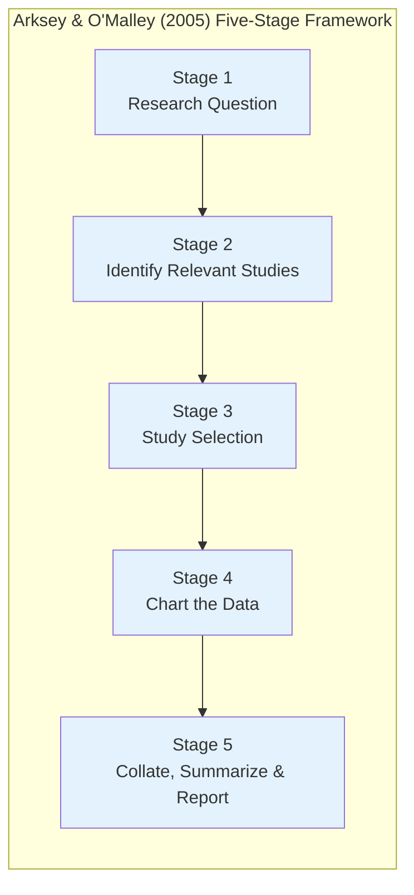
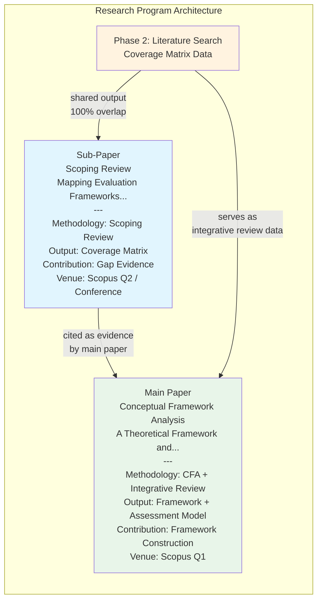

---

# **SUB-PAPER CONCEPT v0.2 — REVISED**

## **Mapping Evaluation Frameworks for Language Learning Platforms in Higher Education: A Scoping Review of Assessment Dimensions and Coverage Gaps**

---

> **Relationship to the Main Paper:**
> This paper is a **precursor study** that independently publishes the Phase 2 output of the main research execution plan ("A Theoretical Framework and Assessment Model..."). It produces empirical-analytic evidence (coverage matrix) cited by the main paper as justification for its contribution. Both papers can be submitted simultaneously or sequentially to different venues.

---

## **DRAFT ABSTRACT** *(≤200 words, conference style)*

The proliferation of digital language learning platforms in higher education has not been matched by evaluation frameworks capable of assessing them comprehensively. Existing frameworks originate from disparate disciplines — Computer-Assisted Language Learning (CALL), Information Systems (IS), and instructional design — each providing only partial coverage of dimensions relevant to platform quality. No single framework simultaneously addresses technology architecture, pedagogical effectiveness, institutional governance, and high-stakes testing specificity. This scoping review systematically maps evaluation frameworks for digital language learning and EdTech platforms in higher education, covering literature published between 2001 and 2025. Following the five-stage methodology of Arksey and O'Malley (2005) and reported in accordance with PRISMA-ScR (Tricco et al., 2018), this study identifies 12 preliminary frameworks and evaluates them against five object-level evaluation dimensions derived from IS quality theory and language assessment theory, supplemented by a separate framework rigor indicator. A dimensional coverage matrix reveals that no existing framework exceeds a coverage score of 2.5/5.0, and the high-stakes test specificity dimension achieves at most partial coverage across all reviewed frameworks. These findings confirm systematic disciplinary fragmentation and establish an empirical baseline justifying the development of an integrated evaluation framework.

**Keywords:** CALL evaluation; EdTech assessment framework; scoping review; dimensional gap analysis; higher education

---

## **1. INTRODUCTION**

### **1.1. Background**

The expansion of *Computer-Assisted Language Learning* (CALL), *Mobile-Assisted Language Learning* (MALL), and language test preparation platforms within higher education ecosystems has created an urgent need for systematic and reproducible evaluation mechanisms. Higher education institutions now face complex adoption decisions: selecting, retaining, or discontinuing EdTech platforms on evidence that is academically and managerially defensible [1][2].

However, the landscape of evaluation frameworks for digital learning platforms is fragmented. Researchers from Applied Linguistics produce frameworks that are pedagogically rich but neglect technical and institutional dimensions [3][4]. Conversely, Information Systems researchers produce technically robust evaluation models that do not operationalize pedagogical quality in a domain-specific manner [5]. This fragmentation means that no single framework can be used by higher education administrators to evaluate language learning platforms comprehensively from the perspectives of technology, pedagogy, *and* institutional governance simultaneously.

Despite the proliferation of existing frameworks, no study has yet systematically **mapped the dimensional coverage** of all available frameworks, identified dimensions that are consistently underrepresented, and charted the conceptual whitespace that future research must address. This constitutes the primary contribution of this paper.

### **1.2. Research Questions**

1. **What evaluation frameworks have been developed for digital language learning platforms and EdTech in higher education contexts over the past two decades?**

2. **Which evaluation dimensions are consistently covered, and which are systematically underrepresented (*underrepresented*) across the existing corpus of frameworks?**

3. **Does any framework simultaneously cover the technology, pedagogy, *and* institutional governance dimensions with adequate operational definitions?**

### **1.3. Research Objectives**

| **Objective** | **Output** |
|:---|:---|
| T1 | Identify and catalogue all relevant EdTech/CALL evaluation frameworks in the literature (2001–2025) |
| T2 | Analyse the dimensions and indicators of each framework through *dimensional coverage analysis* |
| T3 | Construct a *coverage matrix* as demonstrative evidence of existing *assessment gaps* |
| T4 | Formulate future research directions based on the identified *whitespace* |

### **1.4. Significance**

This paper contributes differently from previous reviews: rather than summarising *findings* from evaluation studies (content-focused reviews), it performs a **structural meta-analysis** of the *frameworks* themselves — evaluating the evaluators, not the objects being evaluated. This approach produces *second-order knowledge* about the current state of EdTech evaluation science.

---

## **2. METHODOLOGY: SCOPING REVIEW**

### **2.1. Methodological Choice**

This paper adopts a **scoping review** as formalised by Arksey & O'Malley (2005) [6], extended methodologically by Levac, Colquhoun & O'Brien (2010) [14], and updated by Munn et al. (2018) [7]. A scoping review is chosen — rather than a systematic review or meta-analysis — because:

1. **The objective is mapping** (*mapping the landscape*), not effect synthesis or study quality appraisal
2. **The source corpus is heterogeneous**: frameworks originate from different disciplines (IS, linguistics, education, psychology) and cannot be synthesised quantitatively
3. **The research questions are exploratory** ("what exists?") rather than confirmatory ("is X effective?")

| **Layer** | **Position** |
|:---|:---|
| Objective | Map, identify gaps, and organise the evaluation framework literature |
| Methodology | Scoping review (Arksey & O'Malley, 2005; Munn et al., 2018) |
| Unit of analysis | *Evaluation framework/model*, not empirical studies |
| Output | Coverage matrix + dimensional gap analysis |

**PCC Framework (Population-Concept-Context) per Munn et al. (2018) [7]:**

Munn et al. (2018) recommend the **PCC** framework — rather than PICO — for scoping reviews because the research questions do not require a "Intervention" or experimentally measurable "Outcome":

| **PCC Element** | **Definition in This Study** |
|:---|:---|
| **Population** | Higher education institutions and their stakeholders: learners, instructors, and platform administrators |
| **Concept** | Frameworks and evaluation models designed for digital language learning platforms (CALL/MALL/EdTech/LMS) |
| **Context** | Institutional adoption, quality assurance, and decision-making contexts in higher education |

### **2.2. Five Stages of Scoping Review (Arksey & O'Malley)**



> **Reporting Standard:** This study is reported following **PRISMA-ScR** (*Preferred Reporting Items for Systematic reviews and Meta-Analyses extension for Scoping Reviews*) as formalised by Tricco et al. (2018) [11]. A PRISMA-ScR flow diagram (covering the number of records identified, screened, excluded, and included) will be included in the final paper version to document the study selection process transparently.

### **2.3. Search Protocol**

**Databases:** Scopus (primary), Web of Science, ERIC, IEEE Xplore
**Search period:** 2001–2025 (from Chapelle as the first landmark CALL evaluation framework)

**Search strings:**
```
String A (core):
("evaluation framework" OR "assessment model" OR "quality framework" 
 OR "evaluation criteria" OR "assessment dimensions")
AND
("educational technology" OR "e-learning" OR "CALL" OR "MALL" 
 OR "language learning platform" OR "EdTech" OR "LMS" 
 OR "digital learning platform" OR "mobile learning")
AND
("higher education" OR "university" OR "tertiary" OR "college")

String B (language-specific):
("CALL evaluation" OR "MALL evaluation" OR "language app evaluation"
 OR "test preparation platform" OR "IELTS platform" OR "TOEFL platform")
AND
("framework" OR "model" OR "criteria" OR "dimensions")
```

### **2.4. Inclusion and Exclusion Criteria**

| **Criterion** | **Inclusion** | **Exclusion** |
|:---|:---|:---|
| Source type | Journal articles, book chapters, conference proceedings (peer-reviewed) | Grey literature, white papers, blogs, institutional reports |
| Focus | Papers that *present, propose, or critique* an EdTech/CALL evaluation framework/model | Empirical studies that *use* a framework without developing it |
| Context | Higher education; language learning; CALL/MALL/EdTech; LMS | K-12 only; corporate training; non-educational platforms |
| Language | English | Non-English |
| Index | Scopus-indexed, WoS-indexed, ERIC, IEEE Xplore | Non-indexed journals; predatory journals |

> **Operational definition of "evaluation framework":** This study defines "evaluation framework" as a conceptual instrument designed to assess the quality of a digital platform from the perspective of system quality, content quality, or institutional service. Teacher competency frameworks (e.g. TPACK — which assesses *teacher knowledge*, not platform quality) are explicitly excluded. Technology adoption models (e.g. UTAUT) are included *conditionally* if their constructs have been adapted in the literature as platform quality evaluation dimensions — not merely as user acceptance predictors.

### **2.5. Theoretical Foundations of Analytical Dimensions (D1–D6)**

Five analytical dimensions used in the coverage matrix are derived from two complementary theoretical sources — not constructed ad hoc:

**Source 1 — IS Quality Constructs (DeLone & McLean, 2003 [10]):**

| **Dimension** | **D&M Source Construct** | **Operationalisation in the EdTech Context** |
|:---|:---|:---|
| D1: Technology Architecture | System Quality | Technical stability, adaptivity, accessibility, user interface |
| D2: Pedagogy Effectiveness | Information Quality | Curriculum alignment, content quality, feedback, language skill coverage |
| D3: Institutional Governance | Service Quality | Learning analytics, usage monitoring, data interoperability, decision-support |

> **Note on D&M exclusion from corpus:** DeLone & McLean (2003) [10] function as a **deductive meta-theory** — used as an analytic lens to define D1–D3, not as an evaluation object. Including them in the review corpus would create *circular reasoning*: evaluating a framework using dimensions derived from that very framework. Therefore, D&M is *explicitly excluded* from the reviewed framework list (see Section 3.1).

**Source 2 — Language Learning Assessment Theory:**

| **Dimension** | **Theoretical Source** | **Justification** |
|:---|:---|:---|
| D4: High-Stakes Test Specificity | Bachman & Palmer (2010) [12]; Chapelle (2001) [3] | Authentic assessment frameworks and SLA-based criteria require explicit operationalisation of high-stakes test metrics |
| D6: Multi-Stakeholder Perspective | Scheffel et al. (2014) [9] | Quality indicators for learning analytics identify multi-stakeholder as a distinct platform quality dimension |

> **D5 — Framework Rigor Indicator (separate from coverage score):** Munn et al. (2018) [7] require that systematically applicable frameworks provide adequate operational definitions. D5 assesses whether a framework *has* this quality — but this constitutes an assessment of **the framework's own methodological quality** (meta-level), not of the platform quality dimension being evaluated (object-level). Conflating both in a single score would produce non-equivalent categories. D5 is retained as a separate column in the coverage matrix and is not counted in the coverage score.

---

### **2.6. Data Charting: Dimensional Analysis**

Each included framework is analysed using an **extraction form** that codes the presence or absence of five analytical dimensions (plus D5 as a separate rigor indicator):

| **Code** | **Analytical Dimension** | **Operational Definition for Coding** |
|:---|:---|:---|
| D1 | **Technology Architecture** | Framework covers aspects of technical system quality: stability, adaptivity, accessibility, interface |
| D2 | **Pedagogy Effectiveness** | Framework covers aspects of content and instructional design: curriculum alignment, feedback, cognitive load, skill coverage |
| D3 | **Institutional Governance** | Framework covers institutional aspects: analytics, monitoring, decision-support, data interoperability |
| D4 | **High-Stakes Test Specificity** | Framework explicitly operationalises metrics for high-stakes testing contexts (IELTS, TOEFL, CEFR alignment) |
| D6 | **Multi-Stakeholder Perspective** | Framework accommodates the perspectives of more than one stakeholder (learner + instructor + administrator) |

**Coding scale and numerical weights:**

| **Symbol** | **Interpretation** | **Numerical Score** |
|:---:|:---|:---:|
| ✓ | Fully covered — dimension explicitly defined and operationalised in the framework | 1.0 |
| ◑ | Partially covered — dimension mentioned but not operationally defined, or only implicit | 0.5 |
| ✗ | Not covered — dimension absent from the framework | 0.0 |

**Coverage Score Formula:** $\text{Coverage Score} = \sum_{i \in \{D1,D2,D3,D4,D6\}} s_i$, where $s_i \in \{0, 0.5, 1.0\}$. Maximum score = **5.0**.

> **D5** is assessed in a separate column in the coverage matrix as a *Framework Rigor Indicator* — not counted in the score — to separate the assessment of platform quality (object-level) from the assessment of the framework's own quality (meta-level).

### **2.7. Inter-Rater Reliability (IRR) Procedure**

The objectivity of dimensional coding is ensured through an IRR procedure planned prior to the data charting phase:

1. **Second coder** (a collaborating researcher or doctoral student) independently codes a minimum of **20%** of all included frameworks
2. **Agreement metric**: Cohen's Kappa (κ) — minimum threshold κ ≥ 0.80 for *acceptable agreement*
3. **Disagreement resolution**: consensus discussion between both coders; a third arbitrator for unresolved cases
4. **Reporting**: κ values per dimension are explicitly reported in the methodology section of the final paper

### **2.8. Pre-Registration and Publication Ethics**

This study's protocol will be registered on the **Open Science Framework (OSF)** prior to initiating the data search phase, as a commitment to methodological transparency and to meet the requirements of several target journals. Given that this study shares a data collection phase (Phase 2: literature search and coverage matrix) with the main paper (main CFA paper), this relationship will be fully disclosed to the editor at submission, in accordance with academic integrity norms governing *shared data* across papers.

**Data Availability:** The extraction form template and final coding data will be deposited in the same OSF repository as the protocol pre-registration, and will be made publicly available upon acceptance.

---

## **3. ANALYSIS DESIGN: COVERAGE MATRIX** *(Anticipated Structure — to be populated in Phase 2)*

### **3.1. Framework Corpus for Analysis**

*(The following table is preliminary — it will be fully populated after the Phase 2 execution plan is complete. Frameworks already identified from initial concept mapping are listed as anchors.)*

| **#** | **Framework** | **Discipline of Origin** | **Context** | **Year** |
|:---:|:---|:---|:---|:---:|
| F1 | Chapelle — SLA-based 6 Criteria | Applied Linguistics | CALL | 2001 |
| F2 | Hubbard — Process-oriented Evaluation | Applied Linguistics | CALL courseware | 2011 |
| F3 | Leakey — Integrated 12 Criteria | Applied Linguistics | CALL | 2011 |
| F4 | Colpaert — RBRO Model | Instructional Design | CALL | 2004 |
| F5 | Rosell-Aguilar — MALL Taxonomy | Applied Linguistics | MALL apps | 2017 |
| F6 | Almaiah et al. — Delphi 6-Dimension | Information Systems | E-learning | 2021 |
| F7 | Al-Fraihat et al. — E-learning Success | Information Systems | E-learning/LMS | 2020 |
| F8 | Scheffel et al. — EFLA | Learning Analytics | HE learning tools | 2014 |
| F9 | Park & Jo — LAD (Kirkpatrick-based) | Learning Analytics | HE dashboard | 2019 |
| F10 | Venkatesh et al. — UTAUT | Information Systems | Technology adoption | 2003 |
| F11 | Kampa et al. — TRAM | Information Systems | Language EdTech | 2024 |
| F12 | Essafi — MLLA 3-Aspect | Applied Linguistics | MALL | 2025 |
| F13 | *[to be populated from Phase 2 search]* | — | — | — |

> ⚠️ **Exclusion notes — two frameworks:**
> - **DeLone & McLean (2003):** excluded because they function as a deductive meta-theory (see Section 2.5) — including them would create circular reasoning.
> - **TPACK (Mishra & Koehler, 2006):** excluded because it is a model of *teacher knowledge competency* (technological-pedagogical-content knowledge), not a platform quality evaluation framework. TPACK assesses *what teachers know*, not the quality of the systems they use.
>
> **Inclusion note — UTAUT (F10):** Although UTAUT is a technology acceptance model, its constructs (performance expectancy, effort expectancy, facilitating conditions) have been widely adapted as platform quality evaluation dimensions in the IS literature [Al-Fraihat et al., 2020 — F7]. Included based on *secondary application* as an evaluation lens, not its primary adoption purpose.

### **3.2. Coverage Matrix**

*(Coding uses the ✓/◑/✗ scale with weights 1.0/0.5/0.0. D5 Rigor is displayed as a separate column — not counted in the Coverage Score. See Section 2.6.)*

| **Framework** | **D1 TECH** | **D2 PED** | **D3 INST** | **D4 High-Stakes** | **D6 Multi-Stakeholder** | **Score /5** | **D5 Rigor†** |
|:---|:---:|:---:|:---:|:---:|:---:|:---:|:---:|
| F1 Chapelle (2001) | ✗ | ✓ | ✗ | ◑ | ✗ | 1.5/5 | ◑ |
| F2 Hubbard (2011) | ✗ | ✓ | ✗ | ✗ | ✗ | 1.0/5 | ◑ |
| F3 Leakey (2011) | ◑ | ✓ | ✗ | ✗ | ✗ | 1.5/5 | ◑ |
| F4 Colpaert (2004) | ✗ | ✓ | ✗ | ✗ | ✗ | 1.0/5 | ◑ |
| F5 Rosell-Aguilar (2017) | ◑ | ◑ | ✗ | ✗ | ✗ | 1.0/5 | ✗ |
| F6 Almaiah et al. (2021) | ✓ | ◑ | ◑ | ✗ | ◑ | 2.5/5 | ✗ |
| F7 Al-Fraihat et al. (2020) | ✓ | ◑ | ◑ | ✗ | ◑ | 2.5/5 | ◑ |
| F8 Scheffel/EFLA (2014) | ✗ | ✗ | ✓ | ✗ | ◑ | 1.5/5 | ◑ |
| F9 Park & Jo (2019) | ✗ | ✗ | ✓ | ✗ | ◑ | 1.5/5 | ◑ |
| F10 UTAUT/Venkatesh (2003) | ◑ | ✗ | ✗ | ✗ | ✗ | 0.5/5 | ✗ |
| F11 TRAM/Kampa (2024) | ◑ | ◑ | ✗ | ✗ | ✗ | 1.0/5 | ✗ |
| F12 Essafi/MLLA (2025) | ◑ | ✓ | ✗ | ◑ | ✗ | 2.0/5 | ✗ |
| **Max (any single framework)** | **✓ (F6/F7)** | **✓ (F1)** | **✓ (F8/F9)** | **◑ (F1/F12)** | **◑ (F6–F9)** | **2.5/5** | **◑ (multiple)** |

†*D5 Rigor: ◑ = partial operational definitions; ✗ = reflective checklist only; ✓ = full operationalization (achieved by none in this corpus).*

> **Critical observation:** No single framework exceeds a score of **2.5/5 (50% coverage)**. Two dimensions never achieve full coverage: D4 (High-Stakes Specificity) and D6 (Multi-Stakeholder) both max out at ◑. D3 (Institutional Governance) is only found in learning analytics frameworks (F8/F9), which were not designed as language platform evaluation tools. Separate finding on D5: 5 of 12 frameworks score ✗ — indicating the majority take the form of reflective checklists without systematic measurement operationalisation.

### **3.3. Dimensional Gap Analysis**

Based on the coverage matrix above, four systematic gaps are identified:

```mermaid
graph TD
    subgraph "Four Coverage Gaps (D1–D4, D6)"
        A[Gap 1: Contextual Specificity<br/>D4 never achieves full coverage<br/>— max ◑ across all 12 frameworks]
        B[Gap 2: Disciplinary Silos<br/>CALL frameworks lack D1+D3<br/>IS frameworks lack D2 domain depth]
        C[Gap 3: Institutional Blindspot<br/>D3 only in LA tools (F8/F9)<br/>absent from all CALL/MALL frameworks]
        D[Gap 4: Single-Stakeholder Bias<br/>D6 never achieves full coverage<br/>— max ◑ across all 12 frameworks]
    end
    
    E[Rigor Finding — D5 separate<br/>7/12 frameworks: ◑ partial defs<br/>5/12 frameworks: ✗ checklist only]
    
    A --> F[No framework exceeds<br/>2.5/5 — 50% max coverage<br/>across all 12 reviewed frameworks]
    B --> F
    C --> F
    D --> F
    E -.->|"framework quality finding<br/>(not a coverage gap)"| F
    
    style A fill:#ffebee
    style B fill:#ffebee
    style C fill:#ffebee
    style D fill:#ffebee
    style E fill:#e8eaf6
    style F fill:#b71c1c,color:#fff
```

---

## **4. DISCUSSION**

### **4.1. Theoretical Implications**

The *absence* of any framework with full coverage is not a coincidental gap — it reflects systematic disciplinary fragmentation in the EdTech evaluation literature. Applied Linguistics researchers build evaluation outward from SLA theory, so technical and institutional dimensions structurally fall outside their conceptual radar. Conversely, IS researchers build inward from system quality models, so pedagogical domain-specificity — especially the nuances of *high-stakes testing* — is not regarded as an IS concern.

This finding indicates that the gap stems not from the oversight of individual researchers, but from the absence of a **bridging discipline** that explicitly orchestrates multidisciplinary synthesis. This justifies the need for a new framework built on IS meta-theory (DeLone & McLean, 2003) [10] as an ontological platform integrating all three dimensions.

### **4.2. Practical Implications**

For higher education administrators, these findings carry direct operational implications: no single framework is adequate for comprehensive adoption decision-making. The highest-scoring frameworks — F6 (Almaiah et al.) and F7 (Al-Fraihat et al.) both at 2.5/5 — still fail to cover D4 (high-stakes test specificity) entirely and only reach D6 (multi-stakeholder) partially.

However, the coverage matrix also enables **strategic combinations** based on institutional priorities. As an illustration: administrators prioritising technical alignment and pedagogical completeness can combine F7 Al-Fraihat (strongest on D1+D3) with F1 Chapelle (strongest on D2+D4 partial) — together this combination covers D1, D2, D3, and D4 partially. D6 remains a collective blind spot, inadequately covered by any combination in this corpus. The matrix thus functions as an **evidence-based decision tool** — not merely a gap catalogue.

The D5 findings carry separate implications for evidence-based technology governance: 5 of the 12 reviewed frameworks amount to no more than reflective checklists (✗ on D5), meaning adoption decisions that rely on those frameworks cannot be audited or replicated systematically. Institutions implementing *evidence-based technology governance* need to attend not only to *what* a framework covers, but *how operationalised* its dimensions are.

### **4.3. Limitations**

This scoping review has inherent limitations: (a) although an IRR protocol is planned (Section 2.7), residual subjectivity in dimensional coding cannot be entirely eliminated; (b) the restriction of the search to English-language literature may exclude frameworks from non-Anglophone contexts, particularly East Asia and Latin America; (c) very recent frameworks (2024–2025) may not yet be fully indexed in Scopus at the time of the search; (d) the operational definitions of the five analytical dimensions represent the researcher's interpretation — researchers from different disciplines may operationalise these dimensions differently.

---

## **5. CONCLUSION AND FUTURE RESEARCH**

The three research questions posed are answered as follows:

**RQ1** (*What evaluation frameworks are available for digital language learning platforms in higher education?*): This scoping review identifies 12 preliminary frameworks from four disciplines — Applied Linguistics (CALL/MALL), Information Systems, Learning Analytics, and Instructional Technology — published between 2001 and 2025. No single discipline dominates comprehensively: CALL produces the most frameworks (F1–F5) but is limited to the pedagogy dimension; IS produces technically more comprehensive frameworks but lacks language and test domain-specificity.

**RQ2** (*Which dimensions are most and least frequently covered?*): D2 (Pedagogy Effectiveness) is the most consistently covered dimension, particularly across all CALL frameworks. Conversely, D4 (High-Stakes Test Specificity) and D6 (Multi-Stakeholder Perspective) never achieve full coverage in any framework — maximum ◑ in both. D3 (Institutional Governance) is found in full only in learning analytics frameworks (F8/F9), which were not designed as language platform evaluation tools. On D5 (rigor indicator): 5 of 12 frameworks lack adequate operational definitions, rendering them unsuitable for systematic and reproducible assessment.

**RQ3** (*Does any framework cover all three primary dimensions [D1, D2, D3] together with D4 and D6?*): None. The highest-coverage frameworks (F6 and F7) reach only 2.5/5 (50%). No framework simultaneously covers D1, D2, D3, and D4 — even at a partial level.

The resulting coverage matrix functions as **baseline gap evidence** that can be cited as empirical justification for developing a new integrated framework. Recommended future research directions: (1) development of a framework that bridges IS and Applied Linguistics using a unifying meta-theory; (2) operationalisation of D4 (high-stakes specificity) that is systematically absent from all existing frameworks; (3) integration of the institutional perspective (D3) into language platform evaluation frameworks.

---

## **REFERENCES**

[1] F. Rosell-Aguilar, "State of the app: A taxonomy and framework for evaluating language learning mobile applications," *CALICO J.*, vol. 34, no. 2, pp. 243–258, 2017.

[2] D. Al-Fraihat, M. Joy, R. Masa'deh, and J. Sinclair, "Evaluating e-learning systems success: An empirical study," *Comput. Hum. Behav.*, vol. 102, pp. 67–86, 2020. https://doi.org/10.1016/j.chb.2019.08.004

[3] C. A. Chapelle, *Computer Applications in Second Language Acquisition: Foundations for Teaching, Testing and Research*. Cambridge, U.K.: Cambridge Univ. Press, 2001.

[4] J. Leakey, *Evaluating Computer-Assisted Language Learning: An Integrated Approach to Effectiveness Research in CALL*. Bern, Switzerland: Peter Lang, 2011.

[5] M. A. Almaiah, A. Al-Khasawneh, and A. Althunibat, "Exploring the critical challenges and factors influencing the e-learning system usage during COVID-19 pandemic," *Educ. Inf. Technol.*, vol. 26, no. 5, pp. 5261–5280, 2021. https://doi.org/10.1007/s10639-021-10523-y

[6] H. Arksey and L. O'Malley, "Scoping studies: Towards a methodological framework," *Int. J. Soc. Res. Methodol.*, vol. 8, no. 1, pp. 19–32, 2005. https://doi.org/10.1080/1364557032000119616

[7] Z. Munn, M. D. J. Peters, C. Stern, C. Tufanaru, A. McArthur, and E. Aromataris, "Systematic review or scoping review? Guidance for authors when choosing between a systematic or scoping review approach," *Syst. Rev.*, vol. 7, no. 1, p. 143, 2018. https://doi.org/10.1186/s13643-018-0611-5

[8] P. Hubbard, "Evaluation of courseware and websites," in *Present and Future Promises of CALL*, L. Ducate and N. Arnold, Eds. San Marcos, TX: CALICO, 2011, pp. 407–440.

[9] M. Scheffel, H. Drachsler, S. Stoyanov, and M. Specht, "Quality indicators for learning analytics," *Educ. Technol. Soc.*, vol. 17, no. 4, pp. 117–132, 2014. ⚠️ *DOI/stable URL to be verified before submission; available via Educational Technology & Society journal archive.*

[10] W. H. DeLone and E. R. McLean, "The DeLone and McLean model of information systems success: A ten-year update," *J. Manage. Inf. Syst.*, vol. 19, no. 4, pp. 9–30, 2003. https://doi.org/10.1080/07421222.2003.11045748

[11] A. C. Tricco et al., "PRISMA extension for scoping reviews (PRISMA-ScR): Checklist and explanation," *Ann. Intern. Med.*, vol. 169, no. 7, pp. 467–473, 2018. https://doi.org/10.7326/M18-0850

[12] L. F. Bachman and A. S. Palmer, *Language Assessment in Practice*. Oxford, U.K.: Oxford Univ. Press, 2010.

[13] Y. Park and I.-H. Jo, "Development of the learning analytics dashboard to support students' learning performance," *J. Comput. Assist. Learn.*, vol. 35, no. 4, pp. 556–568, 2019. https://doi.org/10.1111/jcal.12354

[14] D. Levac, H. Colquhoun, and K. K. O'Brien, "Scoping studies: Advancing the methodology," *Implement. Sci.*, vol. 5, no. 1, p. 69, 2010. https://doi.org/10.1186/1748-5908-5-69

---

## **PAPER METADATA**

| **Attribute** | **Detail** |
|:---|:---|
| **Paper Type** | Scoping Review |
| **Methodology** | Scoping review (Arksey & O'Malley, 2005; Munn et al., 2018) |
| **Main Contribution** | Coverage matrix 12 preliminary frameworks × 5 evaluative dimensions + 1 rigor indicator; demonstrated gap evidence |
| **Relationship to Main Paper** | Precursor paper — generates bibliometric evidence cited by the CFA paper |
| **Target Venue (priority)** | **[1st]** *Australasian Journal of Educational Technology* (AJET, Scopus Q1, open access, actively accepts scoping reviews, ~4–6 months review) \| **[2nd]** *Education Sciences* (MDPI, Scopus Q2, rapid review ~3 months, scoping reviews accepted) \| **[3rd]** *LAK Conference Proceedings* (ACM, Scopus-indexed, faster timeline) \| ⚠️ *CALICO Journal* removed from list — too pedagogy-centric for a paper with IS framing |
| **Estimated Length** | 6,000–8,000 words total |
| **Word Allocation per Section** | Abstract: 200 \| Introduction: 800–1,000 \| Methodology: 1,200–1,500 \| Results: 2,000–2,500 \| Discussion: 1,200–1,500 \| Conclusion: 400–500 \| References: ~500 |
| **Estimated Submission** | After Phase 2 execution plan is complete (week 5) |
| **Shared Effort with Main Paper** | Phase 2 data (literature search + coverage matrix) — 100% overlap, zero additional cost |
| **Shared Data Disclosure** | This study's relationship with the main CFA paper will be fully disclosed to the editor in the cover letter. Both papers present distinct contributions — the sub-paper maps what exists; the main paper builds what is new. |
| **Recommended Publication Order** | Submit sub-paper first → revise → acceptance → submit main paper citing sub-paper |

---

## **MAPPING THE RELATIONSHIP BETWEEN BOTH PAPERS**



---

*Last updated: May 22, 2026*
