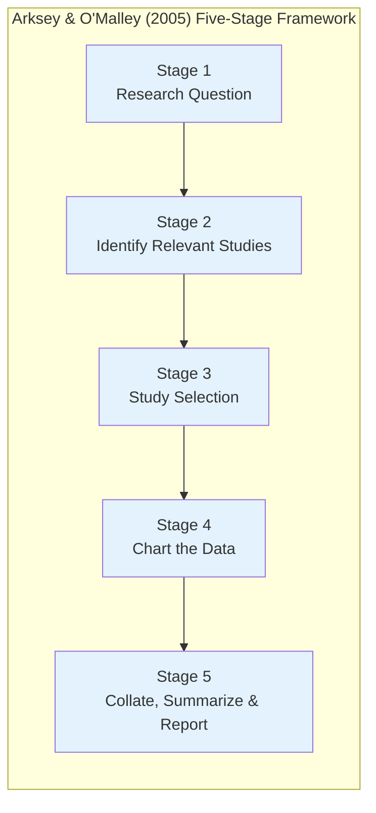
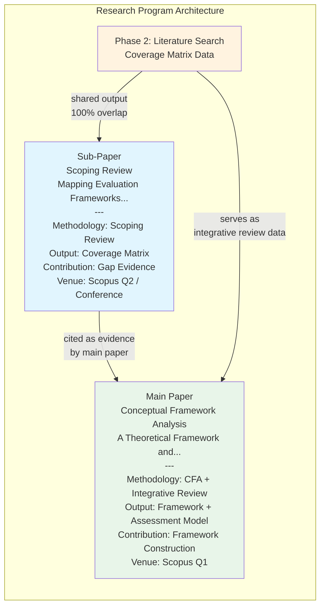

---

# **SUB-PAPER CONCEPT v0.2 — REVISED**

## **Mapping Evaluation Frameworks for Language Learning Platforms in Higher Education: A Scoping Review of Assessment Dimensions and Coverage Gaps**

---

> **Relasi terhadap Paper Utama:**  
> Paper ini adalah **precursor study** yang secara mandiri mempublikasikan output Phase 2 dari execution plan penelitian utama ("A Theoretical Framework and Assessment Model..."). Paper ini menghasilkan bukti empiris-analitik (coverage matrix) yang dikutip oleh paper utama sebagai justifikasi kontribusinya. Keduanya dapat disubmit secara bersamaan atau berurutan ke venue berbeda.

---

## **DRAFT ABSTRACT** *(≤200 kata, conference style)*

The proliferation of digital language learning platforms in higher education has not been matched by evaluation frameworks capable of assessing them comprehensively. Existing frameworks originate from disparate disciplines — Computer-Assisted Language Learning (CALL), Information Systems (IS), and instructional design — each providing only partial coverage of dimensions relevant to platform quality. No single framework simultaneously addresses technology architecture, pedagogical effectiveness, institutional governance, and high-stakes testing specificity. This scoping review systematically maps evaluation frameworks for digital language learning and EdTech platforms in higher education, covering literature published between 2001 and 2025. Following the five-stage methodology of Arksey and O'Malley (2005) and reported in accordance with PRISMA-ScR (Tricco et al., 2018), this study identifies 12 preliminary frameworks and evaluates them against five object-level evaluation dimensions derived from IS quality theory and language assessment theory, supplemented by a separate framework rigor indicator. A dimensional coverage matrix reveals that no existing framework exceeds a coverage score of 2.5/5.0, and the high-stakes test specificity dimension achieves at most partial coverage across all reviewed frameworks. These findings confirm systematic disciplinary fragmentation and establish an empirical baseline justifying the development of an integrated evaluation framework.

**Keywords:** CALL evaluation; EdTech assessment framework; scoping review; dimensional gap analysis; higher education

---

## **1. PENDAHULUAN**

### **1.1. Latar Belakang**

Ekspansi platform *Computer-Assisted Language Learning* (CALL), *Mobile-Assisted Language Learning* (MALL), dan platform persiapan tes berbahasa dalam ekosistem pendidikan tinggi telah mendorong kebutuhan mendesak terhadap mekanisme evaluasi yang sistematis dan reproducible. Institusi perguruan tinggi kini menghadapi keputusan adopsi yang kompleks: memilih, mempertahankan, atau menghentikan platform EdTech berbasis bukti yang dapat dipertanggungjawabkan secara akademis dan manajerial [1][2].

Namun, lanskap framework evaluasi untuk platform pembelajaran digital bersifat terfragmentasi. Peneliti dari disiplin Linguistik Terapan menghasilkan framework yang kaya secara pedagogis tetapi mengabaikan dimensi teknis dan institusional [3][4]. Sebaliknya, peneliti Sistem Informasi menghasilkan model evaluasi teknis yang robust tetapi tidak mengoperasionalisasikan kualitas pedagogis secara domain-spesifik [5]. Fragmentasi ini berarti bahwa tidak ada satu pun framework yang dapat digunakan oleh administrator perguruan tinggi untuk mengevaluasi platform pembelajaran bahasa secara komprehensif dari perspektif teknologi, pedagogi, *dan* tata kelola institusional sekaligus.

Terlepas dari proliferasi framework yang ada, belum ada studi yang secara sistematis **memetakan cakupan dimensi** dari seluruh framework yang tersedia, mengidentifikasi dimensi-dimensi yang secara konsisten tidak terwakili, dan memetakan *whitespace* konseptual yang harus diisi oleh penelitian berikutnya. Inilah yang menjadi kontribusi utama paper ini.

### **1.2. Rumusan Masalah**

1. **Framework evaluasi apa saja yang telah dikembangkan untuk platform pembelajaran bahasa digital dan EdTech di konteks pendidikan tinggi dalam dua dekade terakhir?**

2. **Dimensi evaluasi apa yang secara konsisten tercakup, dan dimensi apa yang secara sistematis tidak terwakili (*underrepresented*) di seluruh korpus framework yang ada?**

3. **Apakah terdapat framework yang secara simultan mencakup dimensi teknologi, pedagogi, *dan* tata kelola institusional dengan definisi operasional yang memadai?**

### **1.3. Tujuan Penelitian**

| **Tujuan** | **Output** |
|:---|:---|
| T1 | Mengidentifikasi dan mengkatalogkan seluruh framework evaluasi EdTech/CALL yang relevan dalam literatur (2001–2025) |
| T2 | Menganalisis dimensi dan indikator per framework melalui *dimensional coverage analysis* |
| T3 | Membangun *coverage matrix* sebagai bukti demonstratif *assessment gaps* yang ada |
| T4 | Merumuskan arah penelitian berikutnya berdasarkan *whitespace* yang teridentifikasi |

### **1.4. Signifikansi**

Paper ini berkontribusi dengan cara yang berbeda dari review sebelumnya: alih-alih meringkas *findings* dari studi evaluasi (review yang bersifat content-focused), paper ini melakukan **meta-analisis struktural** terhadap *framework* itu sendiri — mengevaluasi evaluator, bukan mengevaluasi objek yang dievaluasi. Pendekatan ini menghasilkan *second-order knowledge* tentang kondisi ilmu pengetahuan evaluasi EdTech saat ini.

---

## **2. METODOLOGI: SCOPING REVIEW**

### **2.1. Pilihan Metodologi**

Paper ini mengadopsi **scoping review** sebagaimana diformalisasi oleh Arksey & O'Malley (2005) [6], diperluas metodologinya oleh Levac, Colquhoun & O'Brien (2010) [14], dan diperbarui oleh Munn et al. (2018) [7]. Scoping review dipilih — bukan systematic review atau meta-analysis — karena:

1. **Tujuannya adalah pemetaan** (*mapping the landscape*), bukan sintesis efek atau penilaian kualitas studi
2. **Korpus sumbernya heterogen**: framework berasal dari disiplin berbeda (IS, linguistik, pendidikan, psikologi) yang tidak dapat disintesis secara kuantitatif
3. **Pertanyaan penelitiannya bersifat eksploratoris** ("apa yang ada?") bukan konfirmatoris ("apakah X efektif?")

| **Layer** | **Posisi** |
|:---|:---|
| Tujuan | Memetakan, mengidentifikasi gap, dan mengorganisir literatur framework evaluasi |
| Metodologi | Scoping review (Arksey & O'Malley, 2005; Munn et al., 2018) |
| Unit analisis | *Framework/model evaluasi*, bukan studi empiris |
| Output | Coverage matrix + dimensional gap analysis |

**Kerangka PCC (Population-Concept-Context) per Munn et al. (2018) [7]:**

Munn et al. (2018) merekomendasikan kerangka **PCC** — alih-alih PICO — untuk scoping review karena pertanyaan penelitian tidak mensyaratkan adanya "Intervention" atau "Outcome" yang terukur secara eksperimental:

| **Elemen PCC** | **Definisi dalam Studi Ini** |
|:---|:---|
| **Population** | Higher education institutions dan stakeholdernya: learner, instructor, dan administrator platform |
| **Concept** | Framework dan model evaluasi yang dirancang untuk platform pembelajaran bahasa digital (CALL/MALL/EdTech/LMS) |
| **Context** | Konteks adopsi institusional, quality assurance, dan pengambilan keputusan di perguruan tinggi |

### **2.2. Lima Tahap Scoping Review (Arksey & O'Malley)**



> **Reporting Standard:** Studi ini dilaporkan mengikuti **PRISMA-ScR** (*Preferred Reporting Items for Systematic reviews and Meta-Analyses extension for Scoping Reviews*) sebagaimana diformalisasi oleh Tricco et al. (2018) [11]. PRISMA-ScR flow diagram (mencakup jumlah rekaman yang diidentifikasi, diskrining, dieksklusi, dan diinklusi) akan disertakan dalam versi final paper untuk mendokumentasikan proses seleksi studi secara transparan.

### **2.3. Search Protocol**

**Databases:** Scopus (primary), Web of Science, ERIC, IEEE Xplore  
**Search period:** 2001–2025 (dari Chapelle sebagai landmark CALL framework pertama)

**Search strings:**
```
String A (core):
("evaluation framework" OR "assessment model" OR "quality framework" 
 OR "evaluation criteria" OR "assessment dimensions")
AND
("educational technology" OR "e-learning" OR "CALL" OR "MALL" 
 OR "language learning platform" OR "EdTech" OR "LMS" 
 OR "digital learning platform" OR "mobile learning")
AND
("higher education" OR "university" OR "tertiary" OR "college")

String B (language-specific):
("CALL evaluation" OR "MALL evaluation" OR "language app evaluation"
 OR "test preparation platform" OR "IELTS platform" OR "TOEFL platform")
AND
("framework" OR "model" OR "criteria" OR "dimensions")
```

### **2.4. Kriteria Inklusi dan Eksklusi**

| **Kriteria** | **Inklusi** | **Eksklusi** |
|:---|:---|:---|
| Jenis sumber | Artikel jurnal, book chapter, conference proceedings (peer-reviewed) | Gray literature, white paper, blog, laporan institusi |
| Fokus | Paper yang *menyajikan, mengusulkan, atau mengkritisi* framework/model evaluasi EdTech/CALL | Studi empiris yang *menggunakan* framework tanpa mengembangkannya |
| Konteks | Higher education; language learning; CALL/MALL/EdTech; LMS | K-12 only; corporate training; non-educational platforms |
| Bahasa | Inggris | Non-Inggris |
| Indeks | Scopus-indexed, WoS-indexed, ERIC, IEEE Xplore | Non-indexed journals; predatory journals |

> **Catatan definisi operasional "evaluation framework":** Studi ini mendefinisikan "evaluation framework" sebagai perangkat konseptual yang dirancang untuk menilai kualitas platform digital dari perspektif kualitas sistem, konten, atau layanan institusional. Framework kompetensi guru (mis. TPACK — yang menilai *pengetahuan guru*, bukan kualitas platform) dieksklusi secara eksplisit. Model adopsi teknologi (mis. UTAUT) diinklusi secara *bersyarat* jika konstruknya telah diadaptasi dalam literatur sebagai dimensi evaluasi kualitas platform — bukan sekadar prediksi penerimaan pengguna.

### **2.5. Landasan Teoretis Dimensi Analitik (D1–D6)**

Lima dimensi analitik yang digunakan dalam coverage matrix diturunkan dari dua sumber teoritis yang saling komplementer — bukan dikonstruksi secara ad hoc:

**Sumber 1 — IS Quality Constructs (DeLone & McLean, 2003 [10]):**

| **Dimensi** | **D&M Konstruk Asal** | **Operasionalisasi dalam Konteks EdTech** |
|:---|:---|:---|
| D1: Technology Architecture | System Quality | Stabilitas teknis, adaptivitas, aksesibilitas, antarmuka pengguna |
| D2: Pedagogy Effectiveness | Information Quality | Alignment kurikulum, kualitas konten, umpan balik, cakupan keterampilan bahasa |
| D3: Institutional Governance | Service Quality | Learning analytics, monitoring penggunaan, interoperabilitas data, decision-support |

> **Catatan eksklusi D&M dari korpus:** DeLone & McLean (2003) [10] berfungsi sebagai **meta-teori deduktif** — digunakan sebagai lensa analitik untuk mendefinisikan D1–D3, bukan sebagai objek evaluasi. Memasukkannya dalam korpus review akan menciptakan *circular reasoning*: mengevaluasi framework menggunakan dimensi yang diturunkan dari framework itu sendiri. Oleh karena itu, D&M *secara eksplisit dieksklusi* dari daftar framework yang di-review (lihat Section 3.1).

**Sumber 2 — Language Learning Assessment Theory:**

| **Dimensi** | **Sumber Teoritis** | **Justifikasi** |
|:---|:---|:---|
| D4: High-Stakes Test Specificity | Bachman & Palmer (2010) [12]; Chapelle (2001) [3] | Authentic assessment framework dan SLA-based criteria mensyaratkan operasionalisasi metrik tes bermutu tinggi secara eksplisit |
| D6: Multi-Stakeholder Perspective | Scheffel et al. (2014) [9] | Quality indicators for learning analytics mengidentifikasi multi-stakeholder sebagai dimensi kualitas platform yang tersendiri |

> **D5 — Framework Rigor Indicator (terpisah dari coverage score):** Munn et al. (2018) [7] mensyaratkan bahwa framework yang dapat diaplikasikan secara sistematis harus menyediakan definisi operasional yang memadai. D5 menilai apakah sebuah framework *memiliki* kualitas tersebut — namun ini adalah penilaian terhadap **kualitas metodologis framework itu sendiri** (meta-level), bukan terhadap dimensi kualitas platform yang dievaluasi (object-level). Mencampurkan keduanya dalam satu skor akan menghasilkan kategori yang tidak setara. D5 dipertahankan sebagai kolom terpisah dalam coverage matrix dan tidak dihitung dalam coverage score.

---

### **2.6. Data Charting: Dimensional Analysis**

Setiap framework yang diinklusi dianalisis menggunakan **extraction form** yang mengkodekan ada/tidaknya lima dimensi analitik (plus D5 sebagai rigor indicator terpisah):

| **Kode** | **Dimensi Analitik** | **Definisi Operasional untuk Koding** |
|:---|:---|:---|
| D1 | **Technology Architecture** | Framework mencakup aspek kualitas teknis sistem: stabilitas, adaptivitas, aksesibilitas, antarmuka |
| D2 | **Pedagogy Effectiveness** | Framework mencakup aspek konten dan desain pembelajaran: alignment kurikulum, feedback, cognitive load, skill coverage |
| D3 | **Institutional Governance** | Framework mencakup aspek institusional: analytics, monitoring, decision-support, interoperabilitas data |
| D4 | **High-Stakes Test Specificity** | Framework secara eksplisit mengoperasionalisasikan metrik untuk konteks tes bermutu tinggi (IELTS, TOEFL, CEFR alignment) |
| D6 | **Multi-Stakeholder Perspective** | Framework mengakomodasi perspektif lebih dari satu stakeholder (learner + instructor + administrator) |

**Skala koding dan bobot numerik:**

| **Simbol** | **Interpretasi** | **Skor Numerik** |
|:---:|:---|:---:|
| ✓ | Tercakup penuh — dimensi didefinisikan dan dioperasionalisasikan secara eksplisit dalam framework | 1.0 |
| ◑ | Tercakup parsial — dimensi disinggung tetapi tidak didefinisikan secara operasional atau hanya implisit | 0.5 |
| ✗ | Tidak tercakup — dimensi absen dari framework | 0.0 |

**Coverage Score Formula:** $\text{Coverage Score} = \sum_{i \in \{D1,D2,D3,D4,D6\}} s_i$, dimana $s_i \in \{0, 0.5, 1.0\}$. Skor maksimum = **5.0**.

> **D5** dinilai pada kolom terpisah dalam coverage matrix sebagai *Framework Rigor Indicator* — tidak dihitung dalam score — untuk memisahkan penilaian kualitas platform (object-level) dari penilaian kualitas framework itu sendiri (meta-level).

### **2.7. Prosedur Inter-Rater Reliability (IRR)**

Objektivitas koding dimensi dijamin melalui prosedur IRR yang direncanakan sebelum fase data charting:

1. **Coder kedua** (peneliti kolaborator atau mahasiswa doktoral) mengkoding secara independen minimum **20%** dari total framework yang diinklusi
2. **Metrik kesepakatan**: Cohen's Kappa (κ) — threshold minimum κ ≥ 0.80 untuk *acceptable agreement*
3. **Resolusi disagreement**: diskusi konsensus antara kedua coder; arbitrator ketiga untuk kasus yang tidak terselesaikan
4. **Pelaporan**: nilai κ per dimensi dilaporkan secara eksplisit dalam bagian Metodologi versi final paper

### **2.8. Pre-Registrasi dan Etika Publikasi**

Protokol studi ini akan didaftarkan di **Open Science Framework (OSF)** sebelum dimulainya fase pencarian data, sebagai komitmen terhadap transparansi metodologis dan untuk memenuhi persyaratan beberapa jurnal target. Mengingat bahwa studi ini berbagi fase pengumpulan data (Phase 2: literature search dan coverage matrix) dengan paper utama (main CFA paper), hubungan ini akan diungkapkan secara penuh kepada editor saat submission, sesuai dengan norma academic integrity dalam penanganan *shared data* antar-paper.

**Data Availability:** Template extraction form dan data koding final akan didepositkan di repositori OSF yang sama dengan pre-registrasi protokol, dan tersedia secara publik pada saat acceptance.

---

## **3. RANCANGAN ANALISIS: COVERAGE MATRIX** *(Anticipated Structure — to be populated in Phase 2)*

### **3.1. Korpus Framework yang Dianalisis**

*(Tabel berikut bersifat preliminary — akan diisi penuh setelah Phase 2 execution plan selesai. Framework yang sudah teridentifikasi dari concept mapping awal dicantumkan sebagai anchor.)*

| **#** | **Framework** | **Disiplin Asal** | **Konteks** | **Tahun** |
|:---:|:---|:---|:---|:---:|
| F1 | Chapelle — SLA-based 6 Criteria | Linguistik Terapan | CALL | 2001 |
| F2 | Hubbard — Process-oriented Evaluation | Linguistik Terapan | CALL courseware | 2011 |
| F3 | Leakey — Integrated 12 Criteria | Linguistik Terapan | CALL | 2011 |
| F4 | Colpaert — RBRO Model | Instructional Design | CALL | 2004 |
| F5 | Rosell-Aguilar — MALL Taxonomy | Linguistik Terapan | MALL apps | 2017 |
| F6 | Almaiah et al. — Delphi 6-Dimension | Sistem Informasi | E-learning | 2021 |
| F7 | Al-Fraihat et al. — E-learning Success | Sistem Informasi | E-learning/LMS | 2020 |
| F8 | Scheffel et al. — EFLA | Learning Analytics | HE learning tools | 2014 |
| F9 | Park & Jo — LAD (Kirkpatrick-based) | Learning Analytics | HE dashboard | 2019 |
| F10 | Venkatesh et al. — UTAUT | Sistem Informasi | Technology adoption | 2003 |
| F11 | Kampa et al. — TRAM | Sistem Informasi | Language EdTech | 2024 |
| F12 | Essafi — MLLA 3-Aspect | Linguistik Terapan | MALL | 2025 |
| F13 | *[to be populated from Phase 2 search]* | — | — | — |

> ⚠️ **Catatan eksklusi — dua framework:**
> - **DeLone & McLean (2003):** dieksklusi karena berfungsi sebagai meta-teori deduktif (lihat Section 2.5) — memasukkannya akan menciptakan circular reasoning.
> - **TPACK (Mishra & Koehler, 2006):** dieksklusi karena merupakan model *kompetensi pengetahuan guru* (technological-pedagogical-content knowledge), bukan framework evaluasi kualitas platform. TPACK menilai *apa yang guru ketahui*, bukan kualitas sistem yang mereka gunakan.
>
> **Catatan inklusi — UTAUT (F10):** Meskipun UTAUT adalah model penerimaan teknologi, konstruknya (performance expectancy, effort expectancy, facilitating conditions) telah diadaptasi secara luas sebagai dimensi evaluasi kualitas platform dalam literatur IS [Al-Fraihat et al., 2020 — F7]. Diinklusi berdasarkan *secondary application* sebagai evaluation lens, bukan primary adoption purpose.

### **3.2. Coverage Matrix**

*(Koding menggunakan skala ✓/◑/✗ dengan bobot 1.0/0.5/0.0. D5 Rigor ditampilkan sebagai kolom terpisah — tidak dihitung dalam Coverage Score. Lihat Section 2.6.)*

| **Framework** | **D1 TECH** | **D2 PED** | **D3 INST** | **D4 High-Stakes** | **D6 Multi-Stakeholder** | **Score /5** | **D5 Rigor†** |
|:---|:---:|:---:|:---:|:---:|:---:|:---:|:---:|
| F1 Chapelle (2001) | ✗ | ✓ | ✗ | ◑ | ✗ | 1.5/5 | ◑ |
| F2 Hubbard (2011) | ✗ | ✓ | ✗ | ✗ | ✗ | 1.0/5 | ◑ |
| F3 Leakey (2011) | ◑ | ✓ | ✗ | ✗ | ✗ | 1.5/5 | ◑ |
| F4 Colpaert (2004) | ✗ | ✓ | ✗ | ✗ | ✗ | 1.0/5 | ◑ |
| F5 Rosell-Aguilar (2017) | ◑ | ◑ | ✗ | ✗ | ✗ | 1.0/5 | ✗ |
| F6 Almaiah et al. (2021) | ✓ | ◑ | ◑ | ✗ | ◑ | 2.5/5 | ✗ |
| F7 Al-Fraihat et al. (2020) | ✓ | ◑ | ◑ | ✗ | ◑ | 2.5/5 | ◑ |
| F8 Scheffel/EFLA (2014) | ✗ | ✗ | ✓ | ✗ | ◑ | 1.5/5 | ◑ |
| F9 Park & Jo (2019) | ✗ | ✗ | ✓ | ✗ | ◑ | 1.5/5 | ◑ |
| F10 UTAUT/Venkatesh (2003) | ◑ | ✗ | ✗ | ✗ | ✗ | 0.5/5 | ✗ |
| F11 TRAM/Kampa (2024) | ◑ | ◑ | ✗ | ✗ | ✗ | 1.0/5 | ✗ |
| F12 Essafi/MLLA (2025) | ◑ | ✓ | ✗ | ◑ | ✗ | 2.0/5 | ✗ |
| **Max (any single framework)** | **✓ (F6/F7)** | **✓ (F1)** | **✓ (F8/F9)** | **◑ (F1/F12)** | **◑ (F6–F9)** | **2.5/5** | **◑ (multiple)** |

†*D5 Rigor: ◑ = partial operational definitions; ✗ = reflective checklist only; ✓ = full operationalization (achieved by none in this corpus).*

> **Observasi kritis:** Tidak ada framework tunggal yang melampaui skor **2.5/5 (50% coverage)**. Dua dimensi tidak pernah mencapai cakupan penuh: D4 (High-Stakes Specificity) dan D6 (Multi-Stakeholder) keduanya maksimum ◑. D3 (Institutional Governance) hanya ditemukan di framework learning analytics (F8/F9), yang tidak dirancang sebagai alat evaluasi platform bahasa. Temuan terpisah pada D5: 5 dari 12 framework mencapai ✗ — mengindikasikan mayoritas berbentuk reflective checklist tanpa operasionalisasi pengukuran yang sistematis.

### **3.3. Dimensional Gap Analysis**

Berdasarkan coverage matrix di atas, lima gap sistematis teridentifikasi:

```mermaid
graph TD
    subgraph "Four Coverage Gaps (D1–D4, D6)"
        A[Gap 1: Contextual Specificity<br/>D4 never achieves full coverage<br/>— max ◑ across all 12 frameworks]
        B[Gap 2: Disciplinary Silos<br/>CALL frameworks lack D1+D3<br/>IS frameworks lack D2 domain depth]
        C[Gap 3: Institutional Blindspot<br/>D3 only in LA tools (F8/F9)<br/>absent from all CALL/MALL frameworks]
        D[Gap 4: Single-Stakeholder Bias<br/>D6 never achieves full coverage<br/>— max ◑ across all 12 frameworks]
    end
    
    E[Rigor Finding — D5 separate<br/>7/12 frameworks: ◑ partial defs<br/>5/12 frameworks: ✗ checklist only]
    
    A --> F[No framework exceeds<br/>2.5/5 — 50% max coverage<br/>across all 12 reviewed frameworks]
    B --> F
    C --> F
    D --> F
    E -.->|"framework quality finding<br/>(not a coverage gap)"| F
    
    style A fill:#ffebee
    style B fill:#ffebee
    style C fill:#ffebee
    style D fill:#ffebee
    style E fill:#e8eaf6
    style F fill:#b71c1c,color:#fff
```

---

## **4. DISKUSI**

### **4.1. Implikasi Teoritis**

*Tidak adanya* framework dengan coverage penuh bukan sekadar kekosongan yang kebetulan — ia mencerminkan fragmentasi disiplin yang sistematis dalam literatur evaluasi EdTech. Peneliti Linguistik Terapan membangun evaluasi dari teori SLA ke luar, sehingga dimensi teknis dan institusional secara struktural tidak masuk dalam radar konseptual mereka. Sebaliknya, peneliti IS membangun dari model kualitas sistem ke dalam, sehingga domain-specificity pedagogis — terutama nuansa *high-stakes testing* — tidak dianggap sebagai perhatian IS.

Temuan ini menunjukkan bahwa gap bukan disebabkan oleh kelalaian peneliti individual, melainkan oleh ketiadaan **bridging discipline** yang secara eksplisit mengorkestrasi sintesis multidisiplin. Ini menjustifikasi kebutuhan akan sebuah framework baru yang dibangun dari meta-teori IS (DeLone & McLean, 2003) [10] sebagai platform ontologis yang mengintegrasikan ketiga dimensi.

### **4.2. Implikasi Praktis**

Bagi administrator perguruan tinggi, temuan ini memiliki implikasi operasional langsung: tidak ada framework tunggal yang memadai untuk pengambilan keputusan adopsi yang komprehensif. Framework dengan skor tertinggi — F6 (Almaiah et al.) dan F7 (Al-Fraihat et al.) keduanya pada 2.5/5 — tetap tidak mencakup D4 (high-stakes test specificity) dan hanya menjangkau D6 (multi-stakeholder) secara parsial.

Namun, coverage matrix juga memungkinkan **kombinasi strategis** berdasarkan prioritas institusional. Sebagai ilustrasi: administrator yang memprioritaskan alignment teknis dan kelengkapan pedagogi dapat mengombinasikan F7 Al-Fraihat (terkuat pada D1+D3) dengan F1 Chapelle (terkuat pada D2+D4 parsial) — kombinasi ini bersama mencakup D1, D2, D3, dan D4 secara parsial. Dimensi D6 tetap menjadi blind spot kolektif yang tidak tercover secara memadai oleh kombinasi manapun dalam korpus ini. Matrix ini dengan demikian berfungsi sebagai **decision tool berbasis bukti** — bukan hanya gap catalog.

Temuan D5 memiliki implikasi tersendiri bagi tata kelola teknologi berbasis bukti: 5 dari 12 framework yang ditelaah tidak lebih dari reflective checklist (✗ pada D5), yang berarti keputusan adopsi yang mengandalkan framework tersebut tidak dapat diaudit atau direplikasi secara sistematis. Institusi yang menerapkan *evidence-based technology governance* perlu memperhatikan tidak hanya *apa* yang dicakup framework, tetapi *seberapa teroperasionalisasi* dimensi tersebut.

### **4.3. Keterbatasan**

Scoping review ini memiliki keterbatasan inheren: (a) meskipun protokol IRR direncanakan (Section 2.7), residual subjektivitas dalam koding dimensi tidak dapat sepenuhnya dieliminasi; (b) pembatasan pencarian pada literatur berbahasa Inggris dapat mengecualikan framework dari konteks non-Anglophone, khususnya Asia Timur dan Amerika Latin; (c) framework yang sangat baru (2024–2025) mungkin belum terindeks sepenuhnya di Scopus pada saat pencarian dilakukan; (d) definisi operasional lima dimensi analitik mewakili interpretasi peneliti — peneliti dari disiplin berbeda mungkin mengoperasionalisasikan dimensi-dimensi ini secara berbeda.

---

## **5. KESIMPULAN DAN ARAH PENELITIAN**

Tiga pertanyaan penelitian yang diajukan terjawab sebagai berikut:

**RQ1** (*Framework apa saja yang tersedia untuk mengevaluasi platform pembelajaran bahasa digital di pendidikan tinggi?*): Scoping review ini mengidentifikasi 12 framework preliminary dari empat disiplin — Linguistik Terapan (CALL/MALL), Sistem Informasi, Learning Analytics, dan Instructional Technology — yang diterbitkan antara 2001 dan 2025. Tidak ada disiplin tunggal yang mendominasi secara komprehensif: CALL menghasilkan framework terbanyak (F1–F5) namun terbatas pada dimensi pedagogi; IS menghasilkan framework yang lebih komprehensif secara teknis namun kehilangan domain-spesifisitas bahasa dan tes.

**RQ2** (*Dimensi mana yang paling sering dan paling jarang tercakup?*): D2 (Pedagogy Effectiveness) adalah dimensi yang paling konsisten tercakup, terutama di seluruh framework CALL. Sebaliknya, D4 (High-Stakes Test Specificity) dan D6 (Multi-Stakeholder Perspective) tidak pernah mencapai cakupan penuh di framework manapun — maksimum ◑ di keduanya. D3 (Institutional Governance) hanya ditemukan secara penuh pada framework learning analytics (F8/F9), yang tidak dirancang sebagai alat evaluasi platform bahasa. Pada D5 (rigor indicator): 5 dari 12 framework tidak memiliki definisi operasional yang memadai, menjadikannya tidak dapat dioperasionalisasikan untuk penilaian sistematis yang reproducible.

**RQ3** (*Adakah framework yang mencakup ketiga dimensi utama [D1, D2, D3] sekaligus beserta D4 dan D6?*): Tidak ada. Framework dengan cakupan tertinggi (F6 dan F7) hanya mencapai 2.5/5 (50%). Tidak ada framework yang secara simultan mencakup D1, D2, D3, dan D4 — bahkan pada level parsial.

Coverage matrix yang dihasilkan berfungsi sebagai **baseline gap evidence** yang dapat dikutip sebagai justifikasi empiris untuk pengembangan framework baru yang terintegrasi. Arah penelitian yang direkomendasikan: (1) pengembangan framework yang menjembatani IS dan Linguistik Terapan menggunakan meta-teori unifikasi; (2) operasionalisasi D4 (high-stakes specificity) yang secara sistematis absen dari semua framework yang ada; (3) integrasi perspektif institusional (D3) ke dalam framework evaluasi platform berbasis bahasa.

---

## **DAFTAR PUSTAKA**

[1] F. Rosell-Aguilar, "State of the app: A taxonomy and framework for evaluating language learning mobile applications," *CALICO J.*, vol. 34, no. 2, pp. 243–258, 2017.

[2] D. Al-Fraihat, M. Joy, R. Masa'deh, and J. Sinclair, "Evaluating e-learning systems success: An empirical study," *Comput. Hum. Behav.*, vol. 102, pp. 67–86, 2020. https://doi.org/10.1016/j.chb.2019.08.004

[3] C. A. Chapelle, *Computer Applications in Second Language Acquisition: Foundations for Teaching, Testing and Research*. Cambridge, U.K.: Cambridge Univ. Press, 2001.

[4] J. Leakey, *Evaluating Computer-Assisted Language Learning: An Integrated Approach to Effectiveness Research in CALL*. Bern, Switzerland: Peter Lang, 2011.

[5] M. A. Almaiah, A. Al-Khasawneh, and A. Althunibat, "Exploring the critical challenges and factors influencing the e-learning system usage during COVID-19 pandemic," *Educ. Inf. Technol.*, vol. 26, no. 5, pp. 5261–5280, 2021. https://doi.org/10.1007/s10639-021-10523-y

[6] H. Arksey and L. O'Malley, "Scoping studies: Towards a methodological framework," *Int. J. Soc. Res. Methodol.*, vol. 8, no. 1, pp. 19–32, 2005. https://doi.org/10.1080/1364557032000119616

[7] Z. Munn, M. D. J. Peters, C. Stern, C. Tufanaru, A. McArthur, and E. Aromataris, "Systematic review or scoping review? Guidance for authors when choosing between a systematic or scoping review approach," *Syst. Rev.*, vol. 7, no. 1, p. 143, 2018. https://doi.org/10.1186/s13643-018-0611-5

[8] P. Hubbard, "Evaluation of courseware and websites," in *Present and Future Promises of CALL*, L. Ducate and N. Arnold, Eds. San Marcos, TX: CALICO, 2011, pp. 407–440.

[9] M. Scheffel, H. Drachsler, S. Stoyanov, and M. Specht, "Quality indicators for learning analytics," *Educ. Technol. Soc.*, vol. 17, no. 4, pp. 117–132, 2014. ⚠️ *DOI/stable URL to be verified before submission; available via Educational Technology & Society journal archive.*

[10] W. H. DeLone and E. R. McLean, "The DeLone and McLean model of information systems success: A ten-year update," *J. Manage. Inf. Syst.*, vol. 19, no. 4, pp. 9–30, 2003. https://doi.org/10.1080/07421222.2003.11045748

[11] A. C. Tricco et al., "PRISMA extension for scoping reviews (PRISMA-ScR): Checklist and explanation," *Ann. Intern. Med.*, vol. 169, no. 7, pp. 467–473, 2018. https://doi.org/10.7326/M18-0850

[12] L. F. Bachman and A. S. Palmer, *Language Assessment in Practice*. Oxford, U.K.: Oxford Univ. Press, 2010.

[13] Y. Park and I.-H. Jo, "Development of the learning analytics dashboard to support students' learning performance," *J. Comput. Assist. Learn.*, vol. 35, no. 4, pp. 556–568, 2019. https://doi.org/10.1111/jcal.12354

[14] D. Levac, H. Colquhoun, and K. K. O'Brien, "Scoping studies: Advancing the methodology," *Implement. Sci.*, vol. 5, no. 1, p. 69, 2010. https://doi.org/10.1186/1748-5908-5-69

---

## **METADATA PAPER**

| **Atribut** | **Detail** |
|:---|:---|
| **Tipe paper** | Scoping Review |
| **Metodologi** | Scoping review (Arksey & O'Malley, 2005; Munn et al., 2018) |
| **Kontribusi utama** | Coverage matrix 12 preliminary frameworks × 5 evaluative dimensions + 1 rigor indicator; demonstrated gap evidence |
| **Relasi ke paper utama** | Precursor paper — menghasilkan bukti bibliometrik yang dikutip oleh paper CFA |
| **Target venue (prioritas)** | **[1st]** *Australasian Journal of Educational Technology* (AJET, Scopus Q1, open access, aktif menerima scoping review, ~4–6 bulan review) \| **[2nd]** *Education Sciences* (MDPI, Scopus Q2, rapid review ~3 bulan, scoping review diterima) \| **[3rd]** *LAK Conference Proceedings* (ACM, Scopus-indexed, timeline lebih cepat) \| ⚠️ *CALICO Journal* dihapus dari daftar — terlalu pedagogi-sentris untuk paper dengan IS framing |
| **Estimasi panjang** | 6,000–8,000 kata total |
| **Alokasi kata per seksi** | Abstract: 200 \| Introduction: 800–1,000 \| Methodology: 1,200–1,500 \| Results: 2,000–2,500 \| Discussion: 1,200–1,500 \| Conclusion: 400–500 \| References: ~500 |
| **Perkiraan submission** | Setelah Phase 2 execution plan selesai (minggu ke-5) |
| **Shared effort dengan main paper** | Phase 2 data (literature search + coverage matrix) — 100% overlap, zero additional cost |
| **Disclosure shared data** | Hubungan studi ini dengan main CFA paper akan diungkapkan penuh kepada editor di cover letter. Kedua paper menyajikan kontribusi berbeda — sub-paper memetakan yang ada; main paper membangun yang baru. |
| **Urutan publikasi yang disarankan** | Sub-paper submit dahulu → revisi → acceptance → main paper submit dengan mengutip sub-paper |

---

## **MAPPING RELASI KEDUA PAPER**



---

*Last updated: May 22, 2026*
