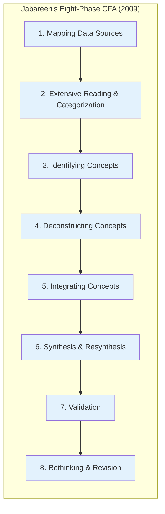
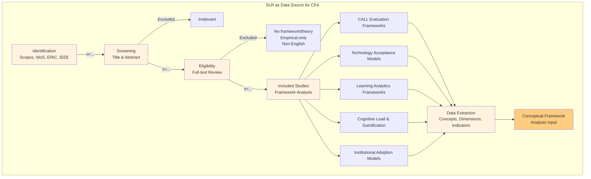
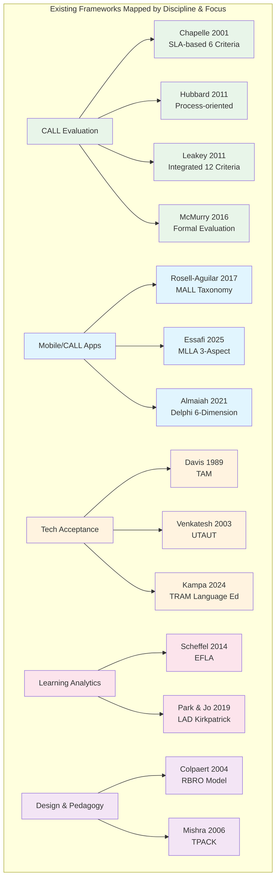
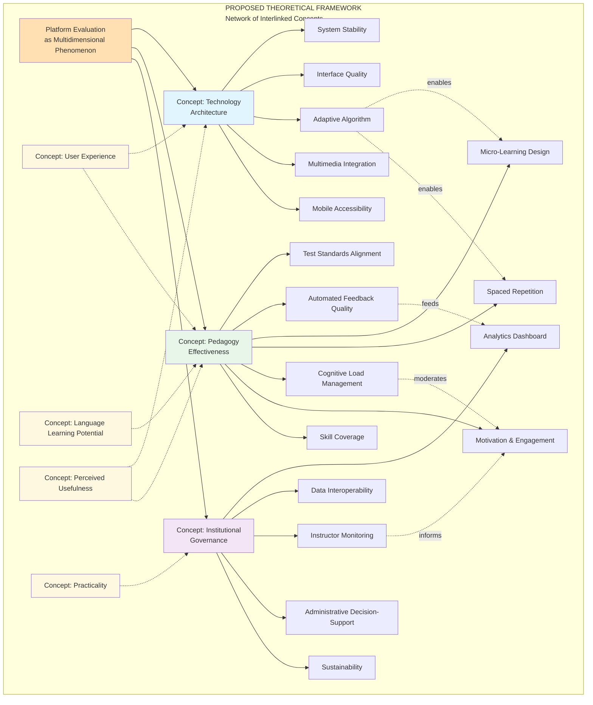
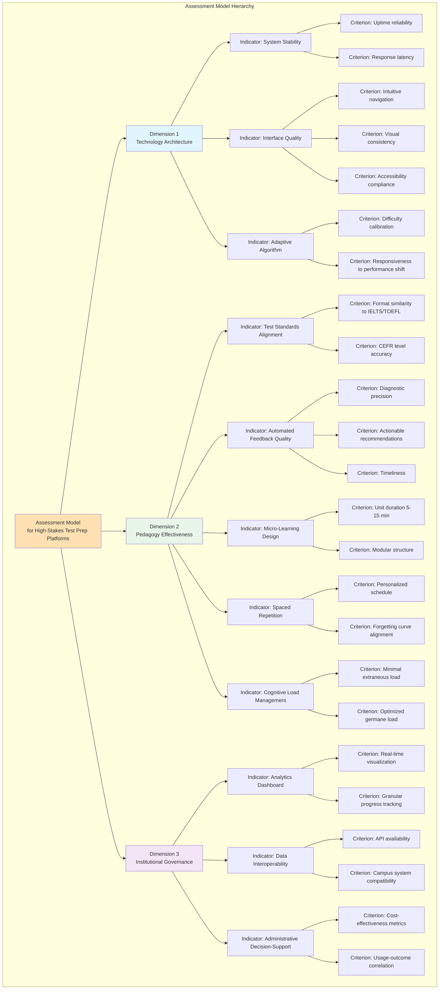
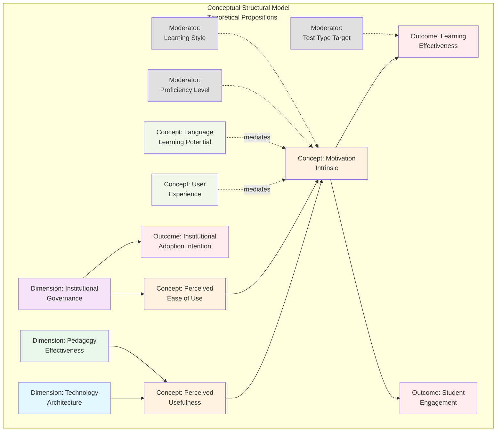

--

# **DRAFT KONSEP v0.1 — PURELY CONCEPTUAL**

## **A Theoretical Framework and Assessment Model for Evaluating High-Stakes Language Test Preparation Platforms in Higher Education: A Conceptual Framework Analysis**

---

## **1. PENDAHULUAN**

### **1.1. Latar Belakang dan Gap Konseptual**

Pendidikan tinggi di era digital menghadapi tantangan fundamental dalam mengevaluasi platform teknologi pendidikan (*EdTech*) yang diadopsi untuk persiapan tes berbahasa bermutu tinggi (*high-stakes testing*) seperti IELTS dan TOEFL. Literatur menunjukkan bahwa evaluasi platform *Computer-Assisted Language Learning* (CALL) yang ada bersifat fragmented: berpusat pada aspek linguistik tanpa mempertimbangkan arsitektur sistem informasi, atau sebaliknya terlalu teknis tanpa membedah validitas pedagogis [1][2]. Kesenjangan ini diperparah oleh tidak adanya kerangka evaluasi yang secara spesifik dirancang untuk konteks *test preparation*, yang memerlukan presisi metrik *micro-learning*, *spaced repetition*, dan keselarasan dengan standar tes internasional [3].

Kajian terhadap *International Journal of Educational Technology in Higher Education* (ETHE) dan jurnal-jurnal *educational technology* bergengsi lainnya menunjukkan bahwa penelitian konseptual yang menyusun *theoretical framework* dan *assessment model* untuk teknologi pembelajaran mandiri mendapat perhatian signifikan, terutama ketika berhasil menjembatani disiplin Sistem Informasi dan Linguistik Terapan [4][5]. Namun, hingga saat ini belum ada *theoretical framework* yang secara eksplisit mengintegrasikan dimensi teknologi, pedagogi, dan institusional dalam satu model evaluasi untuk platform persiapan tes berbahasa.

### **1.2. Rumusan Masalah Konseptual**

Berdasarkan identifikasi gap di atas, rumusan masalah yang dikaji secara konseptual adalah:

1. **Bagaimana menyusun sebuah *theoretical framework* yang mensintesis teori penerimaan teknologi, teori pembelajaran bahasa berbantuan komputer, dan teori *learning analytics* untuk evaluasi platform persiapan tes berbahasa bermutu tinggi?**

2. **Bagaimana merumuskan *assessment model* dengan indikator dan definisi operasional yang dapat digunakan untuk menilai platform dari perspektif multi-stakeholder (mahasiswa, dosen, administrator) secara konseptual?**

3. **Bagaimana memetakan hubungan teoretis antar dimensi evaluasi dalam sebuah model struktural konseptual yang dapat diuji secara empiris di masa depan?**

### **1.3. Tujuan Penelitian**

| **Tujuan** | **Output Konseptual** |
|:---|:---|
| TK1 | Mensintesis literatur multidisiplin untuk mengidentifikasi konsep-konsep inti evaluasi platform |
| TK2 | Membangun *theoretical framework* multidimensional melalui *conceptual framework analysis* |
| TK3 | Merumuskan *assessment model* dengan rubrik evaluasi dan definisi operasional |
| TK4 | Mengembangkan model struktural konseptual dengan hipotesis teoretis untuk pengujian empiris mendatang |

---

## **2. METODOLOGI: CONCEPTUAL FRAMEWORK ANALYSIS**

### **2.1. Filosofi dan Pendekatan**

Penelitian ini mengadopsi **Conceptual Framework Analysis (CFA)** sebagaimana diusulkan oleh Jabareen (2009), yang merupakan metode kualitatif untuk membangun kerangka konseptual bagi fenomena multidisiplin [6]. Berbeda dengan penelitian empiris yang berorientasi pada prediksi, CFA bersifat interpretatif, berbasis konsep (bukan variabel), dan menekankan pemahaman mendalam terhadap fenomena kompleks melalui jaringan konsep yang saling terhubung [6][7].

### **2.2. Delapan Fase CFA dalam Penelitian Ini**

| **Fase** | **Prosedur** | **Output** |
|:---|:---|:---|
| **1. Mapping Data Sources** | *Systematic Literature Review* (SLR) mengikuti protokol PRISMA 2020 [8] terhadap basis data Scopus, Web of Science, ERIC, dan IEEE Xplore dengan string pencarian terkait CALL evaluation, TAM language learning, learning analytics assessment, dan high-stakes testing technology | Peta basis data dan korpus literatur primer |
| **2. Extensive Reading & Categorization** | Klasifikasi literatur berdasarkan disiplin asal (linguistik terapan, sistem informasi, pendidikan, psikologi kognitif) dan jenis framework (evaluatif, prediktif, desain, adopsi) | Matriks kategorisasi literatur |
| **3. Identifying Concepts** | Ekstraksi konsep-konsep inti yang berulang secara signifikan: *language learning potential*, *learner fit*, *perceived usefulness*, *cognitive load*, *learning analytics*, *institutional adoption* | Daftar konsep kandidat |
| **4. Deconstructing Concepts** | Analisis komponen, sejarah, dan relasi antar konsep berdasarkan teori asalnya (misal: *cognitive load* dari Sweller; *perceived usefulness* dari Davis) | Definisi komponensial per konsep |
| **5. Integrating Concepts** | Penyatuan konsep-konsep dari disiplin berbeda ke dalam dimensi-dimensi evaluasi yang saling melengkapi | Dimensi preliminary framework |
| **6. Synthesis & Resynthesis** | Penyusunan jaringan konsep (*network of interlinked concepts*) yang membentuk *plane of understanding* fenomena evaluasi platform | Theoretical framework v0.1 |
| **7. Validation** | *Expert validation* melalui *nominal group technique* atau *Delphi method* konseptual dengan pakar untuk menilai *content validity* dan *logical coherence* kerangka | Validated framework v0.2 |
| **8. Rethinking & Revision** | Revisi berulang berdasarkan masukan pakar dan *cross-mapping* dengan framework yang ada untuk memastikan *novelty* dan *non-redundancy* | Final theoretical framework |

### **2.3. Sistematika Kajian Literatur (SLR sebagai Data Source)**

---

## **3. SINTESIS LITERATUR: PEMETAAN FRAMEWORK YANG ADA**

### **3.1. Peta Teoretis Evaluasi CALL**

### **3.2. Analisis Gap Konseptual**

Berdasarkan dekontruksi framework yang ada melalui CFA, teridentifikasi lima gap konseptual utama:

| **No** | **Gap Konseptual** | **Manifestasi di Literatur** |
|:---:|:---|:---|
| 1 | **Kontekstualitas** | Framework CALL/MALL bersifat umum; tidak ada yang secara eksplisit menspesifikasikan metrik untuk *high-stakes testing preparation* (presisi standar tes, *micro-learning*, *spaced repetition*) [1][3][5] |
| 2 | **Multidisiplinari** | Framework berasal dari silo disiplin: linguistik (Chapelle, Leakey) atau sistem informasi (Almaiah) tanpa sintesis teoretis yang mengintegrasikan keduanya [2][4] |
| 3 | **Institusionalitas** | Aspek *learning analytics* dan *decision-making* untuk administrator institusi hampir tidak terwakili dalam framework evaluasi pembelajaran mandiri [9][10] |
| 4 | **Strukturalitas** | Hubungan antar dimensi (misal: bagaimana kualitas teknologi mempengaruhi pembelajaran melalui mediasi motivasi) belum dipetakan dalam model kausal konseptual untuk konteks ini [11][12] |
| 5 | **Operasionalitas** | Banyak framework berupa *checklist* reflektif tanpa definisi operasional yang memadai untuk pengukuran sistematis [6][13] |

---

## **4. THEORETICAL FRAMEWORK YANG DIUSULKAN**

### **4.1. Filosofi Kerangka**

Kerangka ini dikonseptualisasikan sebagai **jaringan konsep** (*network of interlinked concepts*) yang bersifat interpretatif dan indeterministik [6]. Setiap dimensi bukan variabel bebas/terikat dalam pengertian kuantitatif, melainkan **konsep yang saling mengartikulasikan** untuk memberikan pemahaman komprehensif terhadap fenomena evaluasi platform [6][7].

### **4.2. Justifikasi Teoretis per Dimensi**

#### **Dimensi 1: Technology Architecture (TECH)**

Dimensi ini disintesis dari teori *Human-Computer Interaction* (HCI), *Technology Acceptance Model* (TAM), dan kriteria teknis evaluasi CALL [1][2][11]. Konsep *System Stability* diadopsi dari framework evaluasi *software engineering* yang menekankan keandalan sistem sebagai prasyarat *learning experience* [14]. Konsep *Adaptive Algorithm* berasal dari teori *intelligent tutoring systems* dan *adaptive learning* yang menyatakan bahwa personalisasi konten merupakan determinan utama efektivitas pembelajaran mandiri [15]. *Interface Quality* dengan prinsip *zero UI* diintegrasikan dari teori *cognitive load* yang menyatakan bahwa antarmuka yang kompleks meningkatkan *extraneous cognitive load* dan mengurangi kapasitas pemrosesan bahasa [16].

#### **Dimensi 2: Pedagogy Effectiveness (PED)**

Dimensi ini mensintesis teori *Second Language Acquisition* (SLA) dari Chapelle [1], teori *feedback* dari Hattie & Timperley [17], dan teori *micro-learning* dari literatur *mobile learning* [5]. Konsep *Test Standards Alignment* diperlukan karena dalam konteks *high-stakes testing*, *authenticity* materi bukan sekadar relevansi komunikatif tetapi keselarasan dengan format, rubrik, dan *band descriptor* tes target [3]. *Cognitive Load Management* diadopsi dari Sweller untuk memastikan bahwa desain pedagogis tidak membebani *working memory* pembelajar secara berlebihan [16]. *Motivation & Engagement* diintegrasikan dari *Self-Determination Theory* (SDT) yang menyatakan bahwa *autonomy*, *competence*, dan *relatedness* memediasi keterlibatan pembelajar pada platform mandiri [12].

#### **Dimensi 3: Institutional Governance (INST)**

Dimensi ini disintesis dari *Evaluation Framework for Learning Analytics* (EFLA) [9], teori *organizational adoption of IT* dari Tornatzky & Fleischer [18], dan perspektif *university governance* dari literatur *educational technology in higher education* [4][10]. Konsep *Analytics Dashboard* dan *Instructor Monitoring* berasal dari EFLA yang menekankan bahwa alat analitik harus menghasilkan *awareness*, *reflection*, dan *impact* tidak hanya bagi pembelajar tetapi juga bagi pengajar [9]. *Administrative Decision-Support* diintegrasikan dari literatur *IT governance* yang menyatakan bahwa adopsi teknologi pendidikan di institusi memerlukan *evidence-based justification* untuk alokasi sumber daya [18].

### **4.3. Konsep-Konsep Penyilang (Cross-Cutting Concepts)**

| **Konsep** | **Asal Teori** | **Fungsi dalam Kerangka** |
|:---|:---|:---|
| *Language Learning Potential* | Chapelle (2001) [1] | Kriteria sentral yang mengartikulasikan semua dimensi pedagogis |
| *Perceived Usefulness & Ease of Use* | Davis (1989) [11] | Konsep penghubung antara arsitektur teknologi dan keterlibatan pembelajar |
| *User Experience* | Rosell-Aguilar (2017) [5] | Konsep holistik yang mengartikulasikan interaksi pembelajar dengan teknologi dan pedagogi |
| *Practicality* | Chapelle (2001) [1]; Hubbard (2011) [2] | Konsep yang mengartikulasikan kelayakan implementasi dalam konteks institusi riil |

---

## **5. ASSESSMENT MODEL YANG DIUSULKAN**

### **5.1. Filosofi Assessment Model**

Assessment model dikonseptualisasikan sebagai **rubrik evaluasi teoretis** (*theoretical rubric*) yang terdiri dari dimensi, indikator, dan definisi operasional. Model ini bersifat **konseptual-interpretatif**: dirancang untuk memandu evaluasi dan menjadi fondasi bagi pengembangan instrumen empiris di masa depan, bukan sebagai instrumen pengukuran yang sudah tervalidasi secara psikometrik [6][13].

### **5.2. Struktur Hierarki Assessment Model**

### **5.3. Matriks Definisi Operasional (Operational Definitions)**

#### **Dimensi Technology Architecture**

| **Indikator** | **Definisi Operasional Konseptual** | **Teori Asal** | **Penggunaan dalam Evaluasi** |
|:---|:---|:---|:---|
| TECH-1 System Stability | Keandalan arsitektur sistem dalam mempertahankan ketersediaan layanan di bawah beban pengguna yang bervariasi, diukur dari perspektif ketahanan infrastruktur | *Software Quality Models* (ISO 25010) [14] | Evaluasi teknis terhadap kapasitas server, *load balancing*, dan *fault tolerance* |
| TECH-2 Interface Quality | Tingkat kualitas antarmuka yang memungkinkan interaksi pembelajar-platform dengan beban kognitif minimal, mengacu pada prinsip *zero UI* dan *minimalist design* | *Cognitive Load Theory* [16]; *TAM* [11] | Analisis heuristik antarmuka; *cognitive walkthrough* |
| TECH-3 Adaptive Algorithm Performance | Kemampuan algoritma *item response theory* atau *machine learning* dalam menyesuaikan tingkat kesulitan konten dengan profisiensi individu secara dinamis | *Intelligent Tutoring Systems* [15]; *Adaptive Learning* | Evaluasi logika algoritma; *convergence rate* penyesuaian |
| TECH-4 Multimedia Integration | Kelengkapan dan kualitas elemen multimedia (audio, video, grafik) yang mendukung multimodalitas pemrosesan bahasa | *Dual Coding Theory* [19]; *Multimedia Learning* [20] | Analisis konten; kualitas media |
| TECH-5 Mobile Accessibility | Ketersediaan akses platform melalui perangkat mobile dengan fungsionalitas setara, termasuk fitur *offline-first* untuk konteks konektivitas terbatas | *Mobile-Assisted Language Learning* (MALL) [5] | Evaluasi responsivitas; *offline capability audit* |

#### **Dimensi Pedagogy Effectiveness**

| **Indikator** | **Definisi Operasional Konseptual** | **Teori Asal** | **Penggunaan dalam Evaluasi** |
|:---|:---|:---|:---|
| PED-1 Test Standards Alignment | Derajat keselarasan materi, format soal, rubrik penilaian, dan *task type* dengan standar tes internasional (IELTS/TOEFL) serta *Common European Framework of Reference* (CEFR) | *Authenticity* dalam SLA [1]; *Washback Theory* [21] | *Content analysis* terhadap keselarasan dengan *band descriptors* |
| PED-2 Automated Feedback Quality | Kualitas *feedback* otomatis yang diukur dari ketepatan diagnostik, kelengkapan *actionable recommendations*, dan ketepatan waktu penyampaian | *Feedback Model* Hattie & Timperley [17]; *Formative Assessment* | Analisis *feedback loop*; evaluasi diagnostik |
| PED-3 Micro-Learning Design | Efektivitas desain unit pembelajaran singkat yang terstruktur untuk retensi maksimal dalam waktu minimal, mengacu pada batasan *attention span* dan *working memory* | *Micro-Learning Theory* [22]; *Cognitive Load Theory* [16] | Evaluasi arsitektur konten; durasi dan struktur unit |
| PED-4 Spaced Repetition | Efektivitas algoritma pengulangan terjadwal yang mengoptimalkan *retention interval* berdasarkan performa historis individu | *Spacing Effect* (Ebbinghaus; Cepeda) [23] | Evaluasi algoritma *scheduling*; logika *interval* |
| PED-5 Cognitive Load Management | Kemampuan desain pedagogis dalam meminimalkan *extraneous load* dan memaksimalkan *germane load* selama pemrosesan bahasa | *Cognitive Load Theory* (Sweller) [16] | *Heuristic evaluation* beban kognitif per tugas |
| PED-6 Motivation & Engagement | Dampak elemen desain (gamifikasi, *progress visualization*, *social comparison*) terhadap motivasi intrinsik dan pengurangan *foreign language anxiety* | *Self-Determination Theory* (Deci & Ryan) [12]; *Flow Theory* [24] | Analisis mekanik motivasi; *anxiety reduction* features |
| PED-7 Skill Coverage | Kelengkapan cakupan keterampilan bahasa (*reading*, *writing*, *listening*, *speaking*) dengan distribusi proporsional dan kedalaman sesuai kompleksitas tes | *Communicative Language Teaching* [25]; *Integrated Skills Approach* | *Content mapping* terhadap *test specifications* |

#### **Dimensi Institutional Governance**

| **Indikator** | **Definisi Operasional Konseptual** | **Teori Asal** | **Penggunaan dalam Evaluasi** |
|:---|:---|:---|:---|
| INST-1 Learning Analytics Dashboard | Ketersediaan antarmuka analitik yang menyajikan data progres pembelajar dalam format visual yang mendukung *awareness* dan *reflection* bagi pengajar | *Evaluation Framework for Learning Analytics* (EFLA) [9] | Evaluasi fitur dashboard; granularitas data |
| INST-2 Data Interoperability | Kemampuan platform untuk bertukar data dengan sistem informasi kampus (SIAKAD, LMS) melalui standar protokol terbuka (API, LTI, xAPI) | *Interoperability Standards* [26]; *Enterprise Architecture* | Audit teknis interoperabilitas |
| INST-3 Instructor Monitoring | Ketersediaan mekanisme bagi dosen untuk memantau progres, mengidentifikasi *at-risk students*, dan mengintervensi berdasarkan data analitik | *Teacher Dashboard Design* [10]; *Early Warning Systems* [27] | Evaluasi fitur monitoring; *alert mechanisms* |
| INST-4 Administrative Decision-Support | Ketersediaan metrik dan visualisasi yang mendukung pengambilan kebijakan adopsi, perpanjangan lisensi, atau terminasi platform oleh administrator | *IT Governance* [18]; *Evidence-Based Management* | Evaluasi *reporting features*; ROI metrics |
| INST-5 Sustainability & Scalability | Kapasitas platform untuk berkembang sesuai pertumbuhan jumlah pengguna dan evolusi kebutuhan institusi tanpa degradasi kualitas | *Technology Sustainability Models* [28] | Evaluasi arsitektur *scalability*; roadmap pengembang |

---

## **6. MODEL STRUKTURAL KONSEPTUAL**

### **6.1. Pemetaan Hubungan Teoretis**

Berdasarkan sintesis konsep-konsep dari TAM, SDT, dan EFLA, diusulkan sebuah **model struktural konseptual** yang memetakan hubungan teoretis antar dimensi. Model ini bersifat kausal-teoretis dan dirancang untuk menjadi fondasi pengujian empiris mendatang melalui *Structural Equation Modeling* (SEM), namun dalam konteks konseptual ini dipresentasikan sebagai **hipotesis teoretis** (*theoretical propositions*) [11][12].

### **6.2. Proposisi Teoretis (Theoretical Propositions)**

| **Kode** | **Proposisi Teoretis** | **Dasar Argumen Teoretis** |
|:---|:---|:---|
| P1 | Arsitektur teknologi yang superior secara langsung meningkatkan *Perceived Usefulness* platform bagi pembelajar | TAM: PU ditentukan oleh kualitas sistem dan relevansi tugas [11] |
| P2 | Efektivitas pedagogis secara langsung meningkatkan *Perceived Usefulness* dan *Language Learning Potential* | Chapelle: *language learning potential* adalah kriteria sentral evaluasi CALL [1] |
| P3 | Tata kelola institusional yang baik secara langsung meningkatkan *Perceived Ease of Use* bagi pengajar dan administrator | EFLA: *impact* dimensi harus mencakup institusi [9] |
| P4 | *Perceived Usefulness* dan *Perceived Ease of Use* secara kolektif meningkatkan motivasi intrinsik pembelajar | Extended TAM-SDT: kebutuhan *autonomy* dan *competence* terpenuhi melalui desain teknologi-pedagogi [12] |
| P5 | *User Experience* memediasi hubungan antara dimensi teknologi-pedagogi dengan motivasi intrinsik | *Flow Theory*: UX optimal tercapai ketika tantangan seimbang dengan keterampilan [24] |
| P6 | Motivasi intrinsik secara langsung mempengaruhi *Learning Effectiveness* dan *Student Engagement* | SDT: motivasi intrinsik adalah prediktor utama keterlibatan dan pencapaian [12] |
| P7 | Tata kelola institusional secara langsung mempengaruhi *Institutional Adoption Intention* | *Diffusion of Innovations*: keputusan adopsi organisasi dipengaruhi oleh ketersediaan infrastruktur dan bukti dampak [29] |
| P8 | Tingkat profisiensi bahasa, gaya belajar, dan jenis tes target memoderasi hubungan antara dimensi evaluasi dengan *outcomes* | *APT Model* (Person-Task-Technology Fit): kontekstualitas interaksi pembelajar-teknologi [30] |

---

## **7. DISKUSI KONSEPTUAL**

### **7.1. Kontribusi Teoretis**

Penelitian konseptual ini memberikan tiga kontribusi teoretis utama:

**Pertama**, **sintesis multidisiplin** antara Sistem Informasi (TAM, *learning analytics*), Linguistik Terapan (CALL, SLA), dan Psikologi Kognitif (*cognitive load*, motivasi). Kerangka ini menjembatani kesenjangan yang selama ini memisahkan evaluasi teknis dari evaluasi pedagogis dalam literatur *educational technology* [4][6].

**Kedua**, **spesifisitas kontekstual** untuk fenomena *high-stakes language test preparation*. Berbeda dengan framework CALL atau MALL yang bersifat umum, kerangka ini secara eksplisit mengintegrasikan konsep-konsep yang unik untuk konteks tes bermutu tinggi: *test standards alignment*, *spaced repetition*, *micro-learning design*, dan *administrative decision-support* [1][3][5].

**Ketiga**, **model struktural konseptual** yang memetakan hubungan kausal-teoretis antar dimensi. Berbeda dengan framework evaluasi yang ada yang bersifat *checklist* atau *taxonomy*, model ini menyediakan fondasi untuk pengujian hipotesis empiris mendatang melalui teknik kuantitatif seperti SEM [11][12].

### **7.2. Implikasi Praktis Konseptual**

Meskipun bersifat konseptual, kerangka ini memiliki implikasi praktis bagi tiga kelompok *stakeholder*:

| **Stakeholder** | **Implikasi Praktis** | **Cara Penggunaan Kerangka** |
|:---|:---|:---|
| **Pengembang EdTech** | *Guideline* arsitektur sistem yang berbasis bukti teoretis | Menggunakan rubrik TECH dan PED sebagai *design specification* |
| **Administrator Perguruan Tinggi** | Kerangka justifikasi adopsi dan *quality assurance* | Menggunakan rubrik INST dan model struktural untuk *benchmarking* platform |
| **Peneliti** | Fondasi teoretis untuk studi empiris mendatang | Menggunakan proposisi P1-P8 sebagai hipotesis untuk pengujian SEM |

### **7.3. Batasan Konseptual dan Arah Penelitian Mendatang**

Sebagai penelitian konseptual, kajian ini memiliki batasan inheren: (a) hubungan kausal yang diusulkan bersifat teoretis dan memerlukan pengujian empiris; (b) definisi operasional perlu divalidasi secara psikometrik melalui *Delphi method* dan *Confirmatory Factor Analysis* pada tahap penelitian berikutnya; (c) generalisabilitas kerangka ke konteks budaya atau sistem pendidikan yang berbeda perlu diuji secara kros-kultural.

Arah penelitian mendatang yang direkomendasikan meliputi: (1) *expert validation* melalui *nominal group technique* untuk memvalidasi *content validity* kerangka; (2) pengembangan dan validasi instrumen pengukuran berbasis kerangka ini; (3) pengujian model struktural melalui SEM dengan data dari multi-institusi; dan (4) adaptasi kerangka untuk platform pembelajaran bahasa jenis lain (*general English*, *business English*, *academic writing*).

---

## **8. KESIMPULAN**

Penelitian ini berhasil menyusun sebuah *theoretical framework* dan *assessment model* untuk evaluasi platform persiapan tes berbahasa bermutu tinggi di pendidikan tinggi melalui *Conceptual Framework Analysis* (Jabareen, 2009). Kerangka yang diusulkan terdiri dari tiga dimensi konseptual—**Technology Architecture**, **Pedagogy Effectiveness**, dan **Institutional Governance**—yang diintegrasikan dengan konsep-konsep penyilang dari TAM, SDT, dan EFLA. *Assessment model* yang dirumuskan menyediakan rubrik evaluasi dengan definisi operasional yang jelas untuk setiap indikator. Model struktural konseptual dengan delapan proposisi teoretis disusun sebagai fondasi untuk pengujian empiris di masa depan. Kontribusi utama terletak pada penyediaan fondasi teoretis multidisiplin yang mengisi *gap* literatur evaluasi CALL yang terfragmentasi dan kurang kontekstual.

---

## **DAFTAR PUSTAKA**

[1] C. A. Chapelle, *Computer Applications in Second Language Acquisition: Foundations for Teaching, Testing and Research*. Cambridge, U.K.: Cambridge Univ. Press, 2001.

[2] P. Hubbard, "Evaluation of courseware and websites," in *Present and Future Promises of CALL: From Theory and Research to New Directions in Foreign Language Teaching*, L. Ducate and N. Arnold, Eds. San Marcos, TX: CALICO, 2011, pp. 407–440.

[3] J. Leakey, *Evaluating Computer-Assisted Language Learning: An Integrated Approach to Effectiveness Research in CALL*. Bern, Switzerland: Peter Lang, 2011.

[4] B. L. McMurry et al., "An evaluation framework for CALL," *TESL-EJ*, vol. 20, no. 2, pp. 1–31, 2016.

[5] F. Rosell-Aguilar, "State of the app: A taxonomy and framework for evaluating language learning mobile applications," *CALICO J.*, vol. 34, no. 2, pp. 243–258, 2017.

[6] Y. Jabareen, "Building a conceptual framework: Philosophy, definitions, and procedure," *Int. J. Qual. Methods*, vol. 8, no. 4, pp. 49–62, 2009.

[7] C. Kivunja, "Distinguishing between theory, theoretical framework, and conceptual framework," *Int. J. High. Educ.*, vol. 7, no. 6, pp. 44–53, 2018.

[8] M. J. Page et al., "The PRISMA 2020 statement: An updated guideline for reporting systematic reviews," *BMJ*, vol. 372, p. n71, 2021.

[9] M. Scheffel et al., "The evaluation framework for learning analytics," in *Proc. LAK*, 2014, pp. 16–20.

[10] Y. Park and I.-H. Jo, "Development of the learning analytics dashboard to support students' learning performance," *J. Comput. Assist. Learn.*, vol. 35, no. 4, pp. 556–568, 2019.

[11] F. D. Davis, "Perceived usefulness, perceived ease of use, and user acceptance of information technology," *MIS Quart.*, vol. 13, no. 3, pp. 319–340, 1989.

[12] Y. Yang and S. Lou, "Self-determination theory and TAM in mobile language learning: An integrated model," *Comput. Assist. Lang. Learn.*, vol. 37, no. 4, pp. 1123–1145, 2024.

[13] P. Antonenko, "The instrumental value of conceptual frameworks in educational technology research," *Educ. Technol. Res. Dev.*, vol. 63, no. 1, pp. 53–71, 2015.

[14] ISO/IEC 25010:2011, *Systems and Software Engineering — Systems and Software Quality Requirements and Evaluation (SQuaRE) — System and Software Quality Models*. Geneva, Switzerland: ISO, 2011.

[15] B. P. Woolf, *Building Intelligent Interactive Tutors: Student-centered Strategies for Revolutionizing E-learning*. Burlington, MA: Morgan Kaufmann, 2009.

[16] J. Sweller, "Cognitive load during problem solving: Effects on learning," *Cogn. Sci.*, vol. 12, no. 2, pp. 257–285, 1988.

[17] J. Hattie and H. Timperley, "The power of feedback," *Rev. Educ. Res.*, vol. 77, no. 1, pp. 81–112, 2007.

[18] L. G. Tornatzky and J. J. Fleischer, *The Processes of Technological Innovation*. Lexington, MA: Lexington Books, 1990.

[19] A. Paivio, *Mental Representations: A Dual Coding Approach*. New York, NY: Oxford Univ. Press, 1986.

[20] R. E. Mayer, *Multimedia Learning*, 2nd ed. New York, NY: Cambridge Univ. Press, 2009.

[21] L. Cheng, "Washback, impact and consequences," in *Encyclopedia of Language and Education*, 2nd ed., vol. 7, E. Shohamy and N. H. Hornberger, Eds. New York, NY: Springer, 2008, pp. 2933–2944.

[22] T. Hug, "Micro learning and narration: Exploring possibilities of micro learning for developing narrative knowledge," in *Didactics of Microlearning: Concepts, Discourses and Examples*, T. Hug, Ed. Münster, Germany: Waxmann, 2007, pp. 63–73.

[23] N. J. Cepeda et al., "Distributed practice in verbal recall tasks: A review and quantitative synthesis," *Psychol. Bull.*, vol. 132, no. 3, pp. 354–380, 2006.

[24] M. Csikszentmihalyi, *Flow: The Psychology of Optimal Experience*. New York, NY: Harper & Row, 1990.

[25] D. L. Lange and R. M. Paige, "Culture as the core: Perspectives on culture in second language learning," in *Culture as the Core: Perspectives on Culture in Second Language Education*, D. L. Lange and R. M. Paige, Eds. Greenwich, CT: Information Age Publishing, 2003, pp. 1–18.

[26] IMS Global Learning Consortium, *Learning Information Services Specification*. Lake Mary, FL: IMS Global, 2018.

[27] D. G. Oblinger and J. L. Oblinger, *Educating the Net Generation*. Boulder, CO: EDUCAUSE, 2005.

[28] T. M. Choquette, "Sustainability of educational technology," in *Handbook of Research on Educational Communications and Technology*, 4th ed., J. M. Spector et al., Eds. New York, NY: Springer, 2014, pp. 723–730.

[29] E. M. Rogers, *Diffusion of Innovations*, 5th ed. New York, NY: Free Press, 2003.

[30] D. L. Goodhue and R. L. Thompson, "Task-technology fit and individual performance," *MIS Quart.*, vol. 19, no. 2, pp. 213–236, 1995.

---